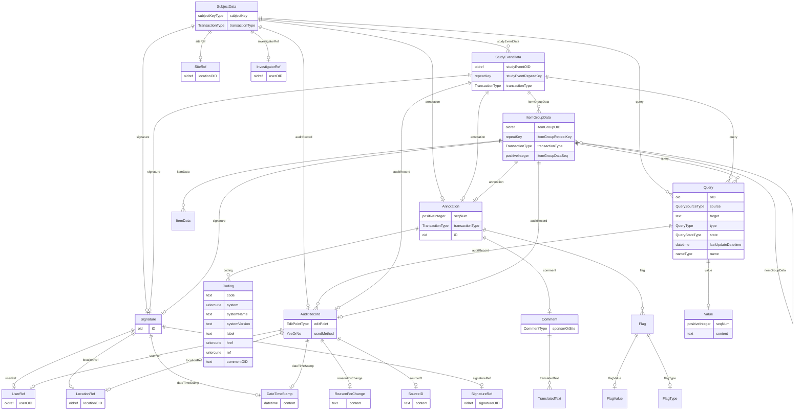

# Class: SubjectData

_Clinical data for a single subject._


URI: [odm:SubjectData](http://www.cdisc.org/ns/odm/v2.0/SubjectData)





<!-- no inheritance hierarchy -->


## Slots

| Name | Cardinality* and Range | Description | Inheritance |
| ---  | --- | --- | --- |
| [subjectKey](subjectKey.md) | 1..1 <br/> [subjectKeyType](subjectKeyType.md) | Unique identifier for the Subject. | direct |
| [transactionType](transactionType.md) | 0..1 <br/> [TransactionType](TransactionType.md) | Identifies the transaction type when /ODM/@FileType is Transactional and ther... | direct |
| [investigatorRef](investigatorRef.md) | 0..1 <br/> [InvestigatorRef](InvestigatorRef.md) | InvestigatorRef reference: Provides a reference to the user who created the S... | direct |
| [siteRef](siteRef.md) | 0..1 <br/> [SiteRef](SiteRef.md) | SiteRef reference: Provides a reference to the site that the SubjectData reco... | direct |
| [studyEventData](studyEventData.md) | 0..* <br/> [StudyEventData](StudyEventData.md) | StudyEventData reference: Clinical data for a study event (visit). The model ... | direct |
| [query](query.md) | 0..* <br/> [Query](Query.md) | Query reference: The Query element represents a request for clarification on ... | direct |
| [auditRecord](auditRecord.md) | 0..1 <br/> [AuditRecord](AuditRecord.md) | AuditRecord reference: An AuditRecord carries information pertaining to the c... | direct |
| [signature](signature.md) | 0..1 <br/> [Signature](Signature.md) | Signature reference: An electronic signature applies to a collection of clini... | direct |
| [annotation](annotation.md) | 0..1 <br/> [Annotation](Annotation.md) | Annotation reference: A general note about clinical data. If an annotation ha... | direct |

_* See [LinkML documentation](https://linkml.io/linkml/schemas/slots.html#slot-cardinality) for cardinality definitions._


## Usages

| used by | used in | type | used |
| ---  | --- | --- | --- |
| [ClinicalData](ClinicalData.md) | [subjectData](subjectData.md) | range | [SubjectData](SubjectData.md) |


## See Also

* [https://wiki.cdisc.org/display/PUB/SubjectData](https://wiki.cdisc.org/display/PUB/SubjectData)

## Identifier and Mapping Information


### Schema Source


* from schema: http://www.cdisc.org/ns/odm/v2.0


## Mappings

| Mapping Type | Mapped Value |
| ---  | ---  |
| self | odm:SubjectData |
| native | odm:SubjectData |


## LinkML Source

<!-- TODO: investigate https://stackoverflow.com/questions/37606292/how-to-create-tabbed-code-blocks-in-mkdocs-or-sphinx -->

### Direct

<details>
```yaml
name: SubjectData
description: Clinical data for a single subject.
from_schema: http://www.cdisc.org/ns/odm/v2.0
see_also:
- https://wiki.cdisc.org/display/PUB/SubjectData
rank: 1000
slots:
- subjectKey
- transactionType
- investigatorRef
- siteRef
- studyEventData
- query
- auditRecord
- signature
- annotation
slot_usage:
  subjectKey:
    name: subjectKey
    description: Unique identifier for the Subject.
    comments:
    - 'Required

      range: subjectKey

      For CDISC SDTM regulatory submission, the SubjectKey value should be the SDTM
      SUBJID variable value.'
    domain_of:
    - SubjectData
    - KeySet
    range: subjectKeyType
    required: true
  transactionType:
    name: transactionType
    description: Identifies the transaction type when /ODM/@FileType is Transactional
      and there is no child element.
    comments:
    - 'Conditional Required when contained within an ODM Transactional file and the
      SubjectData element has no child element content.

      enum values: (Insert | Update | Remove | Upsert | Context)

      When importing data from an ODM Snapshot file, the TransactionType attribute
      must not affect the processing of the SubjectData element.'
    domain_of:
    - SubjectData
    - StudyEventData
    - ItemGroupData
    - ItemData
    - Annotation
    range: TransactionType
  investigatorRef:
    name: investigatorRef
    domain_of:
    - SubjectData
    range: InvestigatorRef
    maximum_cardinality: 1
  siteRef:
    name: siteRef
    domain_of:
    - SubjectData
    range: SiteRef
    maximum_cardinality: 1
  studyEventData:
    name: studyEventData
    multivalued: true
    domain_of:
    - SubjectData
    range: StudyEventData
    inlined: true
    inlined_as_list: true
  query:
    name: query
    multivalued: true
    domain_of:
    - Location
    - ClinicalData
    - SubjectData
    - StudyEventData
    - ItemGroupData
    - ItemData
    range: Query
    inlined: true
    inlined_as_list: true
  auditRecord:
    name: auditRecord
    domain_of:
    - ReferenceData
    - ClinicalData
    - SubjectData
    - StudyEventData
    - ItemGroupData
    - ItemData
    - Query
    range: AuditRecord
    maximum_cardinality: 1
  signature:
    name: signature
    domain_of:
    - ReferenceData
    - ClinicalData
    - SubjectData
    - StudyEventData
    - ItemGroupData
    - ItemData
    range: Signature
    maximum_cardinality: 1
  annotation:
    name: annotation
    domain_of:
    - ReferenceData
    - ClinicalData
    - SubjectData
    - StudyEventData
    - ItemGroupData
    - ItemData
    - Association
    range: Annotation
    maximum_cardinality: 1
class_uri: odm:SubjectData

```
</details>

### Induced

<details>
```yaml
name: SubjectData
description: Clinical data for a single subject.
from_schema: http://www.cdisc.org/ns/odm/v2.0
see_also:
- https://wiki.cdisc.org/display/PUB/SubjectData
rank: 1000
slot_usage:
  subjectKey:
    name: subjectKey
    description: Unique identifier for the Subject.
    comments:
    - 'Required

      range: subjectKey

      For CDISC SDTM regulatory submission, the SubjectKey value should be the SDTM
      SUBJID variable value.'
    domain_of:
    - SubjectData
    - KeySet
    range: subjectKeyType
    required: true
  transactionType:
    name: transactionType
    description: Identifies the transaction type when /ODM/@FileType is Transactional
      and there is no child element.
    comments:
    - 'Conditional Required when contained within an ODM Transactional file and the
      SubjectData element has no child element content.

      enum values: (Insert | Update | Remove | Upsert | Context)

      When importing data from an ODM Snapshot file, the TransactionType attribute
      must not affect the processing of the SubjectData element.'
    domain_of:
    - SubjectData
    - StudyEventData
    - ItemGroupData
    - ItemData
    - Annotation
    range: TransactionType
  investigatorRef:
    name: investigatorRef
    domain_of:
    - SubjectData
    range: InvestigatorRef
    maximum_cardinality: 1
  siteRef:
    name: siteRef
    domain_of:
    - SubjectData
    range: SiteRef
    maximum_cardinality: 1
  studyEventData:
    name: studyEventData
    multivalued: true
    domain_of:
    - SubjectData
    range: StudyEventData
    inlined: true
    inlined_as_list: true
  query:
    name: query
    multivalued: true
    domain_of:
    - Location
    - ClinicalData
    - SubjectData
    - StudyEventData
    - ItemGroupData
    - ItemData
    range: Query
    inlined: true
    inlined_as_list: true
  auditRecord:
    name: auditRecord
    domain_of:
    - ReferenceData
    - ClinicalData
    - SubjectData
    - StudyEventData
    - ItemGroupData
    - ItemData
    - Query
    range: AuditRecord
    maximum_cardinality: 1
  signature:
    name: signature
    domain_of:
    - ReferenceData
    - ClinicalData
    - SubjectData
    - StudyEventData
    - ItemGroupData
    - ItemData
    range: Signature
    maximum_cardinality: 1
  annotation:
    name: annotation
    domain_of:
    - ReferenceData
    - ClinicalData
    - SubjectData
    - StudyEventData
    - ItemGroupData
    - ItemData
    - Association
    range: Annotation
    maximum_cardinality: 1
attributes:
  subjectKey:
    name: subjectKey
    description: Unique identifier for the Subject.
    comments:
    - 'Required

      range: subjectKey

      For CDISC SDTM regulatory submission, the SubjectKey value should be the SDTM
      SUBJID variable value.'
    from_schema: http://www.cdisc.org/ns/odm/v2.0
    rank: 1000
    alias: subjectKey
    owner: SubjectData
    domain_of:
    - SubjectData
    - KeySet
    range: subjectKeyType
    required: true
  transactionType:
    name: transactionType
    description: Identifies the transaction type when /ODM/@FileType is Transactional
      and there is no child element.
    comments:
    - 'Conditional Required when contained within an ODM Transactional file and the
      SubjectData element has no child element content.

      enum values: (Insert | Update | Remove | Upsert | Context)

      When importing data from an ODM Snapshot file, the TransactionType attribute
      must not affect the processing of the SubjectData element.'
    from_schema: http://www.cdisc.org/ns/odm/v2.0
    rank: 1000
    alias: transactionType
    owner: SubjectData
    domain_of:
    - SubjectData
    - StudyEventData
    - ItemGroupData
    - ItemData
    - Annotation
    range: TransactionType
  investigatorRef:
    name: investigatorRef
    description: 'InvestigatorRef reference: Provides a reference to the user who
      created the SubjectData record in the source system.'
    from_schema: http://www.cdisc.org/ns/odm/v2.0
    rank: 1000
    identifier: false
    alias: investigatorRef
    owner: SubjectData
    domain_of:
    - SubjectData
    range: InvestigatorRef
    maximum_cardinality: 1
  siteRef:
    name: siteRef
    description: 'SiteRef reference: Provides a reference to the site that the SubjectData
      record is associated with in the source system.'
    from_schema: http://www.cdisc.org/ns/odm/v2.0
    rank: 1000
    identifier: false
    alias: siteRef
    owner: SubjectData
    domain_of:
    - SubjectData
    range: SiteRef
    maximum_cardinality: 1
  studyEventData:
    name: studyEventData
    description: 'StudyEventData reference: Clinical data for a study event (visit).
      The model supports repeating study events (e.g., when the same set of information
      is collected for a series of patient visits).'
    from_schema: http://www.cdisc.org/ns/odm/v2.0
    rank: 1000
    multivalued: true
    identifier: false
    alias: studyEventData
    owner: SubjectData
    domain_of:
    - SubjectData
    range: StudyEventData
    inlined: true
    inlined_as_list: true
  query:
    name: query
    description: 'Query reference: The Query element represents a request for clarification
      on a data item collected for a clinical trial, specifically a request from a
      sponsor or sponsor’s representative to an investigator to resolve an error or
      inconsistency discovered during data review. Queries can be created manually
      by individuals such as site monitors or data managers or automatically by systems.
      The full text of the Query exists in the Value child element. The optional Name
      attribute provide the means to provide a short identifier that can be included
      in listing or user interfaces.'
    from_schema: http://www.cdisc.org/ns/odm/v2.0
    rank: 1000
    multivalued: true
    identifier: false
    alias: query
    owner: SubjectData
    domain_of:
    - Location
    - ClinicalData
    - SubjectData
    - StudyEventData
    - ItemGroupData
    - ItemData
    range: Query
    inlined: true
    inlined_as_list: true
  auditRecord:
    name: auditRecord
    description: 'AuditRecord reference: An AuditRecord carries information pertaining
      to the creation, deletion, or modification of clinical data. This information
      includes who performed that action, and where, when, and why that action was
      performed.AuditRecord information describes a change to clinical data, but is
      not itself clinical data. The value of some clinical data can always be changed
      by a subsequent transaction, but history cannot be changed, only added to.'
    from_schema: http://www.cdisc.org/ns/odm/v2.0
    rank: 1000
    identifier: false
    alias: auditRecord
    owner: SubjectData
    domain_of:
    - ReferenceData
    - ClinicalData
    - SubjectData
    - StudyEventData
    - ItemGroupData
    - ItemData
    - Query
    range: AuditRecord
    maximum_cardinality: 1
  signature:
    name: signature
    description: 'Signature reference: An electronic signature applies to a collection
      of clinical data. This indicates that some user accepts legal responsibility
      for that data. See 21 CFR Part 11. The signature identifies the person signing,
      the location of signing, the signature meaning (via the referenced SignatureDef),
      the date and time of signing, and (in the case of a digital signature) an encrypted
      hash of the included data.'
    from_schema: http://www.cdisc.org/ns/odm/v2.0
    rank: 1000
    identifier: false
    alias: signature
    owner: SubjectData
    domain_of:
    - ReferenceData
    - ClinicalData
    - SubjectData
    - StudyEventData
    - ItemGroupData
    - ItemData
    range: Signature
    maximum_cardinality: 1
  annotation:
    name: annotation
    description: 'Annotation reference: A general note about clinical data. If an
      annotation has both a comment and flags, the flags should be related to the
      comment.'
    from_schema: http://www.cdisc.org/ns/odm/v2.0
    rank: 1000
    identifier: false
    alias: annotation
    owner: SubjectData
    domain_of:
    - ReferenceData
    - ClinicalData
    - SubjectData
    - StudyEventData
    - ItemGroupData
    - ItemData
    - Association
    range: Annotation
    maximum_cardinality: 1
class_uri: odm:SubjectData

```
</details>