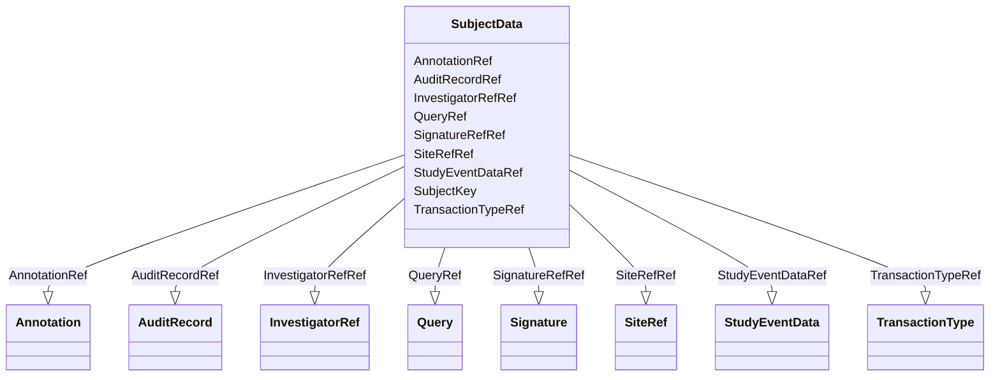

# Class: SubjectData


_Clinical data for a single subject._


URI: [odm:SubjectData](http://www.cdisc.org/ns/odm/v2.0/SubjectData)





<!-- no inheritance hierarchy -->


## Slots

| Name | Cardinality and Range | Description | Inheritance |
| ---  | --- | --- | --- |
| [SubjectKey](SubjectKey.md) | 1..1 <br/> [subjectKey](subjectKey.md) | Unique identifier for the Subject. | direct |
| [TransactionTypeRef](TransactionTypeRef.md) | 0..1 <br/> [TransactionType](TransactionType.md) | Identifies the transaction type when /ODM/@FileType is Transactional and ther... | direct |
| [InvestigatorRefRef](InvestigatorRefRef.md) | 0..1 <br/> [InvestigatorRef](InvestigatorRef.md) | InvestigatorRef reference: Provides a reference to the user who created the S... | direct |
| [SiteRefRef](SiteRefRef.md) | 0..1 <br/> [SiteRef](SiteRef.md) | SiteRef reference: lement NameSiteRefParent ElementsSubjectDataElement XPath(... | direct |
| [StudyEventDataRef](StudyEventDataRef.md) | 0..* <br/> [StudyEventData](StudyEventData.md) | StudyEventData reference: Clinical data for a study event (visit). The model ... | direct |
| [QueryRef](QueryRef.md) | 0..* <br/> [Query](Query.md) | Query reference: The Query element represents a request for clarification on ... | direct |
| [AuditRecordRef](AuditRecordRef.md) | 0..1 <br/> [AuditRecord](AuditRecord.md) | AuditRecord reference: An AuditRecord carries information pertaining to the c... | direct |
| [SignatureRefRef](SignatureRefRef.md) | 0..1 <br/> [Signature](Signature.md) | SignatureRef reference: None | direct |
| [AnnotationRef](AnnotationRef.md) | 0..1 <br/> [Annotation](Annotation.md) | Annotation reference: A general note about clinical data. If an annotation ha... | direct |


## Usages

| used by | used in | type | used |
| ---  | --- | --- | --- |
| [ClinicalData](ClinicalData.md) | [SubjectDataRef](SubjectDataRef.md) | range | [SubjectData](SubjectData.md) |


## See Also

* [https://wiki.cdisc.org/display/ODM2/SubjectData](https://wiki.cdisc.org/display/ODM2/SubjectData)

## Identifier and Mapping Information


### Schema Source


* from schema: http://www.cdisc.org/ns/odm/v2.0


## Mappings

| Mapping Type | Mapped Value |
| ---  | ---  |
| self | odm:SubjectData |
| native | odm:SubjectData |


## LinkML Source

<!-- TODO: investigate https://stackoverflow.com/questions/37606292/how-to-create-tabbed-code-blocks-in-mkdocs-or-sphinx -->

### Direct

<details>
```yaml
name: SubjectData
description: Clinical data for a single subject.
from_schema: http://www.cdisc.org/ns/odm/v2.0
see_also:
- https://wiki.cdisc.org/display/ODM2/SubjectData
slots:
- SubjectKey
- TransactionTypeRef
- InvestigatorRefRef
- SiteRefRef
- StudyEventDataRef
- QueryRef
- AuditRecordRef
- SignatureRefRef
- AnnotationRef
slot_usage:
  SubjectKey:
    name: SubjectKey
    description: Unique identifier for the Subject.
    comments:
    - 'Required

      range:subjectKey

      For CDISC SDTM regulatory submission, the SubjectKey value should be the SDTM
      SUBJID variable value.'
    domain_of:
    - SubjectData
    - KeySet
    range: subjectKey
    required: true
  TransactionTypeRef:
    name: TransactionTypeRef
    description: Identifies the transaction type when /ODM/@FileType is Transactional
      and there is no child element.
    comments:
    - 'Conditional Required when contained within an ODM Transactional file and the
      SubjectData element has no child element content.

      enum values:(Insert | Update | Remove | Upsert | Context)

      When importing data from an ODM Snapshot file, the TransactionType attribute
      must not affect the processing of the SubjectData element.'
    domain_of:
    - SubjectData
    - StudyEventData
    - ItemGroupData
    - ItemData
    - Annotation
    range: TransactionType
  InvestigatorRefRef:
    name: InvestigatorRefRef
    domain_of:
    - SubjectData
    range: InvestigatorRef
    maximum_cardinality: 1
  SiteRefRef:
    name: SiteRefRef
    domain_of:
    - SubjectData
    range: SiteRef
    maximum_cardinality: 1
  StudyEventDataRef:
    name: StudyEventDataRef
    multivalued: true
    domain_of:
    - SubjectData
    range: StudyEventData
    inlined: true
    inlined_as_list: true
  QueryRef:
    name: QueryRef
    multivalued: true
    domain_of:
    - Location
    - ClinicalData
    - SubjectData
    - StudyEventData
    - ItemGroupData
    - ItemData
    range: Query
    inlined: true
    inlined_as_list: true
  AuditRecordRef:
    name: AuditRecordRef
    domain_of:
    - ReferenceData
    - ClinicalData
    - SubjectData
    - StudyEventData
    - ItemGroupData
    - ItemData
    - Query
    range: AuditRecord
    maximum_cardinality: 1
  SignatureRefRef:
    name: SignatureRefRef
    domain_of:
    - ReferenceData
    - ClinicalData
    - SubjectData
    - StudyEventData
    - ItemGroupData
    - ItemData
    - Signature
    range: Signature
    maximum_cardinality: 1
  AnnotationRef:
    name: AnnotationRef
    domain_of:
    - ReferenceData
    - ClinicalData
    - SubjectData
    - StudyEventData
    - ItemGroupData
    - ItemData
    - Association
    range: Annotation
    maximum_cardinality: 1
class_uri: odm:SubjectData

```
</details>

### Induced

<details>
```yaml
name: SubjectData
description: Clinical data for a single subject.
from_schema: http://www.cdisc.org/ns/odm/v2.0
see_also:
- https://wiki.cdisc.org/display/ODM2/SubjectData
slot_usage:
  SubjectKey:
    name: SubjectKey
    description: Unique identifier for the Subject.
    comments:
    - 'Required

      range:subjectKey

      For CDISC SDTM regulatory submission, the SubjectKey value should be the SDTM
      SUBJID variable value.'
    domain_of:
    - SubjectData
    - KeySet
    range: subjectKey
    required: true
  TransactionTypeRef:
    name: TransactionTypeRef
    description: Identifies the transaction type when /ODM/@FileType is Transactional
      and there is no child element.
    comments:
    - 'Conditional Required when contained within an ODM Transactional file and the
      SubjectData element has no child element content.

      enum values:(Insert | Update | Remove | Upsert | Context)

      When importing data from an ODM Snapshot file, the TransactionType attribute
      must not affect the processing of the SubjectData element.'
    domain_of:
    - SubjectData
    - StudyEventData
    - ItemGroupData
    - ItemData
    - Annotation
    range: TransactionType
  InvestigatorRefRef:
    name: InvestigatorRefRef
    domain_of:
    - SubjectData
    range: InvestigatorRef
    maximum_cardinality: 1
  SiteRefRef:
    name: SiteRefRef
    domain_of:
    - SubjectData
    range: SiteRef
    maximum_cardinality: 1
  StudyEventDataRef:
    name: StudyEventDataRef
    multivalued: true
    domain_of:
    - SubjectData
    range: StudyEventData
    inlined: true
    inlined_as_list: true
  QueryRef:
    name: QueryRef
    multivalued: true
    domain_of:
    - Location
    - ClinicalData
    - SubjectData
    - StudyEventData
    - ItemGroupData
    - ItemData
    range: Query
    inlined: true
    inlined_as_list: true
  AuditRecordRef:
    name: AuditRecordRef
    domain_of:
    - ReferenceData
    - ClinicalData
    - SubjectData
    - StudyEventData
    - ItemGroupData
    - ItemData
    - Query
    range: AuditRecord
    maximum_cardinality: 1
  SignatureRefRef:
    name: SignatureRefRef
    domain_of:
    - ReferenceData
    - ClinicalData
    - SubjectData
    - StudyEventData
    - ItemGroupData
    - ItemData
    - Signature
    range: Signature
    maximum_cardinality: 1
  AnnotationRef:
    name: AnnotationRef
    domain_of:
    - ReferenceData
    - ClinicalData
    - SubjectData
    - StudyEventData
    - ItemGroupData
    - ItemData
    - Association
    range: Annotation
    maximum_cardinality: 1
attributes:
  SubjectKey:
    name: SubjectKey
    description: Unique identifier for the Subject.
    comments:
    - 'Required

      range:subjectKey

      For CDISC SDTM regulatory submission, the SubjectKey value should be the SDTM
      SUBJID variable value.'
    from_schema: http://www.cdisc.org/ns/odm/v2.0
    rank: 1000
    alias: SubjectKey
    owner: SubjectData
    domain_of:
    - SubjectData
    - KeySet
    range: subjectKey
    required: true
  TransactionTypeRef:
    name: TransactionTypeRef
    description: Identifies the transaction type when /ODM/@FileType is Transactional
      and there is no child element.
    comments:
    - 'Conditional Required when contained within an ODM Transactional file and the
      SubjectData element has no child element content.

      enum values:(Insert | Update | Remove | Upsert | Context)

      When importing data from an ODM Snapshot file, the TransactionType attribute
      must not affect the processing of the SubjectData element.'
    from_schema: http://www.cdisc.org/ns/odm/v2.0
    rank: 1000
    alias: TransactionTypeRef
    owner: SubjectData
    domain_of:
    - SubjectData
    - StudyEventData
    - ItemGroupData
    - ItemData
    - Annotation
    range: TransactionType
  InvestigatorRefRef:
    name: InvestigatorRefRef
    description: 'InvestigatorRef reference: Provides a reference to the user who
      created the SubjectData record in the source system.'
    from_schema: http://www.cdisc.org/ns/odm/v2.0
    rank: 1000
    identifier: false
    alias: InvestigatorRefRef
    owner: SubjectData
    domain_of:
    - SubjectData
    range: InvestigatorRef
    maximum_cardinality: 1
  SiteRefRef:
    name: SiteRefRef
    description: 'SiteRef reference: lement NameSiteRefParent ElementsSubjectDataElement
      XPath(s)/ODM/ClinicalData/SubjectData/SiteRefElement Textual ValueNoneAttributesLocationOIDChild
      ElementsNoneUsage/Business RulesBusiness Rule(s):Must be provided when the /ODM/FileType
      is Transactional.'
    from_schema: http://www.cdisc.org/ns/odm/v2.0
    rank: 1000
    identifier: false
    alias: SiteRefRef
    owner: SubjectData
    domain_of:
    - SubjectData
    range: SiteRef
    maximum_cardinality: 1
  StudyEventDataRef:
    name: StudyEventDataRef
    description: 'StudyEventData reference: Clinical data for a study event (visit).
      The model supports repeating study events (e.g., when the same set of information
      is collected for a series of patient visits).'
    from_schema: http://www.cdisc.org/ns/odm/v2.0
    rank: 1000
    multivalued: true
    identifier: false
    alias: StudyEventDataRef
    owner: SubjectData
    domain_of:
    - SubjectData
    range: StudyEventData
    inlined: true
    inlined_as_list: true
  QueryRef:
    name: QueryRef
    description: 'Query reference: The Query element represents a request for clarification
      on a data item collected for a clinical trial, specifically a request from a
      sponsor or sponsor’s representative to an investigator to resolve an error or
      inconsistency discovered during data review. Queries can be created manually
      by individuals such as site monitors or data managers or automatically by systems.
      The full text of the Query exists in the Value child element. The optional Name
      attribute provide the means to provide a short identifier that can be included
      in listing or user interfaces.'
    from_schema: http://www.cdisc.org/ns/odm/v2.0
    rank: 1000
    multivalued: true
    identifier: false
    alias: QueryRef
    owner: SubjectData
    domain_of:
    - Location
    - ClinicalData
    - SubjectData
    - StudyEventData
    - ItemGroupData
    - ItemData
    range: Query
    inlined: true
    inlined_as_list: true
  AuditRecordRef:
    name: AuditRecordRef
    description: 'AuditRecord reference: An AuditRecord carries information pertaining
      to the creation, deletion, or modification of clinical data. This information
      includes who performed that action, and where, when, and why that action was
      performed.AuditRecord information describes a change to clinical data, but is
      not itself clinical data. The value of some clinical data can always be changed
      by a subsequent transaction, but history cannot be changed, only added to.'
    from_schema: http://www.cdisc.org/ns/odm/v2.0
    rank: 1000
    identifier: false
    alias: AuditRecordRef
    owner: SubjectData
    domain_of:
    - ReferenceData
    - ClinicalData
    - SubjectData
    - StudyEventData
    - ItemGroupData
    - ItemData
    - Query
    range: AuditRecord
    maximum_cardinality: 1
  SignatureRefRef:
    name: SignatureRefRef
    description: 'SignatureRef reference: None'
    from_schema: http://www.cdisc.org/ns/odm/v2.0
    rank: 1000
    identifier: false
    alias: SignatureRefRef
    owner: SubjectData
    domain_of:
    - ReferenceData
    - ClinicalData
    - SubjectData
    - StudyEventData
    - ItemGroupData
    - ItemData
    - Signature
    range: Signature
    maximum_cardinality: 1
  AnnotationRef:
    name: AnnotationRef
    description: 'Annotation reference: A general note about clinical data. If an
      annotation has both a comment and flags, the flags should be related to the
      comment.'
    from_schema: http://www.cdisc.org/ns/odm/v2.0
    rank: 1000
    identifier: false
    alias: AnnotationRef
    owner: SubjectData
    domain_of:
    - ReferenceData
    - ClinicalData
    - SubjectData
    - StudyEventData
    - ItemGroupData
    - ItemData
    - Association
    range: Annotation
    maximum_cardinality: 1
class_uri: odm:SubjectData

```
</details>