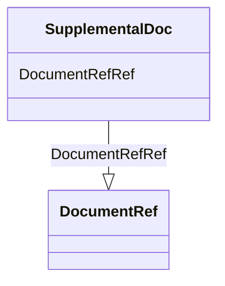

# Class: SupplementalDoc


_Supplemental data definitions_


URI: [odm:SupplementalDoc](http://www.cdisc.org/ns/odm/v2.0/SupplementalDoc)





<!-- no inheritance hierarchy -->


## Slots

| Name | Cardinality and Range | Description | Inheritance |
| ---  | --- | --- | --- |
| [DocumentRefRef](DocumentRefRef.md) | 0..* <br/> [DocumentRef](DocumentRef.md) | Links to a leaf element with the location of the document. | direct |


## Usages

| used by | used in | type | used |
| ---  | --- | --- | --- |
| [MetaDataVersion](MetaDataVersion.md) | [SupplementalDocRef](SupplementalDocRef.md) | range | [SupplementalDoc](SupplementalDoc.md) |


## See Also

* [https://wiki.cdisc.org/display/ODM2/SupplementalDoc](https://wiki.cdisc.org/display/ODM2/SupplementalDoc)

## Identifier and Mapping Information


### Schema Source


* from schema: http://www.cdisc.org/ns/odm/v2.0


## Mappings

| Mapping Type | Mapped Value |
| ---  | ---  |
| self | odm:SupplementalDoc |
| native | odm:SupplementalDoc |


## LinkML Source

<!-- TODO: investigate https://stackoverflow.com/questions/37606292/how-to-create-tabbed-code-blocks-in-mkdocs-or-sphinx -->

### Direct

<details>
```yaml
name: SupplementalDoc
description: Supplemental data definitions
from_schema: http://www.cdisc.org/ns/odm/v2.0
see_also:
- https://wiki.cdisc.org/display/ODM2/SupplementalDoc
slots:
- DocumentRefRef
slot_usage:
  DocumentRefRef:
    name: DocumentRefRef
    description: Links to a leaf element with the location of the document.
    multivalued: true
    domain_of:
    - AnnotatedCRF
    - SupplementalDoc
    - Origin
    - MethodDef
    - CommentDef
    range: DocumentRef
    inlined: true
    inlined_as_list: true
class_uri: odm:SupplementalDoc

```
</details>

### Induced

<details>
```yaml
name: SupplementalDoc
description: Supplemental data definitions
from_schema: http://www.cdisc.org/ns/odm/v2.0
see_also:
- https://wiki.cdisc.org/display/ODM2/SupplementalDoc
slot_usage:
  DocumentRefRef:
    name: DocumentRefRef
    description: Links to a leaf element with the location of the document.
    multivalued: true
    domain_of:
    - AnnotatedCRF
    - SupplementalDoc
    - Origin
    - MethodDef
    - CommentDef
    range: DocumentRef
    inlined: true
    inlined_as_list: true
attributes:
  DocumentRefRef:
    name: DocumentRefRef
    description: Links to a leaf element with the location of the document.
    from_schema: http://www.cdisc.org/ns/odm/v2.0
    rank: 1000
    multivalued: true
    identifier: false
    alias: DocumentRefRef
    owner: SupplementalDoc
    domain_of:
    - AnnotatedCRF
    - SupplementalDoc
    - Origin
    - MethodDef
    - CommentDef
    range: DocumentRef
    inlined: true
    inlined_as_list: true
class_uri: odm:SupplementalDoc

```
</details>