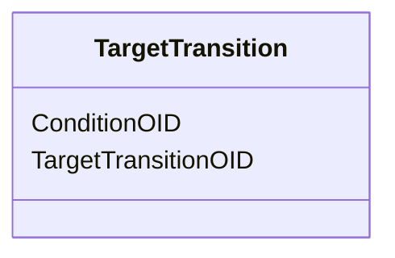

# Class: TargetTransition


_TargetTransition provides a reference to a Transition element that is the target of a branching._


URI: [odm:TargetTransition](http://www.cdisc.org/ns/odm/v2.0/TargetTransition)





<!-- no inheritance hierarchy -->


## Slots

| Name | Cardinality and Range | Description | Inheritance |
| ---  | --- | --- | --- |
| [TargetTransitionOID](TargetTransitionOID.md) | 1..1 <br/> [oidref](oidref.md) | Reference to the Transition that is one of the targets of the branching. | direct |
| [ConditionOID](ConditionOID.md) | 0..1 <br/> [oidref](oidref.md) | Reference to a ConditionDef defining the condition under which the transition... | direct |


## Usages

| used by | used in | type | used |
| ---  | --- | --- | --- |
| [Branching](Branching.md) | [TargetTransitionRef](TargetTransitionRef.md) | range | [TargetTransition](TargetTransition.md) |


## See Also

* [https://wiki.cdisc.org/display/ODM2/TargetTransition](https://wiki.cdisc.org/display/ODM2/TargetTransition)

## Identifier and Mapping Information


### Schema Source


* from schema: http://www.cdisc.org/ns/odm/v2.0


## Mappings

| Mapping Type | Mapped Value |
| ---  | ---  |
| self | odm:TargetTransition |
| native | odm:TargetTransition |


## LinkML Source

<!-- TODO: investigate https://stackoverflow.com/questions/37606292/how-to-create-tabbed-code-blocks-in-mkdocs-or-sphinx -->

### Direct

<details>
```yaml
name: TargetTransition
description: TargetTransition provides a reference to a Transition element that is
  the target of a branching.
from_schema: http://www.cdisc.org/ns/odm/v2.0
see_also:
- https://wiki.cdisc.org/display/ODM2/TargetTransition
slots:
- TargetTransitionOID
- ConditionOID
slot_usage:
  TargetTransitionOID:
    name: TargetTransitionOID
    description: Reference to the Transition that is one of the targets of the branching.
    comments:
    - 'Required

      range: oidref

      The TargetTransitionOID attibute must match the OID attribute of a Transition
      element in the Study/MetaDataVersion.'
    domain_of:
    - TargetTransition
    - DefaultTransition
    range: oidref
    required: true
  ConditionOID:
    name: ConditionOID
    description: Reference to a ConditionDef defining the condition under which the
      transition must be executed. The ConditionOID references a ConditionDef element
      defining a condition that needs to be evaluated at the time of entering the
      branching state. When the condition evaluates to true, the branch is entered.
    comments:
    - 'Required

      range: oidref

      The ConditionOID must match the OID attribute of a ConditionDef element in the
      Study/MetaDataVersion.'
    domain_of:
    - TargetTransition
    - Criterion
    range: oidref
class_uri: odm:TargetTransition

```
</details>

### Induced

<details>
```yaml
name: TargetTransition
description: TargetTransition provides a reference to a Transition element that is
  the target of a branching.
from_schema: http://www.cdisc.org/ns/odm/v2.0
see_also:
- https://wiki.cdisc.org/display/ODM2/TargetTransition
slot_usage:
  TargetTransitionOID:
    name: TargetTransitionOID
    description: Reference to the Transition that is one of the targets of the branching.
    comments:
    - 'Required

      range: oidref

      The TargetTransitionOID attibute must match the OID attribute of a Transition
      element in the Study/MetaDataVersion.'
    domain_of:
    - TargetTransition
    - DefaultTransition
    range: oidref
    required: true
  ConditionOID:
    name: ConditionOID
    description: Reference to a ConditionDef defining the condition under which the
      transition must be executed. The ConditionOID references a ConditionDef element
      defining a condition that needs to be evaluated at the time of entering the
      branching state. When the condition evaluates to true, the branch is entered.
    comments:
    - 'Required

      range: oidref

      The ConditionOID must match the OID attribute of a ConditionDef element in the
      Study/MetaDataVersion.'
    domain_of:
    - TargetTransition
    - Criterion
    range: oidref
attributes:
  TargetTransitionOID:
    name: TargetTransitionOID
    description: Reference to the Transition that is one of the targets of the branching.
    comments:
    - 'Required

      range: oidref

      The TargetTransitionOID attibute must match the OID attribute of a Transition
      element in the Study/MetaDataVersion.'
    from_schema: http://www.cdisc.org/ns/odm/v2.0
    rank: 1000
    alias: TargetTransitionOID
    owner: TargetTransition
    domain_of:
    - TargetTransition
    - DefaultTransition
    range: oidref
    required: true
  ConditionOID:
    name: ConditionOID
    description: Reference to a ConditionDef defining the condition under which the
      transition must be executed. The ConditionOID references a ConditionDef element
      defining a condition that needs to be evaluated at the time of entering the
      branching state. When the condition evaluates to true, the branch is entered.
    comments:
    - 'Required

      range: oidref

      The ConditionOID must match the OID attribute of a ConditionDef element in the
      Study/MetaDataVersion.'
    from_schema: http://www.cdisc.org/ns/odm/v2.0
    rank: 1000
    alias: ConditionOID
    owner: TargetTransition
    domain_of:
    - TargetTransition
    - Criterion
    range: oidref
class_uri: odm:TargetTransition

```
</details>