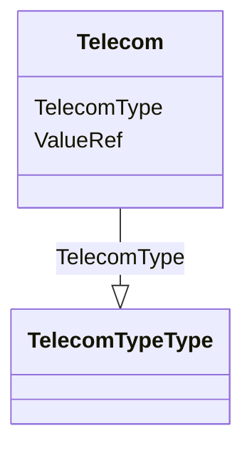

# Class: Telecom


_The telecommunication contacts points of a user, a location, or an organization. The Type attribute designates the type of contact._


URI: [odm:Telecom](http://www.cdisc.org/ns/odm/v2.0/Telecom)





<!-- no inheritance hierarchy -->


## Slots

| Name | Cardinality and Range | Description | Inheritance |
| ---  | --- | --- | --- |
| [TelecomType](TelecomType.md) | 1..1 <br/> [TelecomTypeType](TelecomTypeType.md) |  | direct |
| [ValueRef](ValueRef.md) | 1..1 <br/> [text](text.md) | Human-readable designation of the trial phase. | direct |


## Usages

| used by | used in | type | used |
| ---  | --- | --- | --- |
| [User](User.md) | [TelecomRef](TelecomRef.md) | range | [Telecom](Telecom.md) |
| [Organization](Organization.md) | [TelecomRef](TelecomRef.md) | range | [Telecom](Telecom.md) |
| [Location](Location.md) | [TelecomRef](TelecomRef.md) | range | [Telecom](Telecom.md) |


## See Also

* [https://wiki.cdisc.org/display/ODM2/Telecom](https://wiki.cdisc.org/display/ODM2/Telecom)

## Identifier and Mapping Information


### Schema Source


* from schema: http://www.cdisc.org/ns/odm/v2.0


## Mappings

| Mapping Type | Mapped Value |
| ---  | ---  |
| self | odm:Telecom |
| native | odm:Telecom |


## LinkML Source

<!-- TODO: investigate https://stackoverflow.com/questions/37606292/how-to-create-tabbed-code-blocks-in-mkdocs-or-sphinx -->

### Direct

<details>
```yaml
name: Telecom
description: The telecommunication contacts points of a user, a location, or an organization.
  The Type attribute designates the type of contact.
from_schema: http://www.cdisc.org/ns/odm/v2.0
see_also:
- https://wiki.cdisc.org/display/ODM2/Telecom
slots:
- TelecomType
- ValueRef
slot_usage:
  TelecomType:
    name: TelecomType
    comments:
    - 'Required

      enum values:(Email | Pager | Phone | Fax | SMS | URL | Other)

      Values are aligned with FHIR ContactPoint/System data element.'
    domain_of:
    - Telecom
    range: TelecomTypeType
    required: true
  ValueRef:
    name: ValueRef
    comments:
    - 'Required

      range:text'
    domain_of:
    - TrialPhase
    - ParameterValue
    - Telecom
    - ItemData
    - Query
    range: text
    required: true
class_uri: odm:Telecom

```
</details>

### Induced

<details>
```yaml
name: Telecom
description: The telecommunication contacts points of a user, a location, or an organization.
  The Type attribute designates the type of contact.
from_schema: http://www.cdisc.org/ns/odm/v2.0
see_also:
- https://wiki.cdisc.org/display/ODM2/Telecom
slot_usage:
  TelecomType:
    name: TelecomType
    comments:
    - 'Required

      enum values:(Email | Pager | Phone | Fax | SMS | URL | Other)

      Values are aligned with FHIR ContactPoint/System data element.'
    domain_of:
    - Telecom
    range: TelecomTypeType
    required: true
  ValueRef:
    name: ValueRef
    comments:
    - 'Required

      range:text'
    domain_of:
    - TrialPhase
    - ParameterValue
    - Telecom
    - ItemData
    - Query
    range: text
    required: true
attributes:
  TelecomType:
    name: TelecomType
    comments:
    - 'Required

      enum values:(Email | Pager | Phone | Fax | SMS | URL | Other)

      Values are aligned with FHIR ContactPoint/System data element.'
    from_schema: http://www.cdisc.org/ns/odm/v2.0
    rank: 1000
    alias: TelecomType
    owner: Telecom
    domain_of:
    - Telecom
    range: TelecomTypeType
    required: true
  ValueRef:
    name: ValueRef
    description: Human-readable designation of the trial phase.
    comments:
    - 'Required

      range:text'
    from_schema: http://www.cdisc.org/ns/odm/v2.0
    rank: 1000
    identifier: false
    alias: ValueRef
    owner: Telecom
    domain_of:
    - TrialPhase
    - ParameterValue
    - Telecom
    - ItemData
    - Query
    range: text
    required: true
class_uri: odm:Telecom

```
</details>