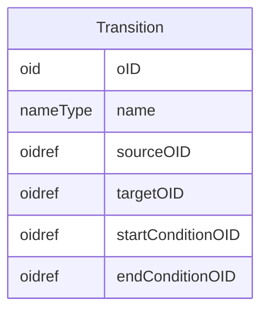

# Class: Transition

_A Transition defines a link between 2 structural elements in a workflow. When the execution of the transition is dependent upon a timing constraint that is either directly defined or calculated, a TransitionTimingConstraint must be defined, referencing the current Transition._


URI: [odm:Transition](http://www.cdisc.org/ns/odm/v2.0/Transition)





<!-- no inheritance hierarchy -->


## Slots

| Name | Cardinality* and Range | Description | Inheritance |
| ---  | --- | --- | --- |
| [oID](oID.md) | 1..1 <br/> [oid](oid.md) | Unique identifier for the Transition element. | direct |
| [name](name.md) | 1..1 <br/> [nameType](nameType.md) | Human readable name for the transition between two structural elements in a W... | direct |
| [sourceOID](sourceOID.md) | 1..1 <br/> [oidref](oidref.md) | References the definition of the source structural element for the transition... | direct |
| [targetOID](targetOID.md) | 1..1 <br/> [oidref](oidref.md) | References the definition of the target structural element for the transition... | direct |
| [startConditionOID](startConditionOID.md) | 0..1 <br/> [oidref](oidref.md) | The StartConditionOID references a ConditionDef specifying a condition that m... | direct |
| [endConditionOID](endConditionOID.md) | 0..1 <br/> [oidref](oidref.md) | The EndConditionOID references a ConditionDef defining the condition under wh... | direct |

_* See [LinkML documentation](https://linkml.io/linkml/schemas/slots.html#slot-cardinality) for cardinality definitions._


## Usages

| used by | used in | type | used |
| ---  | --- | --- | --- |
| [WorkflowDef](WorkflowDef.md) | [transition](transition.md) | range | [Transition](Transition.md) |


## See Also

* [https://wiki.cdisc.org/display/PUB/Transition](https://wiki.cdisc.org/display/PUB/Transition)

## Identifier and Mapping Information


### Schema Source


* from schema: http://www.cdisc.org/ns/odm/v2.0


## Mappings

| Mapping Type | Mapped Value |
| ---  | ---  |
| self | odm:Transition |
| native | odm:Transition |


## LinkML Source

<!-- TODO: investigate https://stackoverflow.com/questions/37606292/how-to-create-tabbed-code-blocks-in-mkdocs-or-sphinx -->

### Direct

<details>
```yaml
name: Transition
description: A Transition defines a link between 2 structural elements in a workflow.
  When the execution of the transition is dependent upon a timing constraint that
  is either directly defined or calculated, a TransitionTimingConstraint must be defined,
  referencing the current Transition.
from_schema: http://www.cdisc.org/ns/odm/v2.0
see_also:
- https://wiki.cdisc.org/display/PUB/Transition
rank: 1000
slots:
- oID
- name
- sourceOID
- targetOID
- startConditionOID
- endConditionOID
slot_usage:
  oID:
    name: oID
    description: Unique identifier for the Transition element.
    comments:
    - 'Required

      range: oid

      The Transition/@OID values must be unique within a study.'
    domain_of:
    - Study
    - MetaDataVersion
    - Standard
    - ValueListDef
    - WhereClauseDef
    - StudyEventGroupDef
    - StudyEventDef
    - ItemGroupDef
    - ItemDef
    - CodeList
    - MethodDef
    - ConditionDef
    - CommentDef
    - StudyIndication
    - StudyIntervention
    - StudyObjective
    - StudyEndPoint
    - StudyTargetPopulation
    - StudyEstimand
    - Arm
    - Epoch
    - StudyParameter
    - StudyTiming
    - TransitionTimingConstraint
    - AbsoluteTimingConstraint
    - RelativeTimingConstraint
    - DurationTimingConstraint
    - WorkflowDef
    - Transition
    - Branching
    - Criterion
    - User
    - Organization
    - Location
    - SignatureDef
    - Query
    range: oid
    required: true
  name:
    name: name
    description: Human readable name for the transition between two structural elements
      in a WorkflowDef element.
    comments:
    - 'Required

      range: name

      The Transition/@Name must be unique within a study.'
    domain_of:
    - Alias
    - MetaDataVersion
    - Standard
    - StudyEventGroupDef
    - StudyEventDef
    - ItemGroupDef
    - Class
    - SubClass
    - SourceItem
    - Resource
    - ItemDef
    - CodeList
    - MethodDef
    - Parameter
    - ReturnValue
    - ConditionDef
    - StudyObjective
    - StudyEndPoint
    - StudyTargetPopulation
    - StudyEstimand
    - Arm
    - Epoch
    - StudyTiming
    - TransitionTimingConstraint
    - AbsoluteTimingConstraint
    - RelativeTimingConstraint
    - DurationTimingConstraint
    - WorkflowDef
    - Transition
    - Branching
    - Criterion
    - Organization
    - Location
    - Query
    range: nameType
    required: true
  sourceOID:
    name: sourceOID
    description: References the definition of the source structural element for the
      transition. The structural element may be a StudyEventGroupDef, StudyEventDef,
      ItemGroupDef, ItemDef, or Branching element.
    comments:
    - 'Required

      range: oidref

      The SourceOID must match the OID attribute of a StudyEventGroupDef, StudyEventDef,
      ItemGroupDef, ItemDef or Branching child element of the MetaDataVersion parent
      element of the WorkflowDef .'
    domain_of:
    - Transition
    range: oidref
    required: true
  targetOID:
    name: targetOID
    description: References the definition of the target structural element for the
      transition. The structural element may be a StudyEventGroupDef, StudyEventDef,
      ItemGroupDef, ItemDef, or Branching element. The latter will be used when there
      is a branching definition necessary as a result of the transition.
    comments:
    - 'Required

      range: oidref

      The TargetOID must match the OID attribute of a StudyEventGroupDef, StudyEventDef,
      ItemGroupDef, ItemDef or Branching child element of the MetaDataVersion parent
      element of the WorkflowDef .'
    domain_of:
    - Transition
    range: oidref
    required: true
  startConditionOID:
    name: startConditionOID
    description: The StartConditionOID references a ConditionDef specifying a condition
      that must be met for the transition to start. For example, if the source structural
      element is a StudyEventGroupDef describing the activities for study screening
      and the target structural element is a StudyEventGroupDef describing study enrollment,
      the ConditionDef referenced by the StartConditionOID specifies the criteria
      that must be met for a subject to transition from screening to enrollment.
    comments:
    - 'Optional

      range: oidref

      The StartConditionOID must match the OID attribute of a ConditionDef child element
      of the MetaDataVersion parent element of the WorkflowDef .'
    domain_of:
    - Transition
    range: oidref
  endConditionOID:
    name: endConditionOID
    description: The EndConditionOID references a ConditionDef defining the condition
      under which the transition can be completed. As long as the condition is not
      met, the transition to the next actitivity or event must be considered to be
      temporary blocked. When the target structural element can be considered to be
      a "visit," the condition can be regarded as a visit entry criterion.
    comments:
    - 'Optional

      range: oidref

      The EndConditionOID must match the OID attribute of a ConditionDef child element
      of the MetaDataVersion parent element of the WorkflowDef .'
    domain_of:
    - Transition
    range: oidref
class_uri: odm:Transition

```
</details>

### Induced

<details>
```yaml
name: Transition
description: A Transition defines a link between 2 structural elements in a workflow.
  When the execution of the transition is dependent upon a timing constraint that
  is either directly defined or calculated, a TransitionTimingConstraint must be defined,
  referencing the current Transition.
from_schema: http://www.cdisc.org/ns/odm/v2.0
see_also:
- https://wiki.cdisc.org/display/PUB/Transition
rank: 1000
slot_usage:
  oID:
    name: oID
    description: Unique identifier for the Transition element.
    comments:
    - 'Required

      range: oid

      The Transition/@OID values must be unique within a study.'
    domain_of:
    - Study
    - MetaDataVersion
    - Standard
    - ValueListDef
    - WhereClauseDef
    - StudyEventGroupDef
    - StudyEventDef
    - ItemGroupDef
    - ItemDef
    - CodeList
    - MethodDef
    - ConditionDef
    - CommentDef
    - StudyIndication
    - StudyIntervention
    - StudyObjective
    - StudyEndPoint
    - StudyTargetPopulation
    - StudyEstimand
    - Arm
    - Epoch
    - StudyParameter
    - StudyTiming
    - TransitionTimingConstraint
    - AbsoluteTimingConstraint
    - RelativeTimingConstraint
    - DurationTimingConstraint
    - WorkflowDef
    - Transition
    - Branching
    - Criterion
    - User
    - Organization
    - Location
    - SignatureDef
    - Query
    range: oid
    required: true
  name:
    name: name
    description: Human readable name for the transition between two structural elements
      in a WorkflowDef element.
    comments:
    - 'Required

      range: name

      The Transition/@Name must be unique within a study.'
    domain_of:
    - Alias
    - MetaDataVersion
    - Standard
    - StudyEventGroupDef
    - StudyEventDef
    - ItemGroupDef
    - Class
    - SubClass
    - SourceItem
    - Resource
    - ItemDef
    - CodeList
    - MethodDef
    - Parameter
    - ReturnValue
    - ConditionDef
    - StudyObjective
    - StudyEndPoint
    - StudyTargetPopulation
    - StudyEstimand
    - Arm
    - Epoch
    - StudyTiming
    - TransitionTimingConstraint
    - AbsoluteTimingConstraint
    - RelativeTimingConstraint
    - DurationTimingConstraint
    - WorkflowDef
    - Transition
    - Branching
    - Criterion
    - Organization
    - Location
    - Query
    range: nameType
    required: true
  sourceOID:
    name: sourceOID
    description: References the definition of the source structural element for the
      transition. The structural element may be a StudyEventGroupDef, StudyEventDef,
      ItemGroupDef, ItemDef, or Branching element.
    comments:
    - 'Required

      range: oidref

      The SourceOID must match the OID attribute of a StudyEventGroupDef, StudyEventDef,
      ItemGroupDef, ItemDef or Branching child element of the MetaDataVersion parent
      element of the WorkflowDef .'
    domain_of:
    - Transition
    range: oidref
    required: true
  targetOID:
    name: targetOID
    description: References the definition of the target structural element for the
      transition. The structural element may be a StudyEventGroupDef, StudyEventDef,
      ItemGroupDef, ItemDef, or Branching element. The latter will be used when there
      is a branching definition necessary as a result of the transition.
    comments:
    - 'Required

      range: oidref

      The TargetOID must match the OID attribute of a StudyEventGroupDef, StudyEventDef,
      ItemGroupDef, ItemDef or Branching child element of the MetaDataVersion parent
      element of the WorkflowDef .'
    domain_of:
    - Transition
    range: oidref
    required: true
  startConditionOID:
    name: startConditionOID
    description: The StartConditionOID references a ConditionDef specifying a condition
      that must be met for the transition to start. For example, if the source structural
      element is a StudyEventGroupDef describing the activities for study screening
      and the target structural element is a StudyEventGroupDef describing study enrollment,
      the ConditionDef referenced by the StartConditionOID specifies the criteria
      that must be met for a subject to transition from screening to enrollment.
    comments:
    - 'Optional

      range: oidref

      The StartConditionOID must match the OID attribute of a ConditionDef child element
      of the MetaDataVersion parent element of the WorkflowDef .'
    domain_of:
    - Transition
    range: oidref
  endConditionOID:
    name: endConditionOID
    description: The EndConditionOID references a ConditionDef defining the condition
      under which the transition can be completed. As long as the condition is not
      met, the transition to the next actitivity or event must be considered to be
      temporary blocked. When the target structural element can be considered to be
      a "visit," the condition can be regarded as a visit entry criterion.
    comments:
    - 'Optional

      range: oidref

      The EndConditionOID must match the OID attribute of a ConditionDef child element
      of the MetaDataVersion parent element of the WorkflowDef .'
    domain_of:
    - Transition
    range: oidref
attributes:
  oID:
    name: oID
    description: Unique identifier for the Transition element.
    comments:
    - 'Required

      range: oid

      The Transition/@OID values must be unique within a study.'
    from_schema: http://www.cdisc.org/ns/odm/v2.0
    rank: 1000
    identifier: true
    alias: oID
    owner: Transition
    domain_of:
    - Study
    - MetaDataVersion
    - Standard
    - ValueListDef
    - WhereClauseDef
    - StudyEventGroupDef
    - StudyEventDef
    - ItemGroupDef
    - ItemDef
    - CodeList
    - MethodDef
    - ConditionDef
    - CommentDef
    - StudyIndication
    - StudyIntervention
    - StudyObjective
    - StudyEndPoint
    - StudyTargetPopulation
    - StudyEstimand
    - Arm
    - Epoch
    - StudyParameter
    - StudyTiming
    - TransitionTimingConstraint
    - AbsoluteTimingConstraint
    - RelativeTimingConstraint
    - DurationTimingConstraint
    - WorkflowDef
    - Transition
    - Branching
    - Criterion
    - User
    - Organization
    - Location
    - SignatureDef
    - Query
    range: oid
    required: true
  name:
    name: name
    description: Human readable name for the transition between two structural elements
      in a WorkflowDef element.
    comments:
    - 'Required

      range: name

      The Transition/@Name must be unique within a study.'
    from_schema: http://www.cdisc.org/ns/odm/v2.0
    rank: 1000
    alias: name
    owner: Transition
    domain_of:
    - Alias
    - MetaDataVersion
    - Standard
    - StudyEventGroupDef
    - StudyEventDef
    - ItemGroupDef
    - Class
    - SubClass
    - SourceItem
    - Resource
    - ItemDef
    - CodeList
    - MethodDef
    - Parameter
    - ReturnValue
    - ConditionDef
    - StudyObjective
    - StudyEndPoint
    - StudyTargetPopulation
    - StudyEstimand
    - Arm
    - Epoch
    - StudyTiming
    - TransitionTimingConstraint
    - AbsoluteTimingConstraint
    - RelativeTimingConstraint
    - DurationTimingConstraint
    - WorkflowDef
    - Transition
    - Branching
    - Criterion
    - Organization
    - Location
    - Query
    range: nameType
    required: true
  sourceOID:
    name: sourceOID
    description: References the definition of the source structural element for the
      transition. The structural element may be a StudyEventGroupDef, StudyEventDef,
      ItemGroupDef, ItemDef, or Branching element.
    comments:
    - 'Required

      range: oidref

      The SourceOID must match the OID attribute of a StudyEventGroupDef, StudyEventDef,
      ItemGroupDef, ItemDef or Branching child element of the MetaDataVersion parent
      element of the WorkflowDef .'
    from_schema: http://www.cdisc.org/ns/odm/v2.0
    rank: 1000
    alias: sourceOID
    owner: Transition
    domain_of:
    - Transition
    range: oidref
    required: true
  targetOID:
    name: targetOID
    description: References the definition of the target structural element for the
      transition. The structural element may be a StudyEventGroupDef, StudyEventDef,
      ItemGroupDef, ItemDef, or Branching element. The latter will be used when there
      is a branching definition necessary as a result of the transition.
    comments:
    - 'Required

      range: oidref

      The TargetOID must match the OID attribute of a StudyEventGroupDef, StudyEventDef,
      ItemGroupDef, ItemDef or Branching child element of the MetaDataVersion parent
      element of the WorkflowDef .'
    from_schema: http://www.cdisc.org/ns/odm/v2.0
    rank: 1000
    alias: targetOID
    owner: Transition
    domain_of:
    - Transition
    range: oidref
    required: true
  startConditionOID:
    name: startConditionOID
    description: The StartConditionOID references a ConditionDef specifying a condition
      that must be met for the transition to start. For example, if the source structural
      element is a StudyEventGroupDef describing the activities for study screening
      and the target structural element is a StudyEventGroupDef describing study enrollment,
      the ConditionDef referenced by the StartConditionOID specifies the criteria
      that must be met for a subject to transition from screening to enrollment.
    comments:
    - 'Optional

      range: oidref

      The StartConditionOID must match the OID attribute of a ConditionDef child element
      of the MetaDataVersion parent element of the WorkflowDef .'
    from_schema: http://www.cdisc.org/ns/odm/v2.0
    rank: 1000
    alias: startConditionOID
    owner: Transition
    domain_of:
    - Transition
    range: oidref
  endConditionOID:
    name: endConditionOID
    description: The EndConditionOID references a ConditionDef defining the condition
      under which the transition can be completed. As long as the condition is not
      met, the transition to the next actitivity or event must be considered to be
      temporary blocked. When the target structural element can be considered to be
      a "visit," the condition can be regarded as a visit entry criterion.
    comments:
    - 'Optional

      range: oidref

      The EndConditionOID must match the OID attribute of a ConditionDef child element
      of the MetaDataVersion parent element of the WorkflowDef .'
    from_schema: http://www.cdisc.org/ns/odm/v2.0
    rank: 1000
    alias: endConditionOID
    owner: Transition
    domain_of:
    - Transition
    range: oidref
class_uri: odm:Transition

```
</details>