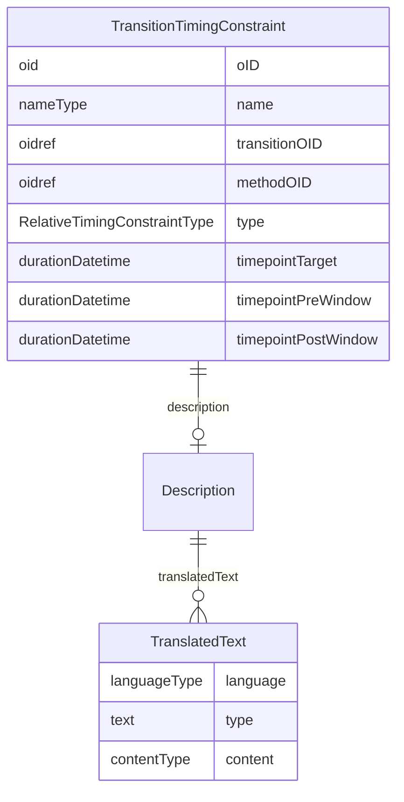

# Class: TransitionTimingConstraint

_The TransitionTimingConstraint element defines a timing constraint on a transition between structural elements as defined in a workflow. As such, it is a non-blocking constraint. This means that the transition is set on hold as long as the timing condition is not fulfilled, and is executed as soon as the timing condition is fulfilled._


URI: [odm:TransitionTimingConstraint](http://www.cdisc.org/ns/odm/v2.0/TransitionTimingConstraint)





<!-- no inheritance hierarchy -->


## Slots

| Name | Cardinality* and Range | Description | Inheritance |
| ---  | --- | --- | --- |
| [oID](oID.md) | 1..1 <br/> [oid](oid.md) | Unique identifier. | direct |
| [name](name.md) | 1..1 <br/> [nameType](nameType.md) | Human-readable name. | direct |
| [transitionOID](transitionOID.md) | 1..1 <br/> [oidref](oidref.md) | References the workflow Transition on which the timing constraint must be exe... | direct |
| [methodOID](methodOID.md) | 0..1 <br/> [oidref](oidref.md) | R eferences a MethodDef that returns a durationDatetime. Use of a method allo... | direct |
| [type](type.md) | 0..1 <br/> [RelativeTimingConstraintType](RelativeTimingConstraintType.md) | Defines how the timing is to be defined between the two activities, starting ... | direct |
| [timepointTarget](timepointTarget.md) | 1..1 <br/> [durationDatetime](durationDatetime.md) | The planned time between the 2 activities defined by the transition in the wo... | direct |
| [timepointPreWindow](timepointPreWindow.md) | 0..1 <br/> [durationDatetime](durationDatetime.md) | Specifies the amount of time prior to the TimepointTarget, the time between t... | direct |
| [timepointPostWindow](timepointPostWindow.md) | 0..1 <br/> [durationDatetime](durationDatetime.md) | Specifies the amount of time after the TimepointTarget, the time between the ... | direct |
| [description](description.md) | 0..1 <br/> [Description](Description.md) | Description reference: A free-text description of the containing metadata com... | direct |

_* See [LinkML documentation](https://linkml.io/linkml/schemas/slots.html#slot-cardinality) for cardinality definitions._


## Usages

| used by | used in | type | used |
| ---  | --- | --- | --- |
| [StudyTiming](StudyTiming.md) | [transitionTimingConstraint](transitionTimingConstraint.md) | range | [TransitionTimingConstraint](TransitionTimingConstraint.md) |


## See Also

* [https://wiki.cdisc.org/display/PUB/TransitionTimingConstraint](https://wiki.cdisc.org/display/PUB/TransitionTimingConstraint)

## Identifier and Mapping Information


### Schema Source


* from schema: http://www.cdisc.org/ns/odm/v2.0


## Mappings

| Mapping Type | Mapped Value |
| ---  | ---  |
| self | odm:TransitionTimingConstraint |
| native | odm:TransitionTimingConstraint |


## LinkML Source

<!-- TODO: investigate https://stackoverflow.com/questions/37606292/how-to-create-tabbed-code-blocks-in-mkdocs-or-sphinx -->

### Direct

<details>
```yaml
name: TransitionTimingConstraint
description: The TransitionTimingConstraint element defines a timing constraint on
  a transition between structural elements as defined in a workflow. As such, it is
  a non-blocking constraint. This means that the transition is set on hold as long
  as the timing condition is not fulfilled, and is executed as soon as the timing
  condition is fulfilled.
from_schema: http://www.cdisc.org/ns/odm/v2.0
see_also:
- https://wiki.cdisc.org/display/PUB/TransitionTimingConstraint
rank: 1000
slots:
- oID
- name
- transitionOID
- methodOID
- type
- timepointTarget
- timepointPreWindow
- timepointPostWindow
- description
slot_usage:
  oID:
    name: oID
    description: Unique identifier.
    comments:
    - 'Required

      range: oid'
    domain_of:
    - Study
    - MetaDataVersion
    - Standard
    - ValueListDef
    - WhereClauseDef
    - StudyEventGroupDef
    - StudyEventDef
    - ItemGroupDef
    - ItemDef
    - CodeList
    - MethodDef
    - ConditionDef
    - CommentDef
    - StudyIndication
    - StudyIntervention
    - StudyObjective
    - StudyEndPoint
    - StudyTargetPopulation
    - StudyEstimand
    - Arm
    - Epoch
    - StudyParameter
    - StudyTiming
    - TransitionTimingConstraint
    - AbsoluteTimingConstraint
    - RelativeTimingConstraint
    - DurationTimingConstraint
    - WorkflowDef
    - Transition
    - Branching
    - Criterion
    - User
    - Organization
    - Location
    - SignatureDef
    - Query
    range: oid
    required: true
  name:
    name: name
    description: Human-readable name.
    comments:
    - 'Required

      range: name'
    domain_of:
    - Alias
    - MetaDataVersion
    - Standard
    - StudyEventGroupDef
    - StudyEventDef
    - ItemGroupDef
    - Class
    - SubClass
    - SourceItem
    - Resource
    - ItemDef
    - CodeList
    - MethodDef
    - Parameter
    - ReturnValue
    - ConditionDef
    - StudyObjective
    - StudyEndPoint
    - StudyTargetPopulation
    - StudyEstimand
    - Arm
    - Epoch
    - StudyTiming
    - TransitionTimingConstraint
    - AbsoluteTimingConstraint
    - RelativeTimingConstraint
    - DurationTimingConstraint
    - WorkflowDef
    - Transition
    - Branching
    - Criterion
    - Organization
    - Location
    - Query
    range: nameType
    required: true
  transitionOID:
    name: transitionOID
    description: References the workflow Transition on which the timing constraint
      must be executed.
    comments:
    - 'Required

      range: oidref'
    domain_of:
    - TransitionTimingConstraint
    range: oidref
    required: true
  methodOID:
    name: methodOID
    description: R eferences a MethodDef that returns a durationDatetime. Use of a
      method allows timings that depend on other pieces of information, or complex
      timing calculations.
    comments:
    - 'Conditional

      range: oidref

      Must match the OID attribute of a MethodDef element in this Study/MetaDataVersion.
      The MethodSignature for the referenced MethodDef must identify the input parameters
      and a return value DateType of durationDatetime. If the returned value for the
      method is a "zero time duration" (i.e., "P0D", "PT0H", or "PT0S"), the transition
      must be executed immediately, or within the provided time window, when provided.
      Either the TimepointTarget or the MethodOID must be provided - not both.'
    domain_of:
    - ItemGroupRef
    - ItemRef
    - TransitionTimingConstraint
    range: oidref
  type:
    name: type
    description: Defines how the timing is to be defined between the two activities,
      starting from the start or the end of the source activity, and ending at the
      start or the end of the target activity.
    comments:
    - 'Optional

      enum values: (StartToStart, StartToFinish, FinishToStart, FinishToFinish)

      If not provided, StartToStart is assumed.'
    domain_of:
    - TranslatedText
    - PDFPageRef
    - Standard
    - StudyEventDef
    - ItemGroupDef
    - Origin
    - Resource
    - MethodDef
    - StudyEndPoint
    - TransitionTimingConstraint
    - RelativeTimingConstraint
    - Branching
    - Organization
    - Query
    range: RelativeTimingConstraintType
  timepointTarget:
    name: timepointTarget
    description: The planned time between the 2 activities defined by the transition
      in the workflow.
    comments:
    - 'Conditional

      range: durationDatetime

      Must be expressed as an ISO 8601 duration. Either the TimepointTarget or the
      MethodOID must be provided - not both. If the value is a "zero time duration"
      (i.e., "P0D", "PT0H", or "PT0S"), the transition must be executed immediately,
      or within the provided time window, when provided.'
    domain_of:
    - TransitionTimingConstraint
    - AbsoluteTimingConstraint
    range: durationDatetime
    required: true
  timepointPreWindow:
    name: timepointPreWindow
    description: Specifies the amount of time prior to the TimepointTarget, the time
      between the two activities, may be shortened.
    comments:
    - 'Optional

      range: durationDatetime

      Must be expressed as an ISO 8601 duration.'
    domain_of:
    - TransitionTimingConstraint
    - AbsoluteTimingConstraint
    - RelativeTimingConstraint
    range: durationDatetime
  timepointPostWindow:
    name: timepointPostWindow
    description: Specifies the amount of time after the TimepointTarget, the time
      between the two activities, may be lengthened.
    comments:
    - 'Optional

      range: durationDatetime

      Must be expressed as an ISO 8601 duration.'
    domain_of:
    - TransitionTimingConstraint
    - AbsoluteTimingConstraint
    - RelativeTimingConstraint
    range: durationDatetime
  description:
    name: description
    domain_of:
    - Study
    - MetaDataVersion
    - ValueListDef
    - StudyEventGroupRef
    - StudyEventGroupDef
    - StudyEventDef
    - ItemGroupDef
    - Origin
    - ItemDef
    - CodeList
    - CodeListItem
    - MethodDef
    - ConditionDef
    - CommentDef
    - Protocol
    - StudyStructure
    - TrialPhase
    - StudyIndication
    - StudyIntervention
    - StudyObjective
    - StudyEndPoint
    - StudyTargetPopulation
    - StudyEstimand
    - IntercurrentEvent
    - SummaryMeasure
    - Arm
    - Epoch
    - TransitionTimingConstraint
    - AbsoluteTimingConstraint
    - RelativeTimingConstraint
    - DurationTimingConstraint
    - WorkflowDef
    - Criterion
    - Organization
    - Location
    - ODMFileMetadata
    range: Description
    maximum_cardinality: 1
class_uri: odm:TransitionTimingConstraint

```
</details>

### Induced

<details>
```yaml
name: TransitionTimingConstraint
description: The TransitionTimingConstraint element defines a timing constraint on
  a transition between structural elements as defined in a workflow. As such, it is
  a non-blocking constraint. This means that the transition is set on hold as long
  as the timing condition is not fulfilled, and is executed as soon as the timing
  condition is fulfilled.
from_schema: http://www.cdisc.org/ns/odm/v2.0
see_also:
- https://wiki.cdisc.org/display/PUB/TransitionTimingConstraint
rank: 1000
slot_usage:
  oID:
    name: oID
    description: Unique identifier.
    comments:
    - 'Required

      range: oid'
    domain_of:
    - Study
    - MetaDataVersion
    - Standard
    - ValueListDef
    - WhereClauseDef
    - StudyEventGroupDef
    - StudyEventDef
    - ItemGroupDef
    - ItemDef
    - CodeList
    - MethodDef
    - ConditionDef
    - CommentDef
    - StudyIndication
    - StudyIntervention
    - StudyObjective
    - StudyEndPoint
    - StudyTargetPopulation
    - StudyEstimand
    - Arm
    - Epoch
    - StudyParameter
    - StudyTiming
    - TransitionTimingConstraint
    - AbsoluteTimingConstraint
    - RelativeTimingConstraint
    - DurationTimingConstraint
    - WorkflowDef
    - Transition
    - Branching
    - Criterion
    - User
    - Organization
    - Location
    - SignatureDef
    - Query
    range: oid
    required: true
  name:
    name: name
    description: Human-readable name.
    comments:
    - 'Required

      range: name'
    domain_of:
    - Alias
    - MetaDataVersion
    - Standard
    - StudyEventGroupDef
    - StudyEventDef
    - ItemGroupDef
    - Class
    - SubClass
    - SourceItem
    - Resource
    - ItemDef
    - CodeList
    - MethodDef
    - Parameter
    - ReturnValue
    - ConditionDef
    - StudyObjective
    - StudyEndPoint
    - StudyTargetPopulation
    - StudyEstimand
    - Arm
    - Epoch
    - StudyTiming
    - TransitionTimingConstraint
    - AbsoluteTimingConstraint
    - RelativeTimingConstraint
    - DurationTimingConstraint
    - WorkflowDef
    - Transition
    - Branching
    - Criterion
    - Organization
    - Location
    - Query
    range: nameType
    required: true
  transitionOID:
    name: transitionOID
    description: References the workflow Transition on which the timing constraint
      must be executed.
    comments:
    - 'Required

      range: oidref'
    domain_of:
    - TransitionTimingConstraint
    range: oidref
    required: true
  methodOID:
    name: methodOID
    description: R eferences a MethodDef that returns a durationDatetime. Use of a
      method allows timings that depend on other pieces of information, or complex
      timing calculations.
    comments:
    - 'Conditional

      range: oidref

      Must match the OID attribute of a MethodDef element in this Study/MetaDataVersion.
      The MethodSignature for the referenced MethodDef must identify the input parameters
      and a return value DateType of durationDatetime. If the returned value for the
      method is a "zero time duration" (i.e., "P0D", "PT0H", or "PT0S"), the transition
      must be executed immediately, or within the provided time window, when provided.
      Either the TimepointTarget or the MethodOID must be provided - not both.'
    domain_of:
    - ItemGroupRef
    - ItemRef
    - TransitionTimingConstraint
    range: oidref
  type:
    name: type
    description: Defines how the timing is to be defined between the two activities,
      starting from the start or the end of the source activity, and ending at the
      start or the end of the target activity.
    comments:
    - 'Optional

      enum values: (StartToStart, StartToFinish, FinishToStart, FinishToFinish)

      If not provided, StartToStart is assumed.'
    domain_of:
    - TranslatedText
    - PDFPageRef
    - Standard
    - StudyEventDef
    - ItemGroupDef
    - Origin
    - Resource
    - MethodDef
    - StudyEndPoint
    - TransitionTimingConstraint
    - RelativeTimingConstraint
    - Branching
    - Organization
    - Query
    range: RelativeTimingConstraintType
  timepointTarget:
    name: timepointTarget
    description: The planned time between the 2 activities defined by the transition
      in the workflow.
    comments:
    - 'Conditional

      range: durationDatetime

      Must be expressed as an ISO 8601 duration. Either the TimepointTarget or the
      MethodOID must be provided - not both. If the value is a "zero time duration"
      (i.e., "P0D", "PT0H", or "PT0S"), the transition must be executed immediately,
      or within the provided time window, when provided.'
    domain_of:
    - TransitionTimingConstraint
    - AbsoluteTimingConstraint
    range: durationDatetime
    required: true
  timepointPreWindow:
    name: timepointPreWindow
    description: Specifies the amount of time prior to the TimepointTarget, the time
      between the two activities, may be shortened.
    comments:
    - 'Optional

      range: durationDatetime

      Must be expressed as an ISO 8601 duration.'
    domain_of:
    - TransitionTimingConstraint
    - AbsoluteTimingConstraint
    - RelativeTimingConstraint
    range: durationDatetime
  timepointPostWindow:
    name: timepointPostWindow
    description: Specifies the amount of time after the TimepointTarget, the time
      between the two activities, may be lengthened.
    comments:
    - 'Optional

      range: durationDatetime

      Must be expressed as an ISO 8601 duration.'
    domain_of:
    - TransitionTimingConstraint
    - AbsoluteTimingConstraint
    - RelativeTimingConstraint
    range: durationDatetime
  description:
    name: description
    domain_of:
    - Study
    - MetaDataVersion
    - ValueListDef
    - StudyEventGroupRef
    - StudyEventGroupDef
    - StudyEventDef
    - ItemGroupDef
    - Origin
    - ItemDef
    - CodeList
    - CodeListItem
    - MethodDef
    - ConditionDef
    - CommentDef
    - Protocol
    - StudyStructure
    - TrialPhase
    - StudyIndication
    - StudyIntervention
    - StudyObjective
    - StudyEndPoint
    - StudyTargetPopulation
    - StudyEstimand
    - IntercurrentEvent
    - SummaryMeasure
    - Arm
    - Epoch
    - TransitionTimingConstraint
    - AbsoluteTimingConstraint
    - RelativeTimingConstraint
    - DurationTimingConstraint
    - WorkflowDef
    - Criterion
    - Organization
    - Location
    - ODMFileMetadata
    range: Description
    maximum_cardinality: 1
attributes:
  oID:
    name: oID
    description: Unique identifier.
    comments:
    - 'Required

      range: oid'
    from_schema: http://www.cdisc.org/ns/odm/v2.0
    rank: 1000
    identifier: true
    alias: oID
    owner: TransitionTimingConstraint
    domain_of:
    - Study
    - MetaDataVersion
    - Standard
    - ValueListDef
    - WhereClauseDef
    - StudyEventGroupDef
    - StudyEventDef
    - ItemGroupDef
    - ItemDef
    - CodeList
    - MethodDef
    - ConditionDef
    - CommentDef
    - StudyIndication
    - StudyIntervention
    - StudyObjective
    - StudyEndPoint
    - StudyTargetPopulation
    - StudyEstimand
    - Arm
    - Epoch
    - StudyParameter
    - StudyTiming
    - TransitionTimingConstraint
    - AbsoluteTimingConstraint
    - RelativeTimingConstraint
    - DurationTimingConstraint
    - WorkflowDef
    - Transition
    - Branching
    - Criterion
    - User
    - Organization
    - Location
    - SignatureDef
    - Query
    range: oid
    required: true
  name:
    name: name
    description: Human-readable name.
    comments:
    - 'Required

      range: name'
    from_schema: http://www.cdisc.org/ns/odm/v2.0
    rank: 1000
    alias: name
    owner: TransitionTimingConstraint
    domain_of:
    - Alias
    - MetaDataVersion
    - Standard
    - StudyEventGroupDef
    - StudyEventDef
    - ItemGroupDef
    - Class
    - SubClass
    - SourceItem
    - Resource
    - ItemDef
    - CodeList
    - MethodDef
    - Parameter
    - ReturnValue
    - ConditionDef
    - StudyObjective
    - StudyEndPoint
    - StudyTargetPopulation
    - StudyEstimand
    - Arm
    - Epoch
    - StudyTiming
    - TransitionTimingConstraint
    - AbsoluteTimingConstraint
    - RelativeTimingConstraint
    - DurationTimingConstraint
    - WorkflowDef
    - Transition
    - Branching
    - Criterion
    - Organization
    - Location
    - Query
    range: nameType
    required: true
  transitionOID:
    name: transitionOID
    description: References the workflow Transition on which the timing constraint
      must be executed.
    comments:
    - 'Required

      range: oidref'
    from_schema: http://www.cdisc.org/ns/odm/v2.0
    rank: 1000
    alias: transitionOID
    owner: TransitionTimingConstraint
    domain_of:
    - TransitionTimingConstraint
    range: oidref
    required: true
  methodOID:
    name: methodOID
    description: R eferences a MethodDef that returns a durationDatetime. Use of a
      method allows timings that depend on other pieces of information, or complex
      timing calculations.
    comments:
    - 'Conditional

      range: oidref

      Must match the OID attribute of a MethodDef element in this Study/MetaDataVersion.
      The MethodSignature for the referenced MethodDef must identify the input parameters
      and a return value DateType of durationDatetime. If the returned value for the
      method is a "zero time duration" (i.e., "P0D", "PT0H", or "PT0S"), the transition
      must be executed immediately, or within the provided time window, when provided.
      Either the TimepointTarget or the MethodOID must be provided - not both.'
    from_schema: http://www.cdisc.org/ns/odm/v2.0
    rank: 1000
    alias: methodOID
    owner: TransitionTimingConstraint
    domain_of:
    - ItemGroupRef
    - ItemRef
    - TransitionTimingConstraint
    range: oidref
  type:
    name: type
    description: Defines how the timing is to be defined between the two activities,
      starting from the start or the end of the source activity, and ending at the
      start or the end of the target activity.
    comments:
    - 'Optional

      enum values: (StartToStart, StartToFinish, FinishToStart, FinishToFinish)

      If not provided, StartToStart is assumed.'
    from_schema: http://www.cdisc.org/ns/odm/v2.0
    rank: 1000
    alias: type
    owner: TransitionTimingConstraint
    domain_of:
    - TranslatedText
    - PDFPageRef
    - Standard
    - StudyEventDef
    - ItemGroupDef
    - Origin
    - Resource
    - MethodDef
    - StudyEndPoint
    - TransitionTimingConstraint
    - RelativeTimingConstraint
    - Branching
    - Organization
    - Query
    range: RelativeTimingConstraintType
  timepointTarget:
    name: timepointTarget
    description: The planned time between the 2 activities defined by the transition
      in the workflow.
    comments:
    - 'Conditional

      range: durationDatetime

      Must be expressed as an ISO 8601 duration. Either the TimepointTarget or the
      MethodOID must be provided - not both. If the value is a "zero time duration"
      (i.e., "P0D", "PT0H", or "PT0S"), the transition must be executed immediately,
      or within the provided time window, when provided.'
    from_schema: http://www.cdisc.org/ns/odm/v2.0
    rank: 1000
    alias: timepointTarget
    owner: TransitionTimingConstraint
    domain_of:
    - TransitionTimingConstraint
    - AbsoluteTimingConstraint
    range: durationDatetime
    required: true
  timepointPreWindow:
    name: timepointPreWindow
    description: Specifies the amount of time prior to the TimepointTarget, the time
      between the two activities, may be shortened.
    comments:
    - 'Optional

      range: durationDatetime

      Must be expressed as an ISO 8601 duration.'
    from_schema: http://www.cdisc.org/ns/odm/v2.0
    rank: 1000
    alias: timepointPreWindow
    owner: TransitionTimingConstraint
    domain_of:
    - TransitionTimingConstraint
    - AbsoluteTimingConstraint
    - RelativeTimingConstraint
    range: durationDatetime
  timepointPostWindow:
    name: timepointPostWindow
    description: Specifies the amount of time after the TimepointTarget, the time
      between the two activities, may be lengthened.
    comments:
    - 'Optional

      range: durationDatetime

      Must be expressed as an ISO 8601 duration.'
    from_schema: http://www.cdisc.org/ns/odm/v2.0
    rank: 1000
    alias: timepointPostWindow
    owner: TransitionTimingConstraint
    domain_of:
    - TransitionTimingConstraint
    - AbsoluteTimingConstraint
    - RelativeTimingConstraint
    range: durationDatetime
  description:
    name: description
    description: 'Description reference: A free-text description of the containing
      metadata component, unless restricted by Business Rules.'
    from_schema: http://www.cdisc.org/ns/odm/v2.0
    rank: 1000
    identifier: false
    alias: description
    owner: TransitionTimingConstraint
    domain_of:
    - Study
    - MetaDataVersion
    - ValueListDef
    - StudyEventGroupRef
    - StudyEventGroupDef
    - StudyEventDef
    - ItemGroupDef
    - Origin
    - ItemDef
    - CodeList
    - CodeListItem
    - MethodDef
    - ConditionDef
    - CommentDef
    - Protocol
    - StudyStructure
    - TrialPhase
    - StudyIndication
    - StudyIntervention
    - StudyObjective
    - StudyEndPoint
    - StudyTargetPopulation
    - StudyEstimand
    - IntercurrentEvent
    - SummaryMeasure
    - Arm
    - Epoch
    - TransitionTimingConstraint
    - AbsoluteTimingConstraint
    - RelativeTimingConstraint
    - DurationTimingConstraint
    - WorkflowDef
    - Criterion
    - Organization
    - Location
    - ODMFileMetadata
    range: Description
    maximum_cardinality: 1
class_uri: odm:TransitionTimingConstraint

```
</details>