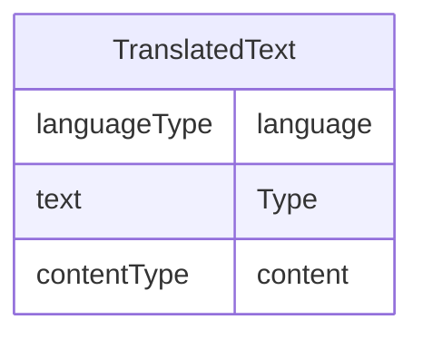

# Class: TranslatedText

_Human-readable text that is appropriate for a particular language. TranslatedText elements typically occur in a series, presenting a set of alternative textual renditions for different languages and types._


URI: [odm:TranslatedText](http://www.cdisc.org/ns/odm/v2.0/TranslatedText)





<!-- no inheritance hierarchy -->


## Slots

| Name | Cardinality* and Range | Description | Inheritance |
| ---  | --- | --- | --- |
| [language](language.md) | 0..1 <br/> [languageType](languageType.md) | Code representing the language of the enclosed text value. Default value depe... | direct |
| [Type](Type.md) | 1..1 <br/> [text](text.md) | Contains IANA media type of the TranslatedText element contents. | direct |
| [content](content.md) | 0..1 <br/> [contentType](contentType.md) | multi-line text content from between XML tags | direct |

_* See [LinkML documentation](https://linkml.io/linkml/schemas/slots.html#slot-cardinality) for cardinality definitions._


## Usages

| used by | used in | type | used |
| ---  | --- | --- | --- |
| [Description](Description.md) | [TranslatedTextRef](TranslatedTextRef.md) | range | [TranslatedText](TranslatedText.md) |
| [Question](Question.md) | [TranslatedTextRef](TranslatedTextRef.md) | range | [TranslatedText](TranslatedText.md) |
| [Definition](Definition.md) | [TranslatedTextRef](TranslatedTextRef.md) | range | [TranslatedText](TranslatedText.md) |
| [Prompt](Prompt.md) | [TranslatedTextRef](TranslatedTextRef.md) | range | [TranslatedText](TranslatedText.md) |
| [CRFCompletionInstructions](CRFCompletionInstructions.md) | [TranslatedTextRef](TranslatedTextRef.md) | range | [TranslatedText](TranslatedText.md) |
| [ImplementationNotes](ImplementationNotes.md) | [TranslatedTextRef](TranslatedTextRef.md) | range | [TranslatedText](TranslatedText.md) |
| [CDISCNotes](CDISCNotes.md) | [TranslatedTextRef](TranslatedTextRef.md) | range | [TranslatedText](TranslatedText.md) |
| [ErrorMessage](ErrorMessage.md) | [TranslatedTextRef](TranslatedTextRef.md) | range | [TranslatedText](TranslatedText.md) |
| [Decode](Decode.md) | [TranslatedTextRef](TranslatedTextRef.md) | range | [TranslatedText](TranslatedText.md) |
| [Comment](Comment.md) | [TranslatedTextRef](TranslatedTextRef.md) | range | [TranslatedText](TranslatedText.md) |


## See Also

* [https://wiki.cdisc.org/display/PUB/TranslatedText](https://wiki.cdisc.org/display/PUB/TranslatedText)

## Identifier and Mapping Information


### Schema Source


* from schema: http://www.cdisc.org/ns/odm/v2.0


## Mappings

| Mapping Type | Mapped Value |
| ---  | ---  |
| self | odm:TranslatedText |
| native | odm:TranslatedText |


## LinkML Source

<!-- TODO: investigate https://stackoverflow.com/questions/37606292/how-to-create-tabbed-code-blocks-in-mkdocs-or-sphinx -->

### Direct

<details>
```yaml
name: TranslatedText
description: Human-readable text that is appropriate for a particular language. TranslatedText
  elements typically occur in a series, presenting a set of alternative textual renditions
  for different languages and types.
from_schema: http://www.cdisc.org/ns/odm/v2.0
see_also:
- https://wiki.cdisc.org/display/PUB/TranslatedText
rank: 1000
slots:
- language
- Type
- content
slot_usage:
  language:
    name: language
    description: 'Code representing the language of the enclosed text value. Default
      value depends on locale. Note: The xml:lang attribute is part of the XML standard.
      See IETF Trust, Tags for Identifying Languages'
    comments:
    - 'Optional

      range: xs:language

      The schema requires xml:lang to be unique within a parent element for the same
      type. If only one TranslatedText element is provided, the xml:lang is optional.
      For submissions to the FDA, text content must be in English. To avoid ambiguity,
      a particular language tag must not occur more than once in a series of TranslatedText
      elements with the same type. Only one TranslatedText element without an xml:lang
      attribute may occur within the same parent and type. Examples: "en" for English
      "en-GB" for British English'
    domain_of:
    - TranslatedText
    range: languageType
  Type:
    name: Type
    description: Contains IANA media type of the TranslatedText element contents.
    comments:
    - 'Required

      enum values: (text/plain | application/xhtml+xml)

      A TranslatedText element with plain text with specified type "text/plain" must
      always be present, despite the fact whether other TranslatedText elements with
      enhanced presentation of the same text are present or not. When type="application/xhtml+xml",
      contents of the TranslatedText element must contains a limited number of HTML
      tags. Layout containers : <div> <p> Headers : <h1> <h2> <h3> <h4> <h5> <h6>
      Lists : <ul> <ol> <li> Definitions: <dl> <dt> <dd> Lines : <hr> Block-level
      quotes/preformatted : <pre> <blockquote> Links : <a> Inline elements : <span>
      <code> <br> Text styling : <em> <strong> <b> <i> Tables : <table> <caption>
      <thead> <tfoot> <tbody> <colgroup> <col> <tr> <th> <td> Images :  <map>
      <area> Color : <span style="color:xxx">'
    domain_of:
    - TranslatedText
    - PDFPageRef
    - Standard
    - StudyEventDef
    - ItemGroupDef
    - Origin
    - Resource
    - MethodDef
    - StudyEndPoint
    - TransitionTimingConstraint
    - RelativeTimingConstraint
    - Branching
    - Organization
    - Query
    range: text
    required: true
  content:
    name: content
    domain_of:
    - TranslatedText
    - Title
    - CheckValue
    - Code
    - WorkflowEnd
    - UserName
    - Prefix
    - Suffix
    - FullName
    - GivenName
    - FamilyName
    - StreetName
    - HouseNumber
    - City
    - StateProv
    - Country
    - PostalCode
    - OtherText
    - Meaning
    - LegalReason
    - DateTimeStamp
    - ReasonForChange
    - SourceID
    - FlagValue
    - FlagType
    - Value
    range: contentType
    maximum_cardinality: 1
class_uri: odm:TranslatedText

```
</details>

### Induced

<details>
```yaml
name: TranslatedText
description: Human-readable text that is appropriate for a particular language. TranslatedText
  elements typically occur in a series, presenting a set of alternative textual renditions
  for different languages and types.
from_schema: http://www.cdisc.org/ns/odm/v2.0
see_also:
- https://wiki.cdisc.org/display/PUB/TranslatedText
rank: 1000
slot_usage:
  language:
    name: language
    description: 'Code representing the language of the enclosed text value. Default
      value depends on locale. Note: The xml:lang attribute is part of the XML standard.
      See IETF Trust, Tags for Identifying Languages'
    comments:
    - 'Optional

      range: xs:language

      The schema requires xml:lang to be unique within a parent element for the same
      type. If only one TranslatedText element is provided, the xml:lang is optional.
      For submissions to the FDA, text content must be in English. To avoid ambiguity,
      a particular language tag must not occur more than once in a series of TranslatedText
      elements with the same type. Only one TranslatedText element without an xml:lang
      attribute may occur within the same parent and type. Examples: "en" for English
      "en-GB" for British English'
    domain_of:
    - TranslatedText
    range: languageType
  Type:
    name: Type
    description: Contains IANA media type of the TranslatedText element contents.
    comments:
    - 'Required

      enum values: (text/plain | application/xhtml+xml)

      A TranslatedText element with plain text with specified type "text/plain" must
      always be present, despite the fact whether other TranslatedText elements with
      enhanced presentation of the same text are present or not. When type="application/xhtml+xml",
      contents of the TranslatedText element must contains a limited number of HTML
      tags. Layout containers : <div> <p> Headers : <h1> <h2> <h3> <h4> <h5> <h6>
      Lists : <ul> <ol> <li> Definitions: <dl> <dt> <dd> Lines : <hr> Block-level
      quotes/preformatted : <pre> <blockquote> Links : <a> Inline elements : <span>
      <code> <br> Text styling : <em> <strong> <b> <i> Tables : <table> <caption>
      <thead> <tfoot> <tbody> <colgroup> <col> <tr> <th> <td> Images :  <map>
      <area> Color : <span style="color:xxx">'
    domain_of:
    - TranslatedText
    - PDFPageRef
    - Standard
    - StudyEventDef
    - ItemGroupDef
    - Origin
    - Resource
    - MethodDef
    - StudyEndPoint
    - TransitionTimingConstraint
    - RelativeTimingConstraint
    - Branching
    - Organization
    - Query
    range: text
    required: true
  content:
    name: content
    domain_of:
    - TranslatedText
    - Title
    - CheckValue
    - Code
    - WorkflowEnd
    - UserName
    - Prefix
    - Suffix
    - FullName
    - GivenName
    - FamilyName
    - StreetName
    - HouseNumber
    - City
    - StateProv
    - Country
    - PostalCode
    - OtherText
    - Meaning
    - LegalReason
    - DateTimeStamp
    - ReasonForChange
    - SourceID
    - FlagValue
    - FlagType
    - Value
    range: contentType
    maximum_cardinality: 1
attributes:
  language:
    name: language
    description: 'Code representing the language of the enclosed text value. Default
      value depends on locale. Note: The xml:lang attribute is part of the XML standard.
      See IETF Trust, Tags for Identifying Languages'
    comments:
    - 'Optional

      range: xs:language

      The schema requires xml:lang to be unique within a parent element for the same
      type. If only one TranslatedText element is provided, the xml:lang is optional.
      For submissions to the FDA, text content must be in English. To avoid ambiguity,
      a particular language tag must not occur more than once in a series of TranslatedText
      elements with the same type. Only one TranslatedText element without an xml:lang
      attribute may occur within the same parent and type. Examples: "en" for English
      "en-GB" for British English'
    from_schema: http://www.cdisc.org/ns/odm/v2.0
    rank: 1000
    alias: language
    owner: TranslatedText
    domain_of:
    - TranslatedText
    range: languageType
  Type:
    name: Type
    description: Contains IANA media type of the TranslatedText element contents.
    comments:
    - 'Required

      enum values: (text/plain | application/xhtml+xml)

      A TranslatedText element with plain text with specified type "text/plain" must
      always be present, despite the fact whether other TranslatedText elements with
      enhanced presentation of the same text are present or not. When type="application/xhtml+xml",
      contents of the TranslatedText element must contains a limited number of HTML
      tags. Layout containers : <div> <p> Headers : <h1> <h2> <h3> <h4> <h5> <h6>
      Lists : <ul> <ol> <li> Definitions: <dl> <dt> <dd> Lines : <hr> Block-level
      quotes/preformatted : <pre> <blockquote> Links : <a> Inline elements : <span>
      <code> <br> Text styling : <em> <strong> <b> <i> Tables : <table> <caption>
      <thead> <tfoot> <tbody> <colgroup> <col> <tr> <th> <td> Images :  <map>
      <area> Color : <span style="color:xxx">'
    from_schema: http://www.cdisc.org/ns/odm/v2.0
    rank: 1000
    alias: Type
    owner: TranslatedText
    domain_of:
    - TranslatedText
    - PDFPageRef
    - Standard
    - StudyEventDef
    - ItemGroupDef
    - Origin
    - Resource
    - MethodDef
    - StudyEndPoint
    - TransitionTimingConstraint
    - RelativeTimingConstraint
    - Branching
    - Organization
    - Query
    range: text
    required: true
  content:
    name: content
    description: multi-line text content from between XML tags
    from_schema: http://www.cdisc.org/ns/odm/v2.0
    rank: 1000
    alias: content
    owner: TranslatedText
    domain_of:
    - TranslatedText
    - Title
    - CheckValue
    - Code
    - WorkflowEnd
    - UserName
    - Prefix
    - Suffix
    - FullName
    - GivenName
    - FamilyName
    - StreetName
    - HouseNumber
    - City
    - StateProv
    - Country
    - PostalCode
    - OtherText
    - Meaning
    - LegalReason
    - DateTimeStamp
    - ReasonForChange
    - SourceID
    - FlagValue
    - FlagType
    - Value
    range: contentType
    inlined: true
    maximum_cardinality: 1
class_uri: odm:TranslatedText

```
</details>