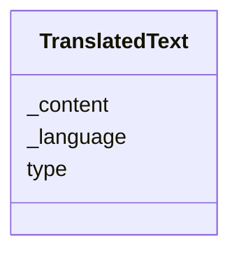

# Class: TranslatedText


URI: [odm:TranslatedText](http://www.cdisc.org/ns/odm/v2.0/TranslatedText)





<!-- no inheritance hierarchy -->


## Slots

| Name | Cardinality and Range | Description | Inheritance |
| ---  | --- | --- | --- |
| [_language](_language.md) | 0..1 <br/> [LanguageType](LanguageType.md) | language context for internationalisation and localisation | direct |
| [type](type.md) | 1..1 <br/> [Text](Text.md) |  | direct |
| [_content](_content.md) | 0..1 <br/> [ContentType](ContentType.md) | multi-line text content from between XML tags | direct |


## Usages

| used by | used in | type | used |
| ---  | --- | --- | --- |
| [Description](Description.md) | [TranslatedTextRef](TranslatedTextRef.md) | range | [TranslatedText](TranslatedText.md) |
| [Question](Question.md) | [TranslatedTextRef](TranslatedTextRef.md) | range | [TranslatedText](TranslatedText.md) |
| [Definition](Definition.md) | [TranslatedTextRef](TranslatedTextRef.md) | range | [TranslatedText](TranslatedText.md) |
| [Prompt](Prompt.md) | [TranslatedTextRef](TranslatedTextRef.md) | range | [TranslatedText](TranslatedText.md) |
| [CRFCompletionInstructions](CRFCompletionInstructions.md) | [TranslatedTextRef](TranslatedTextRef.md) | range | [TranslatedText](TranslatedText.md) |
| [ImplementationNotes](ImplementationNotes.md) | [TranslatedTextRef](TranslatedTextRef.md) | range | [TranslatedText](TranslatedText.md) |
| [CDISCNotes](CDISCNotes.md) | [TranslatedTextRef](TranslatedTextRef.md) | range | [TranslatedText](TranslatedText.md) |
| [ErrorMessage](ErrorMessage.md) | [TranslatedTextRef](TranslatedTextRef.md) | range | [TranslatedText](TranslatedText.md) |
| [Decode](Decode.md) | [TranslatedTextRef](TranslatedTextRef.md) | range | [TranslatedText](TranslatedText.md) |
| [Comment](Comment.md) | [TranslatedTextRef](TranslatedTextRef.md) | range | [TranslatedText](TranslatedText.md) |


## See Also

* [https://wiki.cdisc.org/display/ODM2/TranslatedText](https://wiki.cdisc.org/display/ODM2/TranslatedText)

## Identifier and Mapping Information


### Schema Source


* from schema: http://www.cdisc.org/ns/odm/v2.0


## Mappings

| Mapping Type | Mapped Value |
| ---  | ---  |
| self | odm:TranslatedText |
| native | odm:TranslatedText |


## LinkML Source

<!-- TODO: investigate https://stackoverflow.com/questions/37606292/how-to-create-tabbed-code-blocks-in-mkdocs-or-sphinx -->

### Direct

<details>
```yaml
name: TranslatedText
from_schema: http://www.cdisc.org/ns/odm/v2.0
see_also:
- https://wiki.cdisc.org/display/ODM2/TranslatedText
slots:
- _language
- type
- _content
slot_usage:
  type:
    name: type
    domain_of:
    - TranslatedText
    range: text
    required: true
  _content:
    name: _content
    domain_of:
    - TranslatedText
    - CheckValue
    - Code
    - WorkflowEnd
    - UserName
    - Prefix
    - Suffix
    - FullName
    - GivenName
    - FamilyName
    - StreetName
    - HouseNumber
    - City
    - StateProv
    - Country
    - PostalCode
    - OtherText
    - Meaning
    - LegalReason
    - DateTimeStamp
    - ReasonForChange
    - SourceID
    - FlagValue
    - FlagType
    - Value
    range: _contentType
    maximum_cardinality: 1
class_uri: odm:TranslatedText

```
</details>

### Induced

<details>
```yaml
name: TranslatedText
from_schema: http://www.cdisc.org/ns/odm/v2.0
see_also:
- https://wiki.cdisc.org/display/ODM2/TranslatedText
slot_usage:
  type:
    name: type
    domain_of:
    - TranslatedText
    range: text
    required: true
  _content:
    name: _content
    domain_of:
    - TranslatedText
    - CheckValue
    - Code
    - WorkflowEnd
    - UserName
    - Prefix
    - Suffix
    - FullName
    - GivenName
    - FamilyName
    - StreetName
    - HouseNumber
    - City
    - StateProv
    - Country
    - PostalCode
    - OtherText
    - Meaning
    - LegalReason
    - DateTimeStamp
    - ReasonForChange
    - SourceID
    - FlagValue
    - FlagType
    - Value
    range: _contentType
    maximum_cardinality: 1
attributes:
  _language:
    name: _language
    description: language context for internationalisation and localisation
    from_schema: http://www.cdisc.org/ns/odm/v2.0
    rank: 1000
    alias: _language
    owner: TranslatedText
    domain_of:
    - TranslatedText
    range: _languageType
  type:
    name: type
    from_schema: http://www.cdisc.org/ns/odm/v2.0
    rank: 1000
    alias: type
    owner: TranslatedText
    domain_of:
    - TranslatedText
    range: text
    required: true
  _content:
    name: _content
    description: multi-line text content from between XML tags
    from_schema: http://www.cdisc.org/ns/odm/v2.0
    rank: 1000
    alias: _content
    owner: TranslatedText
    domain_of:
    - TranslatedText
    - CheckValue
    - Code
    - WorkflowEnd
    - UserName
    - Prefix
    - Suffix
    - FullName
    - GivenName
    - FamilyName
    - StreetName
    - HouseNumber
    - City
    - StateProv
    - Country
    - PostalCode
    - OtherText
    - Meaning
    - LegalReason
    - DateTimeStamp
    - ReasonForChange
    - SourceID
    - FlagValue
    - FlagType
    - Value
    range: _contentType
    inlined: true
    maximum_cardinality: 1
class_uri: odm:TranslatedText

```
</details>