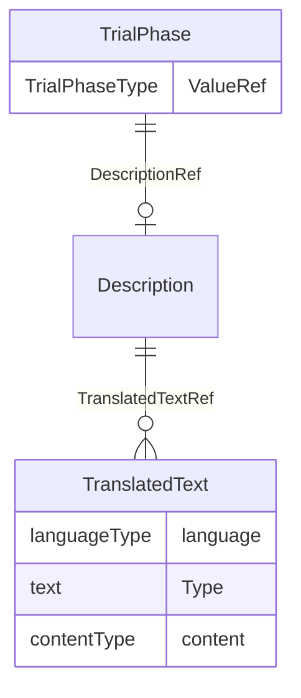

# Class: TrialPhase

_The TrialPhase element designates the phase of the study in the clinical trial._


URI: [odm:TrialPhase](http://www.cdisc.org/ns/odm/v2.0/TrialPhase)





<!-- no inheritance hierarchy -->


## Slots

| Name | Cardinality* and Range | Description | Inheritance |
| ---  | --- | --- | --- |
| [ValueRef](ValueRef.md) | 1..1 <br/> [TrialPhaseType](TrialPhaseType.md) | Human-readable designation of the trial phase. | direct |
| [DescriptionRef](DescriptionRef.md) | 0..1 <br/> [Description](Description.md) | Description reference: A free-text description of the containing metadata com... | direct |

_* See [LinkML documentation](https://linkml.io/linkml/schemas/slots.html#slot-cardinality) for cardinality definitions._


## Usages

| used by | used in | type | used |
| ---  | --- | --- | --- |
| [Protocol](Protocol.md) | [TrialPhaseRef](TrialPhaseRef.md) | range | [TrialPhase](TrialPhase.md) |


## See Also

* [https://wiki.cdisc.org/display/PUB/TrialPhase](https://wiki.cdisc.org/display/PUB/TrialPhase)

## Identifier and Mapping Information


### Schema Source


* from schema: http://www.cdisc.org/ns/odm/v2.0


## Mappings

| Mapping Type | Mapped Value |
| ---  | ---  |
| self | odm:TrialPhase |
| native | odm:TrialPhase |


## LinkML Source

<!-- TODO: investigate https://stackoverflow.com/questions/37606292/how-to-create-tabbed-code-blocks-in-mkdocs-or-sphinx -->

### Direct

<details>
```yaml
name: TrialPhase
description: The TrialPhase element designates the phase of the study in the clinical
  trial.
from_schema: http://www.cdisc.org/ns/odm/v2.0
see_also:
- https://wiki.cdisc.org/display/PUB/TrialPhase
rank: 1000
slots:
- ValueRef
- DescriptionRef
slot_usage:
  ValueRef:
    name: ValueRef
    description: Human-readable designation of the trial phase.
    comments:
    - 'Required

      enum values: (PHASE 0 TRIAL, PHASE I TRIAL, PHASE I/II TRIAL, PHASE II TRIAL,
      PHASE II/III TRIAL, PHASE IIA TRIAL, PHASE IIB TRIAL, PHASE III TRIAL, PHASE
      IIIA TRIAL, PHASE IIIB TRIAL, PHASE IV TRIAL, PHASE V TRIAL, NOT APPLICABLE)

      The TrialPhase/@Name must be unique within the Study. The values are enumerated
      by CDISC controlled terminology TPHASE (NCI code C66737). This is an extensible
      attribute.'
    domain_of:
    - TrialPhase
    - ParameterValue
    - Telecom
    - ItemData
    - Query
    range: TrialPhaseType
    required: true
  DescriptionRef:
    name: DescriptionRef
    domain_of:
    - Study
    - MetaDataVersion
    - ValueListDef
    - StudyEventGroupRef
    - StudyEventGroupDef
    - StudyEventDef
    - ItemGroupDef
    - Origin
    - ItemDef
    - CodeList
    - CodeListItem
    - MethodDef
    - ConditionDef
    - CommentDef
    - Protocol
    - StudyStructure
    - TrialPhase
    - StudyIndication
    - StudyIntervention
    - StudyObjective
    - StudyEndPoint
    - StudyTargetPopulation
    - StudyEstimand
    - IntercurrentEvent
    - SummaryMeasure
    - Arm
    - Epoch
    - TransitionTimingConstraint
    - AbsoluteTimingConstraint
    - RelativeTimingConstraint
    - DurationTimingConstraint
    - WorkflowDef
    - Criterion
    - Organization
    - Location
    - ODMFileMetadata
    range: Description
    maximum_cardinality: 1
class_uri: odm:TrialPhase

```
</details>

### Induced

<details>
```yaml
name: TrialPhase
description: The TrialPhase element designates the phase of the study in the clinical
  trial.
from_schema: http://www.cdisc.org/ns/odm/v2.0
see_also:
- https://wiki.cdisc.org/display/PUB/TrialPhase
rank: 1000
slot_usage:
  ValueRef:
    name: ValueRef
    description: Human-readable designation of the trial phase.
    comments:
    - 'Required

      enum values: (PHASE 0 TRIAL, PHASE I TRIAL, PHASE I/II TRIAL, PHASE II TRIAL,
      PHASE II/III TRIAL, PHASE IIA TRIAL, PHASE IIB TRIAL, PHASE III TRIAL, PHASE
      IIIA TRIAL, PHASE IIIB TRIAL, PHASE IV TRIAL, PHASE V TRIAL, NOT APPLICABLE)

      The TrialPhase/@Name must be unique within the Study. The values are enumerated
      by CDISC controlled terminology TPHASE (NCI code C66737). This is an extensible
      attribute.'
    domain_of:
    - TrialPhase
    - ParameterValue
    - Telecom
    - ItemData
    - Query
    range: TrialPhaseType
    required: true
  DescriptionRef:
    name: DescriptionRef
    domain_of:
    - Study
    - MetaDataVersion
    - ValueListDef
    - StudyEventGroupRef
    - StudyEventGroupDef
    - StudyEventDef
    - ItemGroupDef
    - Origin
    - ItemDef
    - CodeList
    - CodeListItem
    - MethodDef
    - ConditionDef
    - CommentDef
    - Protocol
    - StudyStructure
    - TrialPhase
    - StudyIndication
    - StudyIntervention
    - StudyObjective
    - StudyEndPoint
    - StudyTargetPopulation
    - StudyEstimand
    - IntercurrentEvent
    - SummaryMeasure
    - Arm
    - Epoch
    - TransitionTimingConstraint
    - AbsoluteTimingConstraint
    - RelativeTimingConstraint
    - DurationTimingConstraint
    - WorkflowDef
    - Criterion
    - Organization
    - Location
    - ODMFileMetadata
    range: Description
    maximum_cardinality: 1
attributes:
  ValueRef:
    name: ValueRef
    description: Human-readable designation of the trial phase.
    comments:
    - 'Required

      enum values: (PHASE 0 TRIAL, PHASE I TRIAL, PHASE I/II TRIAL, PHASE II TRIAL,
      PHASE II/III TRIAL, PHASE IIA TRIAL, PHASE IIB TRIAL, PHASE III TRIAL, PHASE
      IIIA TRIAL, PHASE IIIB TRIAL, PHASE IV TRIAL, PHASE V TRIAL, NOT APPLICABLE)

      The TrialPhase/@Name must be unique within the Study. The values are enumerated
      by CDISC controlled terminology TPHASE (NCI code C66737). This is an extensible
      attribute.'
    from_schema: http://www.cdisc.org/ns/odm/v2.0
    rank: 1000
    identifier: false
    alias: ValueRef
    owner: TrialPhase
    domain_of:
    - TrialPhase
    - ParameterValue
    - Telecom
    - ItemData
    - Query
    range: TrialPhaseType
    required: true
  DescriptionRef:
    name: DescriptionRef
    description: 'Description reference: A free-text description of the containing
      metadata component, unless restricted by Business Rules.'
    from_schema: http://www.cdisc.org/ns/odm/v2.0
    rank: 1000
    identifier: false
    alias: DescriptionRef
    owner: TrialPhase
    domain_of:
    - Study
    - MetaDataVersion
    - ValueListDef
    - StudyEventGroupRef
    - StudyEventGroupDef
    - StudyEventDef
    - ItemGroupDef
    - Origin
    - ItemDef
    - CodeList
    - CodeListItem
    - MethodDef
    - ConditionDef
    - CommentDef
    - Protocol
    - StudyStructure
    - TrialPhase
    - StudyIndication
    - StudyIntervention
    - StudyObjective
    - StudyEndPoint
    - StudyTargetPopulation
    - StudyEstimand
    - IntercurrentEvent
    - SummaryMeasure
    - Arm
    - Epoch
    - TransitionTimingConstraint
    - AbsoluteTimingConstraint
    - RelativeTimingConstraint
    - DurationTimingConstraint
    - WorkflowDef
    - Criterion
    - Organization
    - Location
    - ODMFileMetadata
    range: Description
    maximum_cardinality: 1
class_uri: odm:TrialPhase

```
</details>