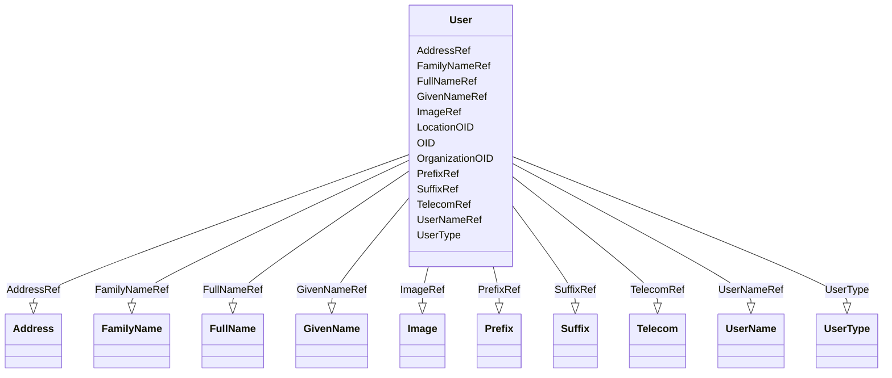

# Class: User


URI: [odm:User](http://www.cdisc.org/ns/odm/v2.0/User)





<!-- no inheritance hierarchy -->


## Slots

| Name | Cardinality and Range | Description | Inheritance |
| ---  | --- | --- | --- |
| [OID](OID.md) | 1..1 <br/> [Oid](Oid.md) | Unique identifier of the version within the XML document | direct |
| [UserType](UserType.md) | 0..1 <br/> [UserType](UserType.md) |  | direct |
| [OrganizationOID](OrganizationOID.md) | 0..1 <br/> [Oidref](Oidref.md) |  | direct |
| [LocationOID](LocationOID.md) | 0..1 <br/> [Oidref](Oidref.md) |  | direct |
| [UserNameRef](UserNameRef.md) | 0..1 <br/> [UserName](UserName.md) |  | direct |
| [PrefixRef](PrefixRef.md) | 0..1 <br/> [Prefix](Prefix.md) |  | direct |
| [SuffixRef](SuffixRef.md) | 0..1 <br/> [Suffix](Suffix.md) |  | direct |
| [FullNameRef](FullNameRef.md) | 0..1 <br/> [FullName](FullName.md) |  | direct |
| [GivenNameRef](GivenNameRef.md) | 0..1 <br/> [GivenName](GivenName.md) |  | direct |
| [FamilyNameRef](FamilyNameRef.md) | 0..1 <br/> [FamilyName](FamilyName.md) |  | direct |
| [ImageRef](ImageRef.md) | 0..1 <br/> [Image](Image.md) |  | direct |
| [AddressRef](AddressRef.md) | 0..* <br/> [Address](Address.md) |  | direct |
| [TelecomRef](TelecomRef.md) | 0..* <br/> [Telecom](Telecom.md) |  | direct |


## Usages

| used by | used in | type | used |
| ---  | --- | --- | --- |
| [AdminData](AdminData.md) | [UserRef](UserRef.md) | range | [User](User.md) |


## Identifier and Mapping Information


### Schema Source


* from schema: http://www.cdisc.org/ns/odm/v2.0


## Mappings

| Mapping Type | Mapped Value |
| ---  | ---  |
| self | odm:User |
| native | odm:User |


## LinkML Source

<!-- TODO: investigate https://stackoverflow.com/questions/37606292/how-to-create-tabbed-code-blocks-in-mkdocs-or-sphinx -->

### Direct

<details>
```yaml
name: User
from_schema: http://www.cdisc.org/ns/odm/v2.0
slots:
- OID
- UserType
- OrganizationOID
- LocationOID
- UserNameRef
- PrefixRef
- SuffixRef
- FullNameRef
- GivenNameRef
- FamilyNameRef
- ImageRef
- AddressRef
- TelecomRef
slot_usage:
  OID:
    name: OID
    domain_of:
    - ValueListDef
    - WhereClauseDef
    - StudyEventGroupDef
    - CommentDef
    - StudyIndication
    - StudyIntervention
    - StudyObjective
    - StudyEndPoint
    - StudyTargetPopulation
    - StudyEstimand
    - Arm
    - Epoch
    - StudyParameter
    - StudyTiming
    - TransitionTimingConstraint
    - AbsoluteTimingConstraint
    - RelativeTimingConstraint
    - DurationTimingConstraint
    - WorkflowDef
    - Transition
    - Branching
    - Criterion
    - ExceptionEvent
    - Organization
    - Query
    - MetaDataVersion
    - StudyEventDef
    - ItemGroupDef
    - ItemDef
    - CodeList
    - ConditionDef
    - MethodDef
    - Standard
    - User
    - Location
    - SignatureDef
    - Study
    range: oid
    required: true
  UserType:
    name: UserType
    domain_of:
    - User
    range: UserType
    required: false
  OrganizationOID:
    name: OrganizationOID
    domain_of:
    - User
    - Location
    range: oidref
    required: false
  LocationOID:
    name: LocationOID
    domain_of:
    - Organization
    - SiteRef
    - LocationRef
    - User
    range: oidref
    required: false
  UserNameRef:
    name: UserNameRef
    domain_of:
    - User
    range: UserName
    required: false
    minimum_cardinality: 0
    maximum_cardinality: 1
  PrefixRef:
    name: PrefixRef
    domain_of:
    - User
    range: Prefix
    required: false
    minimum_cardinality: 0
    maximum_cardinality: 1
  SuffixRef:
    name: SuffixRef
    domain_of:
    - User
    range: Suffix
    required: false
    minimum_cardinality: 0
    maximum_cardinality: 1
  FullNameRef:
    name: FullNameRef
    domain_of:
    - User
    range: FullName
    required: false
    minimum_cardinality: 0
    maximum_cardinality: 1
  GivenNameRef:
    name: GivenNameRef
    domain_of:
    - User
    range: GivenName
    required: false
    minimum_cardinality: 0
    maximum_cardinality: 1
  FamilyNameRef:
    name: FamilyNameRef
    domain_of:
    - User
    range: FamilyName
    required: false
    minimum_cardinality: 0
    maximum_cardinality: 1
  ImageRef:
    name: ImageRef
    domain_of:
    - User
    range: Image
    required: false
    minimum_cardinality: 0
    maximum_cardinality: 1
  AddressRef:
    name: AddressRef
    multivalued: true
    domain_of:
    - Organization
    - User
    - Location
    range: Address
    required: false
    minimum_cardinality: 0
  TelecomRef:
    name: TelecomRef
    multivalued: true
    domain_of:
    - Organization
    - User
    - Location
    range: Telecom
    required: false
    minimum_cardinality: 0
class_uri: odm:User
unique_keys:
  UC-AD-1:
    unique_key_name: UC-AD-1
    unique_key_slots:
    - OID

```
</details>

### Induced

<details>
```yaml
name: User
from_schema: http://www.cdisc.org/ns/odm/v2.0
slot_usage:
  OID:
    name: OID
    domain_of:
    - ValueListDef
    - WhereClauseDef
    - StudyEventGroupDef
    - CommentDef
    - StudyIndication
    - StudyIntervention
    - StudyObjective
    - StudyEndPoint
    - StudyTargetPopulation
    - StudyEstimand
    - Arm
    - Epoch
    - StudyParameter
    - StudyTiming
    - TransitionTimingConstraint
    - AbsoluteTimingConstraint
    - RelativeTimingConstraint
    - DurationTimingConstraint
    - WorkflowDef
    - Transition
    - Branching
    - Criterion
    - ExceptionEvent
    - Organization
    - Query
    - MetaDataVersion
    - StudyEventDef
    - ItemGroupDef
    - ItemDef
    - CodeList
    - ConditionDef
    - MethodDef
    - Standard
    - User
    - Location
    - SignatureDef
    - Study
    range: oid
    required: true
  UserType:
    name: UserType
    domain_of:
    - User
    range: UserType
    required: false
  OrganizationOID:
    name: OrganizationOID
    domain_of:
    - User
    - Location
    range: oidref
    required: false
  LocationOID:
    name: LocationOID
    domain_of:
    - Organization
    - SiteRef
    - LocationRef
    - User
    range: oidref
    required: false
  UserNameRef:
    name: UserNameRef
    domain_of:
    - User
    range: UserName
    required: false
    minimum_cardinality: 0
    maximum_cardinality: 1
  PrefixRef:
    name: PrefixRef
    domain_of:
    - User
    range: Prefix
    required: false
    minimum_cardinality: 0
    maximum_cardinality: 1
  SuffixRef:
    name: SuffixRef
    domain_of:
    - User
    range: Suffix
    required: false
    minimum_cardinality: 0
    maximum_cardinality: 1
  FullNameRef:
    name: FullNameRef
    domain_of:
    - User
    range: FullName
    required: false
    minimum_cardinality: 0
    maximum_cardinality: 1
  GivenNameRef:
    name: GivenNameRef
    domain_of:
    - User
    range: GivenName
    required: false
    minimum_cardinality: 0
    maximum_cardinality: 1
  FamilyNameRef:
    name: FamilyNameRef
    domain_of:
    - User
    range: FamilyName
    required: false
    minimum_cardinality: 0
    maximum_cardinality: 1
  ImageRef:
    name: ImageRef
    domain_of:
    - User
    range: Image
    required: false
    minimum_cardinality: 0
    maximum_cardinality: 1
  AddressRef:
    name: AddressRef
    multivalued: true
    domain_of:
    - Organization
    - User
    - Location
    range: Address
    required: false
    minimum_cardinality: 0
  TelecomRef:
    name: TelecomRef
    multivalued: true
    domain_of:
    - Organization
    - User
    - Location
    range: Telecom
    required: false
    minimum_cardinality: 0
attributes:
  OID:
    name: OID
    description: Unique identifier of the version within the XML document.
    from_schema: http://www.cdisc.org/ns/odm/v2.0
    rank: 1000
    alias: OID
    owner: User
    domain_of:
    - ValueListDef
    - WhereClauseDef
    - StudyEventGroupDef
    - CommentDef
    - StudyIndication
    - StudyIntervention
    - StudyObjective
    - StudyEndPoint
    - StudyTargetPopulation
    - StudyEstimand
    - Arm
    - Epoch
    - StudyParameter
    - StudyTiming
    - TransitionTimingConstraint
    - AbsoluteTimingConstraint
    - RelativeTimingConstraint
    - DurationTimingConstraint
    - WorkflowDef
    - Transition
    - Branching
    - Criterion
    - ExceptionEvent
    - Organization
    - Query
    - MetaDataVersion
    - StudyEventDef
    - ItemGroupDef
    - ItemDef
    - CodeList
    - ConditionDef
    - MethodDef
    - Standard
    - User
    - Location
    - SignatureDef
    - Study
    range: oid
    required: true
  UserType:
    name: UserType
    from_schema: http://www.cdisc.org/ns/odm/v2.0
    rank: 1000
    alias: UserType
    owner: User
    domain_of:
    - User
    range: UserType
    required: false
  OrganizationOID:
    name: OrganizationOID
    from_schema: http://www.cdisc.org/ns/odm/v2.0
    rank: 1000
    alias: OrganizationOID
    owner: User
    domain_of:
    - User
    - Location
    range: oidref
    required: false
  LocationOID:
    name: LocationOID
    from_schema: http://www.cdisc.org/ns/odm/v2.0
    rank: 1000
    alias: LocationOID
    owner: User
    domain_of:
    - Organization
    - SiteRef
    - LocationRef
    - User
    range: oidref
    required: false
  UserNameRef:
    name: UserNameRef
    from_schema: http://www.cdisc.org/ns/odm/v2.0
    rank: 1000
    alias: UserNameRef
    owner: User
    domain_of:
    - User
    range: UserName
    required: false
    minimum_cardinality: 0
    maximum_cardinality: 1
  PrefixRef:
    name: PrefixRef
    from_schema: http://www.cdisc.org/ns/odm/v2.0
    rank: 1000
    alias: PrefixRef
    owner: User
    domain_of:
    - User
    range: Prefix
    required: false
    minimum_cardinality: 0
    maximum_cardinality: 1
  SuffixRef:
    name: SuffixRef
    from_schema: http://www.cdisc.org/ns/odm/v2.0
    rank: 1000
    alias: SuffixRef
    owner: User
    domain_of:
    - User
    range: Suffix
    required: false
    minimum_cardinality: 0
    maximum_cardinality: 1
  FullNameRef:
    name: FullNameRef
    from_schema: http://www.cdisc.org/ns/odm/v2.0
    rank: 1000
    alias: FullNameRef
    owner: User
    domain_of:
    - User
    range: FullName
    required: false
    minimum_cardinality: 0
    maximum_cardinality: 1
  GivenNameRef:
    name: GivenNameRef
    from_schema: http://www.cdisc.org/ns/odm/v2.0
    rank: 1000
    alias: GivenNameRef
    owner: User
    domain_of:
    - User
    range: GivenName
    required: false
    minimum_cardinality: 0
    maximum_cardinality: 1
  FamilyNameRef:
    name: FamilyNameRef
    from_schema: http://www.cdisc.org/ns/odm/v2.0
    rank: 1000
    alias: FamilyNameRef
    owner: User
    domain_of:
    - User
    range: FamilyName
    required: false
    minimum_cardinality: 0
    maximum_cardinality: 1
  ImageRef:
    name: ImageRef
    from_schema: http://www.cdisc.org/ns/odm/v2.0
    rank: 1000
    alias: ImageRef
    owner: User
    domain_of:
    - User
    range: Image
    required: false
    minimum_cardinality: 0
    maximum_cardinality: 1
  AddressRef:
    name: AddressRef
    from_schema: http://www.cdisc.org/ns/odm/v2.0
    rank: 1000
    multivalued: true
    alias: AddressRef
    owner: User
    domain_of:
    - Organization
    - User
    - Location
    range: Address
    required: false
    minimum_cardinality: 0
  TelecomRef:
    name: TelecomRef
    from_schema: http://www.cdisc.org/ns/odm/v2.0
    rank: 1000
    multivalued: true
    alias: TelecomRef
    owner: User
    domain_of:
    - Organization
    - User
    - Location
    range: Telecom
    required: false
    minimum_cardinality: 0
class_uri: odm:User
unique_keys:
  UC-AD-1:
    unique_key_name: UC-AD-1
    unique_key_slots:
    - OID

```
</details>