# Class: User

_Information about a specific user of a clinical data collection or data management system._


URI: [odm:User](http://www.cdisc.org/ns/odm/v2.0/User)

```mermaid
erDiagram
User {
    oid OID  
    UserType userType  
}
Telecom {
    TelecomTypeType telecomType  
    text value  
}
Address {

}
OtherText {
    text content  
}
GeoPosition {
    decimal longitude  
    decimal latitude  
    decimal altitude  
}
PostalCode {
    text content  
}
Country {
    text content  
}
StateProv {
    text content  
}
City {
    text content  
}
HouseNumber {
    text content  
}
StreetName {
    text content  
}
Image {
    fileName imageFileName  
    text href  
    text mimeType  
}
FamilyName {
    text content  
}
GivenName {
    text content  
}
FullName {
    text content  
}
Suffix {
    text content  
}
Prefix {
    text content  
}
UserName {
    text content  
}
Location {
    oid OID  
    nameType name  
    text role  
}
Query {
    oid OID  
    QuerySourceType source  
    text target  
    QueryType type  
    QueryStateType state  
    datetime lastUpdateDatetime  
    nameType name  
}
MetaDataVersionRef {
    date effectiveDate  
}
Description {

}
Organization {
    oid OID  
    nameType name  
    text role  
    OrganizationType type  
}

User ||--|o Organization : "organizationOID"
User ||--|o Location : "locationOID"
User ||--|o UserName : "userName"
User ||--|o Prefix : "prefix"
User ||--|o Suffix : "suffix"
User ||--|o FullName : "fullName"
User ||--|o GivenName : "givenName"
User ||--|o FamilyName : "familyName"
User ||--|o Image : "image"
User ||--}o Address : "address"
User ||--}o Telecom : "telecom"
Address ||--|o StreetName : "streetName"
Address ||--|o HouseNumber : "houseNumber"
Address ||--|o City : "city"
Address ||--|o StateProv : "stateProv"
Address ||--|o Country : "country"
Address ||--|o PostalCode : "postalCode"
Address ||--|o GeoPosition : "geoPosition"
Address ||--|o OtherText : "otherText"
Location ||--|o Organization : "organizationOID"
Location ||--|o Description : "description"
Location ||--}o MetaDataVersionRef : "metaDataVersionRef"
Location ||--}o Address : "address"
Location ||--}o Telecom : "telecom"
Location ||--}o Query : "query"
Query ||--|o Value : "value"
Query ||--}o AuditRecord : "auditRecord"
MetaDataVersionRef ||--|| Study : "studyOID"
MetaDataVersionRef ||--|| MetaDataVersion : "metaDataVersionOID"
Description ||--}o TranslatedText : "translatedText"
Organization ||--|o Location : "locationOID"
Organization ||--|o Organization : "partOfOrganizationOID"
Organization ||--|o Description : "description"
Organization ||--}o Address : "address"
Organization ||--}o Telecom : "telecom"

```





<!-- no inheritance hierarchy -->


## Slots

| Name | Cardinality* and Range | Description | Inheritance |
| ---  | --- | --- | --- |
| [OID](OID.md) | 1..1 <br/> [oid](oid.md) | Business Rules | direct |
| [userType](userType.md) | 0..1 <br/> [UserType](UserType.md) | User's role in the study. | direct |
| [organizationOID](organizationOID.md) | 0..1 <br/> [Organization](Organization.md) | Reference to an Organization elment. | direct |
| [locationOID](locationOID.md) | 0..1 <br/> [Location](Location.md) | Reference to a Location element. | direct |
| [userName](userName.md) | 0..1 <br/> [UserName](UserName.md) | UserName reference: The user's login identification in the sender's system. | direct |
| [prefix](prefix.md) | 0..1 <br/> [Prefix](Prefix.md) | Prefix reference: Title or other prefix. Maps to FHIR HumanName.prefix (https... | direct |
| [suffix](suffix.md) | 0..1 <br/> [Suffix](Suffix.md) | Suffix reference: This element may include credentials, or suffixes (e.g., Jr... | direct |
| [fullName](fullName.md) | 0..1 <br/> [FullName](FullName.md) | FullName reference: The user's full formal name. May be a combination of Pref... | direct |
| [givenName](givenName.md) | 0..1 <br/> [GivenName](GivenName.md) | GivenName reference: The user's initial given name or all given names. | direct |
| [familyName](familyName.md) | 0..1 <br/> [FamilyName](FamilyName.md) | FamilyName reference: The user's surname (family name). | direct |
| [image](image.md) | 0..1 <br/> [Image](Image.md) | Image reference: A visual depiction of the user. | direct |
| [address](address.md) | 0..* <br/> [Address](Address.md) | Address reference: The postal address for a user, location, or organization. | direct |
| [telecom](telecom.md) | 0..* <br/> [Telecom](Telecom.md) | Telecom reference: The telecommunication contacts points of a user, a locatio... | direct |

_* See [LinkML documentation](https://linkml.io/linkml/schemas/slots.html#slot-cardinality) for cardinality definitions._


## Usages

| used by | used in | type | used |
| ---  | --- | --- | --- |
| [AdminData](AdminData.md) | [user](user.md) | range | [User](User.md) |
| [InvestigatorRef](InvestigatorRef.md) | [userOID](userOID.md) | range | [User](User.md) |
| [UserRef](UserRef.md) | [userOID](userOID.md) | range | [User](User.md) |


## See Also

* [https://wiki.cdisc.org/display/PUB/User](https://wiki.cdisc.org/display/PUB/User)

## Identifier and Mapping Information


### Schema Source


* from schema: http://www.cdisc.org/ns/odm/v2.0


## Mappings

| Mapping Type | Mapped Value |
| ---  | ---  |
| self | odm:User |
| native | odm:User |


## LinkML Source

<!-- TODO: investigate https://stackoverflow.com/questions/37606292/how-to-create-tabbed-code-blocks-in-mkdocs-or-sphinx -->

### Direct

<details>
```yaml
name: User
description: Information about a specific user of a clinical data collection or data
  management system.
from_schema: http://www.cdisc.org/ns/odm/v2.0
see_also:
- https://wiki.cdisc.org/display/PUB/User
rank: 1000
slots:
- OID
- userType
- organizationOID
- locationOID
- userName
- prefix
- suffix
- fullName
- givenName
- familyName
- image
- address
- telecom
slot_usage:
  OID:
    name: OID
    description: Business Rules
    comments:
    - 'Required

      range: oid

      For each UserRef/@UserOID value in an AuditRecord or Signature element in the
      Clinical Data there must be a User element with a matching OID attribute.'
    identifier: true
    domain_of:
    - Study
    - MetaDataVersion
    - Standard
    - ValueListDef
    - WhereClauseDef
    - StudyEventGroupDef
    - StudyEventDef
    - ItemGroupDef
    - ItemDef
    - CodeList
    - MethodDef
    - ConditionDef
    - CommentDef
    - StudyIndication
    - StudyIntervention
    - StudyObjective
    - StudyEndPoint
    - StudyTargetPopulation
    - StudyEstimand
    - Arm
    - Epoch
    - StudyParameter
    - StudyTiming
    - TransitionTimingConstraint
    - AbsoluteTimingConstraint
    - RelativeTimingConstraint
    - DurationTimingConstraint
    - WorkflowDef
    - Transition
    - Branching
    - Criterion
    - User
    - Organization
    - Location
    - SignatureDef
    - Query
    range: oid
    required: true
  userType:
    name: userType
    description: User's role in the study.
    comments:
    - 'Optional

      enum values: (Sponsor | Investigator | Subject | Monitor | Data analyst | Care
      provider | Assessor | Lab | Other)

      A user can be a member of more than one organization, work or enter data at
      different locations. For studies that include patient reported outcomes, the
      user may be a study subject and/or their care-giver.'
    domain_of:
    - User
    range: UserType
  organizationOID:
    name: organizationOID
    description: Reference to an Organization elment.
    comments:
    - 'Optional

      range: oidref

      Must match the OID attribute for an OrganizationDef element within this AdminData
      element.'
    domain_of:
    - User
    - Location
    range: Organization
  locationOID:
    name: locationOID
    description: Reference to a Location element.
    comments:
    - 'Optional

      range: oidref

      Must match the OID attribute for an OrganizationDef element within this AdminData
      element.'
    domain_of:
    - User
    - Organization
    - SiteRef
    - LocationRef
    range: Location
  userName:
    name: userName
    domain_of:
    - User
    range: UserName
    maximum_cardinality: 1
  prefix:
    name: prefix
    domain_of:
    - User
    range: Prefix
    maximum_cardinality: 1
  suffix:
    name: suffix
    domain_of:
    - User
    range: Suffix
    maximum_cardinality: 1
  fullName:
    name: fullName
    domain_of:
    - User
    range: FullName
    maximum_cardinality: 1
  givenName:
    name: givenName
    domain_of:
    - User
    range: GivenName
    maximum_cardinality: 1
  familyName:
    name: familyName
    domain_of:
    - User
    range: FamilyName
    maximum_cardinality: 1
  image:
    name: image
    domain_of:
    - User
    range: Image
    maximum_cardinality: 1
  address:
    name: address
    multivalued: true
    domain_of:
    - User
    - Organization
    - Location
    range: Address
    inlined: true
    inlined_as_list: true
  telecom:
    name: telecom
    multivalued: true
    domain_of:
    - User
    - Organization
    - Location
    range: Telecom
    inlined: true
    inlined_as_list: true
class_uri: odm:User

```
</details>

### Induced

<details>
```yaml
name: User
description: Information about a specific user of a clinical data collection or data
  management system.
from_schema: http://www.cdisc.org/ns/odm/v2.0
see_also:
- https://wiki.cdisc.org/display/PUB/User
rank: 1000
slot_usage:
  OID:
    name: OID
    description: Business Rules
    comments:
    - 'Required

      range: oid

      For each UserRef/@UserOID value in an AuditRecord or Signature element in the
      Clinical Data there must be a User element with a matching OID attribute.'
    identifier: true
    domain_of:
    - Study
    - MetaDataVersion
    - Standard
    - ValueListDef
    - WhereClauseDef
    - StudyEventGroupDef
    - StudyEventDef
    - ItemGroupDef
    - ItemDef
    - CodeList
    - MethodDef
    - ConditionDef
    - CommentDef
    - StudyIndication
    - StudyIntervention
    - StudyObjective
    - StudyEndPoint
    - StudyTargetPopulation
    - StudyEstimand
    - Arm
    - Epoch
    - StudyParameter
    - StudyTiming
    - TransitionTimingConstraint
    - AbsoluteTimingConstraint
    - RelativeTimingConstraint
    - DurationTimingConstraint
    - WorkflowDef
    - Transition
    - Branching
    - Criterion
    - User
    - Organization
    - Location
    - SignatureDef
    - Query
    range: oid
    required: true
  userType:
    name: userType
    description: User's role in the study.
    comments:
    - 'Optional

      enum values: (Sponsor | Investigator | Subject | Monitor | Data analyst | Care
      provider | Assessor | Lab | Other)

      A user can be a member of more than one organization, work or enter data at
      different locations. For studies that include patient reported outcomes, the
      user may be a study subject and/or their care-giver.'
    domain_of:
    - User
    range: UserType
  organizationOID:
    name: organizationOID
    description: Reference to an Organization elment.
    comments:
    - 'Optional

      range: oidref

      Must match the OID attribute for an OrganizationDef element within this AdminData
      element.'
    domain_of:
    - User
    - Location
    range: Organization
  locationOID:
    name: locationOID
    description: Reference to a Location element.
    comments:
    - 'Optional

      range: oidref

      Must match the OID attribute for an OrganizationDef element within this AdminData
      element.'
    domain_of:
    - User
    - Organization
    - SiteRef
    - LocationRef
    range: Location
  userName:
    name: userName
    domain_of:
    - User
    range: UserName
    maximum_cardinality: 1
  prefix:
    name: prefix
    domain_of:
    - User
    range: Prefix
    maximum_cardinality: 1
  suffix:
    name: suffix
    domain_of:
    - User
    range: Suffix
    maximum_cardinality: 1
  fullName:
    name: fullName
    domain_of:
    - User
    range: FullName
    maximum_cardinality: 1
  givenName:
    name: givenName
    domain_of:
    - User
    range: GivenName
    maximum_cardinality: 1
  familyName:
    name: familyName
    domain_of:
    - User
    range: FamilyName
    maximum_cardinality: 1
  image:
    name: image
    domain_of:
    - User
    range: Image
    maximum_cardinality: 1
  address:
    name: address
    multivalued: true
    domain_of:
    - User
    - Organization
    - Location
    range: Address
    inlined: true
    inlined_as_list: true
  telecom:
    name: telecom
    multivalued: true
    domain_of:
    - User
    - Organization
    - Location
    range: Telecom
    inlined: true
    inlined_as_list: true
attributes:
  OID:
    name: OID
    description: Business Rules
    comments:
    - 'Required

      range: oid

      For each UserRef/@UserOID value in an AuditRecord or Signature element in the
      Clinical Data there must be a User element with a matching OID attribute.'
    from_schema: http://www.cdisc.org/ns/odm/v2.0
    rank: 1000
    identifier: true
    alias: OID
    owner: User
    domain_of:
    - Study
    - MetaDataVersion
    - Standard
    - ValueListDef
    - WhereClauseDef
    - StudyEventGroupDef
    - StudyEventDef
    - ItemGroupDef
    - ItemDef
    - CodeList
    - MethodDef
    - ConditionDef
    - CommentDef
    - StudyIndication
    - StudyIntervention
    - StudyObjective
    - StudyEndPoint
    - StudyTargetPopulation
    - StudyEstimand
    - Arm
    - Epoch
    - StudyParameter
    - StudyTiming
    - TransitionTimingConstraint
    - AbsoluteTimingConstraint
    - RelativeTimingConstraint
    - DurationTimingConstraint
    - WorkflowDef
    - Transition
    - Branching
    - Criterion
    - User
    - Organization
    - Location
    - SignatureDef
    - Query
    range: oid
    required: true
  userType:
    name: userType
    description: User's role in the study.
    comments:
    - 'Optional

      enum values: (Sponsor | Investigator | Subject | Monitor | Data analyst | Care
      provider | Assessor | Lab | Other)

      A user can be a member of more than one organization, work or enter data at
      different locations. For studies that include patient reported outcomes, the
      user may be a study subject and/or their care-giver.'
    from_schema: http://www.cdisc.org/ns/odm/v2.0
    rank: 1000
    alias: userType
    owner: User
    domain_of:
    - User
    range: UserType
  organizationOID:
    name: organizationOID
    description: Reference to an Organization elment.
    comments:
    - 'Optional

      range: oidref

      Must match the OID attribute for an OrganizationDef element within this AdminData
      element.'
    from_schema: http://www.cdisc.org/ns/odm/v2.0
    rank: 1000
    alias: organizationOID
    owner: User
    domain_of:
    - User
    - Location
    range: Organization
  locationOID:
    name: locationOID
    description: Reference to a Location element.
    comments:
    - 'Optional

      range: oidref

      Must match the OID attribute for an OrganizationDef element within this AdminData
      element.'
    from_schema: http://www.cdisc.org/ns/odm/v2.0
    rank: 1000
    alias: locationOID
    owner: User
    domain_of:
    - User
    - Organization
    - SiteRef
    - LocationRef
    range: Location
  userName:
    name: userName
    description: 'UserName reference: The user''s login identification in the sender''s
      system.'
    from_schema: http://www.cdisc.org/ns/odm/v2.0
    rank: 1000
    alias: userName
    owner: User
    domain_of:
    - User
    range: UserName
    maximum_cardinality: 1
  prefix:
    name: prefix
    description: 'Prefix reference: Title or other prefix. Maps to FHIR HumanName.prefix
      (https://www.hl7.org/fhir/datatypes.html#humanname).'
    from_schema: http://www.cdisc.org/ns/odm/v2.0
    rank: 1000
    alias: prefix
    owner: User
    domain_of:
    - User
    range: Prefix
    maximum_cardinality: 1
  suffix:
    name: suffix
    description: 'Suffix reference: This element may include credentials, or suffixes
      (e.g., Jr., III).'
    from_schema: http://www.cdisc.org/ns/odm/v2.0
    rank: 1000
    alias: suffix
    owner: User
    domain_of:
    - User
    range: Suffix
    maximum_cardinality: 1
  fullName:
    name: fullName
    description: 'FullName reference: The user''s full formal name. May be a combination
      of Prefix, GivenName, FamilyName & Suffix. Intended to be used for display.'
    from_schema: http://www.cdisc.org/ns/odm/v2.0
    rank: 1000
    alias: fullName
    owner: User
    domain_of:
    - User
    range: FullName
    maximum_cardinality: 1
  givenName:
    name: givenName
    description: 'GivenName reference: The user''s initial given name or all given
      names.'
    from_schema: http://www.cdisc.org/ns/odm/v2.0
    rank: 1000
    alias: givenName
    owner: User
    domain_of:
    - User
    range: GivenName
    maximum_cardinality: 1
  familyName:
    name: familyName
    description: 'FamilyName reference: The user''s surname (family name).'
    from_schema: http://www.cdisc.org/ns/odm/v2.0
    rank: 1000
    alias: familyName
    owner: User
    domain_of:
    - User
    range: FamilyName
    maximum_cardinality: 1
  image:
    name: image
    description: 'Image reference: A visual depiction of the user.'
    from_schema: http://www.cdisc.org/ns/odm/v2.0
    rank: 1000
    alias: image
    owner: User
    domain_of:
    - User
    range: Image
    maximum_cardinality: 1
  address:
    name: address
    description: 'Address reference: The postal address for a user, location, or organization.'
    from_schema: http://www.cdisc.org/ns/odm/v2.0
    rank: 1000
    multivalued: true
    alias: address
    owner: User
    domain_of:
    - User
    - Organization
    - Location
    range: Address
    inlined: true
    inlined_as_list: true
  telecom:
    name: telecom
    description: 'Telecom reference: The telecommunication contacts points of a user,
      a location, or an organization. The Type attribute designates the type of contact.'
    from_schema: http://www.cdisc.org/ns/odm/v2.0
    rank: 1000
    multivalued: true
    alias: telecom
    owner: User
    domain_of:
    - User
    - Organization
    - Location
    range: Telecom
    inlined: true
    inlined_as_list: true
class_uri: odm:User

```
</details>