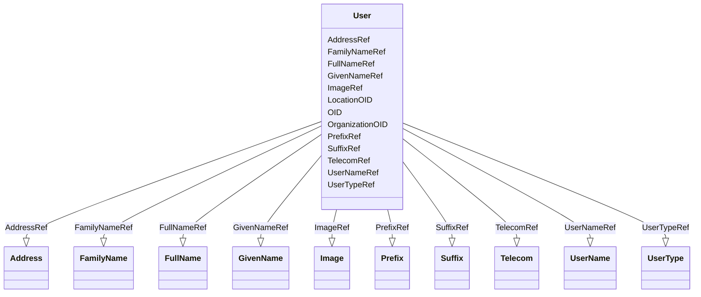

# Class: User


_Information about a specific user of a clinical data collection or data management system._


URI: [odm:User](http://www.cdisc.org/ns/odm/v2.0/User)





<!-- no inheritance hierarchy -->


## Slots

| Name | Cardinality and Range | Description | Inheritance |
| ---  | --- | --- | --- |
| [OID](OID.md) | 1..1 <br/> [oid](oid.md) | Business Rules | direct |
| [UserTypeRef](UserTypeRef.md) | 0..1 <br/> [UserType](UserType.md) | User's role in the study. | direct |
| [OrganizationOID](OrganizationOID.md) | 0..1 <br/> [oidref](oidref.md) | Reference to an Organization elment. | direct |
| [LocationOID](LocationOID.md) | 0..1 <br/> [oidref](oidref.md) | Reference to a Location element. | direct |
| [UserNameRef](UserNameRef.md) | 0..1 <br/> [UserName](UserName.md) | UserName reference: The user's login identification in the sender's system. | direct |
| [PrefixRef](PrefixRef.md) | 0..1 <br/> [Prefix](Prefix.md) | Prefix reference: Title or other prefix. Maps to FHIR HumanName.prefix (https... | direct |
| [SuffixRef](SuffixRef.md) | 0..1 <br/> [Suffix](Suffix.md) | Suffix reference: This element may include credentials, or suffixes (e.g., Jr... | direct |
| [FullNameRef](FullNameRef.md) | 0..1 <br/> [FullName](FullName.md) | FullName reference: The user's full formal name. May be a combination of Pref... | direct |
| [GivenNameRef](GivenNameRef.md) | 0..1 <br/> [GivenName](GivenName.md) | GivenName reference: The user's initial given name or all given names. | direct |
| [FamilyNameRef](FamilyNameRef.md) | 0..1 <br/> [FamilyName](FamilyName.md) | FamilyName reference: The user's surname (family name). | direct |
| [ImageRef](ImageRef.md) | 0..1 <br/> [Image](Image.md) | Image reference: A visual depiction of the user. | direct |
| [AddressRef](AddressRef.md) | 0..* <br/> [Address](Address.md) | Address reference: The postal address for a user, location, or organization. | direct |
| [TelecomRef](TelecomRef.md) | 0..* <br/> [Telecom](Telecom.md) | Telecom reference: The telecommunication contacts points of a user, a locatio... | direct |


## Usages

| used by | used in | type | used |
| ---  | --- | --- | --- |
| [AdminData](AdminData.md) | [UserRefRef](UserRefRef.md) | range | [User](User.md) |


## See Also

* [https://wiki.cdisc.org/display/ODM2/User](https://wiki.cdisc.org/display/ODM2/User)

## Identifier and Mapping Information


### Schema Source


* from schema: http://www.cdisc.org/ns/odm/v2.0


## Mappings

| Mapping Type | Mapped Value |
| ---  | ---  |
| self | odm:User |
| native | odm:User |


## LinkML Source

<!-- TODO: investigate https://stackoverflow.com/questions/37606292/how-to-create-tabbed-code-blocks-in-mkdocs-or-sphinx -->

### Direct

<details>
```yaml
name: User
description: Information about a specific user of a clinical data collection or data
  management system.
from_schema: http://www.cdisc.org/ns/odm/v2.0
see_also:
- https://wiki.cdisc.org/display/ODM2/User
slots:
- OID
- UserTypeRef
- OrganizationOID
- LocationOID
- UserNameRef
- PrefixRef
- SuffixRef
- FullNameRef
- GivenNameRef
- FamilyNameRef
- ImageRef
- AddressRef
- TelecomRef
slot_usage:
  OID:
    name: OID
    description: Business Rules
    comments:
    - 'Required

      range:oid

      For each UserRef/@UserOID value in an AuditRecord or Signature element in the
      Clinical Data there must be a User element with a matching OID attribute.'
    domain_of:
    - Study
    - MetaDataVersion
    - Standard
    - ValueListDef
    - WhereClauseDef
    - StudyEventGroupDef
    - StudyEventDef
    - ItemGroupDef
    - ItemDef
    - CodeList
    - MethodDef
    - ConditionDef
    - CommentDef
    - StudyIndication
    - StudyIntervention
    - StudyObjective
    - StudyEndPoint
    - StudyTargetPopulation
    - StudyEstimand
    - Arm
    - Epoch
    - StudyParameter
    - StudyTiming
    - TransitionTimingConstraint
    - AbsoluteTimingConstraint
    - RelativeTimingConstraint
    - DurationTimingConstraint
    - WorkflowDef
    - Transition
    - Branching
    - Criterion
    - ExceptionEvent
    - User
    - Organization
    - Location
    - SignatureDef
    - Query
    range: oid
    required: true
  UserTypeRef:
    name: UserTypeRef
    description: User's role in the study.
    comments:
    - 'Optional

      enum values:(Sponsor | Investigator | Subject | Monitor | Data analyst | Care
      provider | Assessor | Lab | Other)

      A user can be a member of more than one organization, work or enter data at
      different locations. For studies that include patient reported outcomes, the
      user may be a study subject and/or their care-giver.'
    domain_of:
    - User
    range: UserType
  OrganizationOID:
    name: OrganizationOID
    description: Reference to an Organization elment.
    comments:
    - 'Optional

      range:oidref

      Must match the OID attribute for an OrganizationDef element within this AdminData
      element.'
    domain_of:
    - User
    - Location
    range: oidref
  LocationOID:
    name: LocationOID
    description: Reference to a Location element.
    comments:
    - 'Optional

      range:oidref

      Must match the OID attribute for an OrganizationDef element within this AdminData
      element.'
    domain_of:
    - User
    - Organization
    - SiteRef
    - LocationRef
    range: oidref
  UserNameRef:
    name: UserNameRef
    domain_of:
    - User
    range: UserName
    maximum_cardinality: 1
  PrefixRef:
    name: PrefixRef
    domain_of:
    - User
    range: Prefix
    maximum_cardinality: 1
  SuffixRef:
    name: SuffixRef
    domain_of:
    - User
    range: Suffix
    maximum_cardinality: 1
  FullNameRef:
    name: FullNameRef
    domain_of:
    - User
    range: FullName
    maximum_cardinality: 1
  GivenNameRef:
    name: GivenNameRef
    domain_of:
    - User
    range: GivenName
    maximum_cardinality: 1
  FamilyNameRef:
    name: FamilyNameRef
    domain_of:
    - User
    range: FamilyName
    maximum_cardinality: 1
  ImageRef:
    name: ImageRef
    domain_of:
    - User
    range: Image
    maximum_cardinality: 1
  AddressRef:
    name: AddressRef
    multivalued: true
    domain_of:
    - User
    - Organization
    - Location
    range: Address
    inlined: true
    inlined_as_list: true
  TelecomRef:
    name: TelecomRef
    multivalued: true
    domain_of:
    - User
    - Organization
    - Location
    range: Telecom
    inlined: true
    inlined_as_list: true
class_uri: odm:User

```
</details>

### Induced

<details>
```yaml
name: User
description: Information about a specific user of a clinical data collection or data
  management system.
from_schema: http://www.cdisc.org/ns/odm/v2.0
see_also:
- https://wiki.cdisc.org/display/ODM2/User
slot_usage:
  OID:
    name: OID
    description: Business Rules
    comments:
    - 'Required

      range:oid

      For each UserRef/@UserOID value in an AuditRecord or Signature element in the
      Clinical Data there must be a User element with a matching OID attribute.'
    domain_of:
    - Study
    - MetaDataVersion
    - Standard
    - ValueListDef
    - WhereClauseDef
    - StudyEventGroupDef
    - StudyEventDef
    - ItemGroupDef
    - ItemDef
    - CodeList
    - MethodDef
    - ConditionDef
    - CommentDef
    - StudyIndication
    - StudyIntervention
    - StudyObjective
    - StudyEndPoint
    - StudyTargetPopulation
    - StudyEstimand
    - Arm
    - Epoch
    - StudyParameter
    - StudyTiming
    - TransitionTimingConstraint
    - AbsoluteTimingConstraint
    - RelativeTimingConstraint
    - DurationTimingConstraint
    - WorkflowDef
    - Transition
    - Branching
    - Criterion
    - ExceptionEvent
    - User
    - Organization
    - Location
    - SignatureDef
    - Query
    range: oid
    required: true
  UserTypeRef:
    name: UserTypeRef
    description: User's role in the study.
    comments:
    - 'Optional

      enum values:(Sponsor | Investigator | Subject | Monitor | Data analyst | Care
      provider | Assessor | Lab | Other)

      A user can be a member of more than one organization, work or enter data at
      different locations. For studies that include patient reported outcomes, the
      user may be a study subject and/or their care-giver.'
    domain_of:
    - User
    range: UserType
  OrganizationOID:
    name: OrganizationOID
    description: Reference to an Organization elment.
    comments:
    - 'Optional

      range:oidref

      Must match the OID attribute for an OrganizationDef element within this AdminData
      element.'
    domain_of:
    - User
    - Location
    range: oidref
  LocationOID:
    name: LocationOID
    description: Reference to a Location element.
    comments:
    - 'Optional

      range:oidref

      Must match the OID attribute for an OrganizationDef element within this AdminData
      element.'
    domain_of:
    - User
    - Organization
    - SiteRef
    - LocationRef
    range: oidref
  UserNameRef:
    name: UserNameRef
    domain_of:
    - User
    range: UserName
    maximum_cardinality: 1
  PrefixRef:
    name: PrefixRef
    domain_of:
    - User
    range: Prefix
    maximum_cardinality: 1
  SuffixRef:
    name: SuffixRef
    domain_of:
    - User
    range: Suffix
    maximum_cardinality: 1
  FullNameRef:
    name: FullNameRef
    domain_of:
    - User
    range: FullName
    maximum_cardinality: 1
  GivenNameRef:
    name: GivenNameRef
    domain_of:
    - User
    range: GivenName
    maximum_cardinality: 1
  FamilyNameRef:
    name: FamilyNameRef
    domain_of:
    - User
    range: FamilyName
    maximum_cardinality: 1
  ImageRef:
    name: ImageRef
    domain_of:
    - User
    range: Image
    maximum_cardinality: 1
  AddressRef:
    name: AddressRef
    multivalued: true
    domain_of:
    - User
    - Organization
    - Location
    range: Address
    inlined: true
    inlined_as_list: true
  TelecomRef:
    name: TelecomRef
    multivalued: true
    domain_of:
    - User
    - Organization
    - Location
    range: Telecom
    inlined: true
    inlined_as_list: true
attributes:
  OID:
    name: OID
    description: Business Rules
    comments:
    - 'Required

      range:oid

      For each UserRef/@UserOID value in an AuditRecord or Signature element in the
      Clinical Data there must be a User element with a matching OID attribute.'
    from_schema: http://www.cdisc.org/ns/odm/v2.0
    rank: 1000
    identifier: true
    alias: OID
    owner: User
    domain_of:
    - Study
    - MetaDataVersion
    - Standard
    - ValueListDef
    - WhereClauseDef
    - StudyEventGroupDef
    - StudyEventDef
    - ItemGroupDef
    - ItemDef
    - CodeList
    - MethodDef
    - ConditionDef
    - CommentDef
    - StudyIndication
    - StudyIntervention
    - StudyObjective
    - StudyEndPoint
    - StudyTargetPopulation
    - StudyEstimand
    - Arm
    - Epoch
    - StudyParameter
    - StudyTiming
    - TransitionTimingConstraint
    - AbsoluteTimingConstraint
    - RelativeTimingConstraint
    - DurationTimingConstraint
    - WorkflowDef
    - Transition
    - Branching
    - Criterion
    - ExceptionEvent
    - User
    - Organization
    - Location
    - SignatureDef
    - Query
    range: oid
    required: true
  UserTypeRef:
    name: UserTypeRef
    description: User's role in the study.
    comments:
    - 'Optional

      enum values:(Sponsor | Investigator | Subject | Monitor | Data analyst | Care
      provider | Assessor | Lab | Other)

      A user can be a member of more than one organization, work or enter data at
      different locations. For studies that include patient reported outcomes, the
      user may be a study subject and/or their care-giver.'
    from_schema: http://www.cdisc.org/ns/odm/v2.0
    rank: 1000
    alias: UserTypeRef
    owner: User
    domain_of:
    - User
    range: UserType
  OrganizationOID:
    name: OrganizationOID
    description: Reference to an Organization elment.
    comments:
    - 'Optional

      range:oidref

      Must match the OID attribute for an OrganizationDef element within this AdminData
      element.'
    from_schema: http://www.cdisc.org/ns/odm/v2.0
    rank: 1000
    alias: OrganizationOID
    owner: User
    domain_of:
    - User
    - Location
    range: oidref
  LocationOID:
    name: LocationOID
    description: Reference to a Location element.
    comments:
    - 'Optional

      range:oidref

      Must match the OID attribute for an OrganizationDef element within this AdminData
      element.'
    from_schema: http://www.cdisc.org/ns/odm/v2.0
    rank: 1000
    alias: LocationOID
    owner: User
    domain_of:
    - User
    - Organization
    - SiteRef
    - LocationRef
    range: oidref
  UserNameRef:
    name: UserNameRef
    description: 'UserName reference: The user''s login identification in the sender''s
      system.'
    from_schema: http://www.cdisc.org/ns/odm/v2.0
    rank: 1000
    identifier: false
    alias: UserNameRef
    owner: User
    domain_of:
    - User
    range: UserName
    maximum_cardinality: 1
  PrefixRef:
    name: PrefixRef
    description: 'Prefix reference: Title or other prefix. Maps to FHIR HumanName.prefix
      (https://www.hl7.org/fhir/datatypes.html#humanname).'
    from_schema: http://www.cdisc.org/ns/odm/v2.0
    rank: 1000
    identifier: false
    alias: PrefixRef
    owner: User
    domain_of:
    - User
    range: Prefix
    maximum_cardinality: 1
  SuffixRef:
    name: SuffixRef
    description: 'Suffix reference: This element may include credentials, or suffixes
      (e.g., Jr., III).'
    from_schema: http://www.cdisc.org/ns/odm/v2.0
    rank: 1000
    identifier: false
    alias: SuffixRef
    owner: User
    domain_of:
    - User
    range: Suffix
    maximum_cardinality: 1
  FullNameRef:
    name: FullNameRef
    description: 'FullName reference: The user''s full formal name. May be a combination
      of Prefix, GivenName, FamilyName & Suffix. Intended to be used for display.'
    from_schema: http://www.cdisc.org/ns/odm/v2.0
    rank: 1000
    identifier: false
    alias: FullNameRef
    owner: User
    domain_of:
    - User
    range: FullName
    maximum_cardinality: 1
  GivenNameRef:
    name: GivenNameRef
    description: 'GivenName reference: The user''s initial given name or all given
      names.'
    from_schema: http://www.cdisc.org/ns/odm/v2.0
    rank: 1000
    identifier: false
    alias: GivenNameRef
    owner: User
    domain_of:
    - User
    range: GivenName
    maximum_cardinality: 1
  FamilyNameRef:
    name: FamilyNameRef
    description: 'FamilyName reference: The user''s surname (family name).'
    from_schema: http://www.cdisc.org/ns/odm/v2.0
    rank: 1000
    identifier: false
    alias: FamilyNameRef
    owner: User
    domain_of:
    - User
    range: FamilyName
    maximum_cardinality: 1
  ImageRef:
    name: ImageRef
    description: 'Image reference: A visual depiction of the user.'
    from_schema: http://www.cdisc.org/ns/odm/v2.0
    rank: 1000
    identifier: false
    alias: ImageRef
    owner: User
    domain_of:
    - User
    range: Image
    maximum_cardinality: 1
  AddressRef:
    name: AddressRef
    description: 'Address reference: The postal address for a user, location, or organization.'
    from_schema: http://www.cdisc.org/ns/odm/v2.0
    rank: 1000
    multivalued: true
    identifier: false
    alias: AddressRef
    owner: User
    domain_of:
    - User
    - Organization
    - Location
    range: Address
    inlined: true
    inlined_as_list: true
  TelecomRef:
    name: TelecomRef
    description: 'Telecom reference: The telecommunication contacts points of a user,
      a location, or an organization. The Type attribute designates the type of contact.'
    from_schema: http://www.cdisc.org/ns/odm/v2.0
    rank: 1000
    multivalued: true
    identifier: false
    alias: TelecomRef
    owner: User
    domain_of:
    - User
    - Organization
    - Location
    range: Telecom
    inlined: true
    inlined_as_list: true
class_uri: odm:User

```
</details>