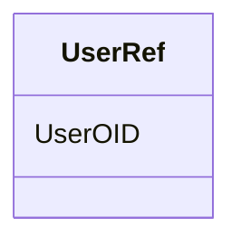

# Class: UserRef


_Element NameUserRefParent ElementsAuditRecord, SignatureElement XPath(s)/ODM/AdminData/Location/Query/AuditRecord/ODM/ClinicalData/Query/AuditRecord/ODM/ClinicalData/SubjectData/AuditRecord/ODM/ClinicalData/SubjecData/Query/AuditRecord/ODM/ClinicalData/SubjectData/StudyEvent/AuditRecord/ODM/ClinicalData/SubjecData/StudyEvent/Query/AuditRecord/ODM/ClinicalData/SubjectData/StudyEvent/ItemGroupData/AuditRecord/ODM/ClinicalData/SubjecData/StudyEvent/ItemGroupData/Query/AuditRecord/ODM/ClinicalData/SubjectData/StudyEvent/ItemGroupData/ItemData/AuditRecord/ODM/ClinicalData/SubjecData/StudyEvent/ItemGroupData/ItemData/Query/AuditRecord/ODM/ClinicalData/SubjectData/Signature/ODM/ClinicalData/SubjectData/StudyEvent/Signature/ODM/ClinicalData/SubjectData/StudyEvent/ItemGroupData/Signature/ODM/ClinicalData/SubjectData/StudyEvent/ItemGroupData/ItemData/SignatureElement Textual ValueNoneAttributesUserOIDChild ElementsNoneUsage/Business Rules_


URI: [odm:UserRef](http://www.cdisc.org/ns/odm/v2.0/UserRef)





<!-- no inheritance hierarchy -->


## Slots

| Name | Cardinality and Range | Description | Inheritance |
| ---  | --- | --- | --- |
| [UserOID](UserOID.md) | 1..1 <br/> [Oidref](Oidref.md) | Reference to the User definition | direct |


## Usages

| used by | used in | type | used |
| ---  | --- | --- | --- |
| [AuditRecord](AuditRecord.md) | [UserRefRef](UserRefRef.md) | range | [UserRef](UserRef.md) |
| [Signature](Signature.md) | [UserRefRef](UserRefRef.md) | range | [UserRef](UserRef.md) |


## See Also

* [https://wiki.cdisc.org/display/ODM2/UserRef](https://wiki.cdisc.org/display/ODM2/UserRef)

## Identifier and Mapping Information


### Schema Source


* from schema: http://www.cdisc.org/ns/odm/v2.0


## Mappings

| Mapping Type | Mapped Value |
| ---  | ---  |
| self | odm:UserRef |
| native | odm:UserRef |


## LinkML Source

<!-- TODO: investigate https://stackoverflow.com/questions/37606292/how-to-create-tabbed-code-blocks-in-mkdocs-or-sphinx -->

### Direct

<details>
```yaml
name: UserRef
description: Element NameUserRefParent ElementsAuditRecord, SignatureElement XPath(s)/ODM/AdminData/Location/Query/AuditRecord/ODM/ClinicalData/Query/AuditRecord/ODM/ClinicalData/SubjectData/AuditRecord/ODM/ClinicalData/SubjecData/Query/AuditRecord/ODM/ClinicalData/SubjectData/StudyEvent/AuditRecord/ODM/ClinicalData/SubjecData/StudyEvent/Query/AuditRecord/ODM/ClinicalData/SubjectData/StudyEvent/ItemGroupData/AuditRecord/ODM/ClinicalData/SubjecData/StudyEvent/ItemGroupData/Query/AuditRecord/ODM/ClinicalData/SubjectData/StudyEvent/ItemGroupData/ItemData/AuditRecord/ODM/ClinicalData/SubjecData/StudyEvent/ItemGroupData/ItemData/Query/AuditRecord/ODM/ClinicalData/SubjectData/Signature/ODM/ClinicalData/SubjectData/StudyEvent/Signature/ODM/ClinicalData/SubjectData/StudyEvent/ItemGroupData/Signature/ODM/ClinicalData/SubjectData/StudyEvent/ItemGroupData/ItemData/SignatureElement
  Textual ValueNoneAttributesUserOIDChild ElementsNoneUsage/Business Rules
from_schema: http://www.cdisc.org/ns/odm/v2.0
see_also:
- https://wiki.cdisc.org/display/ODM2/UserRef
slots:
- UserOID
slot_usage:
  UserOID:
    name: UserOID
    description: Reference to the User definition.
    comments:
    - "Required \nMust match the OID attribute of an AdminData/User element. If used\
      \ within a ClinicalData element, the ClinicalData StudyOID attribute must match\
      \ the StudyOID attribute in the the AdminData element."
    domain_of:
    - InvestigatorRef
    - UserRef
    range: oidref
    required: true
class_uri: odm:UserRef

```
</details>

### Induced

<details>
```yaml
name: UserRef
description: Element NameUserRefParent ElementsAuditRecord, SignatureElement XPath(s)/ODM/AdminData/Location/Query/AuditRecord/ODM/ClinicalData/Query/AuditRecord/ODM/ClinicalData/SubjectData/AuditRecord/ODM/ClinicalData/SubjecData/Query/AuditRecord/ODM/ClinicalData/SubjectData/StudyEvent/AuditRecord/ODM/ClinicalData/SubjecData/StudyEvent/Query/AuditRecord/ODM/ClinicalData/SubjectData/StudyEvent/ItemGroupData/AuditRecord/ODM/ClinicalData/SubjecData/StudyEvent/ItemGroupData/Query/AuditRecord/ODM/ClinicalData/SubjectData/StudyEvent/ItemGroupData/ItemData/AuditRecord/ODM/ClinicalData/SubjecData/StudyEvent/ItemGroupData/ItemData/Query/AuditRecord/ODM/ClinicalData/SubjectData/Signature/ODM/ClinicalData/SubjectData/StudyEvent/Signature/ODM/ClinicalData/SubjectData/StudyEvent/ItemGroupData/Signature/ODM/ClinicalData/SubjectData/StudyEvent/ItemGroupData/ItemData/SignatureElement
  Textual ValueNoneAttributesUserOIDChild ElementsNoneUsage/Business Rules
from_schema: http://www.cdisc.org/ns/odm/v2.0
see_also:
- https://wiki.cdisc.org/display/ODM2/UserRef
slot_usage:
  UserOID:
    name: UserOID
    description: Reference to the User definition.
    comments:
    - "Required \nMust match the OID attribute of an AdminData/User element. If used\
      \ within a ClinicalData element, the ClinicalData StudyOID attribute must match\
      \ the StudyOID attribute in the the AdminData element."
    domain_of:
    - InvestigatorRef
    - UserRef
    range: oidref
    required: true
attributes:
  UserOID:
    name: UserOID
    description: Reference to the User definition.
    comments:
    - "Required \nMust match the OID attribute of an AdminData/User element. If used\
      \ within a ClinicalData element, the ClinicalData StudyOID attribute must match\
      \ the StudyOID attribute in the the AdminData element."
    from_schema: http://www.cdisc.org/ns/odm/v2.0
    rank: 1000
    alias: UserOID
    owner: UserRef
    domain_of:
    - InvestigatorRef
    - UserRef
    range: oidref
    required: true
class_uri: odm:UserRef

```
</details>