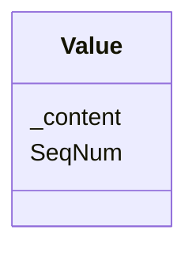

# Class: Value


_The data collected for an item. This data is represented according to DataType attribute of the ItemDef referenced by the ItemOID attribute in the parent ItemData element._


URI: [odm:Value](http://www.cdisc.org/ns/odm/v2.0/Value)





<!-- no inheritance hierarchy -->


## Slots

| Name | Cardinality and Range | Description | Inheritance |
| ---  | --- | --- | --- |
| [SeqNum](SeqNum.md) | 0..1 <br/> [positiveInteger](positiveInteger.md) | When more than 1 Value element exists this attribute uniquely identifies each... | direct |
| [_content](_content.md) | 0..1 <br/> [text](text.md) | multi-line text content from between XML tags | direct |


## Usages

| used by | used in | type | used |
| ---  | --- | --- | --- |
| [ItemData](ItemData.md) | [ValueRef](ValueRef.md) | range | [Value](Value.md) |
| [Query](Query.md) | [ValueRef](ValueRef.md) | range | [Value](Value.md) |


## See Also

* [https://wiki.cdisc.org/display/ODM2/Value](https://wiki.cdisc.org/display/ODM2/Value)

## Identifier and Mapping Information


### Schema Source


* from schema: http://www.cdisc.org/ns/odm/v2.0


## Mappings

| Mapping Type | Mapped Value |
| ---  | ---  |
| self | odm:Value |
| native | odm:Value |


## LinkML Source

<!-- TODO: investigate https://stackoverflow.com/questions/37606292/how-to-create-tabbed-code-blocks-in-mkdocs-or-sphinx -->

### Direct

<details>
```yaml
name: Value
description: The data collected for an item. This data is represented according to
  DataType attribute of the ItemDef referenced by the ItemOID attribute in the parent
  ItemData element.
from_schema: http://www.cdisc.org/ns/odm/v2.0
see_also:
- https://wiki.cdisc.org/display/ODM2/Value
slots:
- SeqNum
- _content
slot_usage:
  SeqNum:
    name: SeqNum
    description: When more than 1 Value element exists this attribute uniquely identifies
      each Value and defines the order of a Value in a list of Values.
    comments:
    - 'Conditional Required when the parent ItemData has more than one Value element.

      Must be unique within the ItemData element.'
    domain_of:
    - Annotation
    - Value
    range: positiveInteger
  _content:
    name: _content
    domain_of:
    - TranslatedText
    - CheckValue
    - Code
    - WorkflowEnd
    - UserName
    - Prefix
    - Suffix
    - FullName
    - GivenName
    - FamilyName
    - StreetName
    - HouseNumber
    - City
    - StateProv
    - Country
    - PostalCode
    - OtherText
    - Meaning
    - LegalReason
    - DateTimeStamp
    - ReasonForChange
    - SourceID
    - FlagValue
    - FlagType
    - Value
    range: text
class_uri: odm:Value

```
</details>

### Induced

<details>
```yaml
name: Value
description: The data collected for an item. This data is represented according to
  DataType attribute of the ItemDef referenced by the ItemOID attribute in the parent
  ItemData element.
from_schema: http://www.cdisc.org/ns/odm/v2.0
see_also:
- https://wiki.cdisc.org/display/ODM2/Value
slot_usage:
  SeqNum:
    name: SeqNum
    description: When more than 1 Value element exists this attribute uniquely identifies
      each Value and defines the order of a Value in a list of Values.
    comments:
    - 'Conditional Required when the parent ItemData has more than one Value element.

      Must be unique within the ItemData element.'
    domain_of:
    - Annotation
    - Value
    range: positiveInteger
  _content:
    name: _content
    domain_of:
    - TranslatedText
    - CheckValue
    - Code
    - WorkflowEnd
    - UserName
    - Prefix
    - Suffix
    - FullName
    - GivenName
    - FamilyName
    - StreetName
    - HouseNumber
    - City
    - StateProv
    - Country
    - PostalCode
    - OtherText
    - Meaning
    - LegalReason
    - DateTimeStamp
    - ReasonForChange
    - SourceID
    - FlagValue
    - FlagType
    - Value
    range: text
attributes:
  SeqNum:
    name: SeqNum
    description: When more than 1 Value element exists this attribute uniquely identifies
      each Value and defines the order of a Value in a list of Values.
    comments:
    - 'Conditional Required when the parent ItemData has more than one Value element.

      Must be unique within the ItemData element.'
    from_schema: http://www.cdisc.org/ns/odm/v2.0
    rank: 1000
    alias: SeqNum
    owner: Value
    domain_of:
    - Annotation
    - Value
    range: positiveInteger
  _content:
    name: _content
    description: multi-line text content from between XML tags
    from_schema: http://www.cdisc.org/ns/odm/v2.0
    rank: 1000
    alias: _content
    owner: Value
    domain_of:
    - TranslatedText
    - CheckValue
    - Code
    - WorkflowEnd
    - UserName
    - Prefix
    - Suffix
    - FullName
    - GivenName
    - FamilyName
    - StreetName
    - HouseNumber
    - City
    - StateProv
    - Country
    - PostalCode
    - OtherText
    - Meaning
    - LegalReason
    - DateTimeStamp
    - ReasonForChange
    - SourceID
    - FlagValue
    - FlagType
    - Value
    range: text
    inlined: true
class_uri: odm:Value

```
</details>