# Class: ValueListDef

_The following table specifies the XML structure for valuelist metadata. The ValueListDef element contains ItemRef elements that reference ItemDef elements that provide the value-level metadata details_


URI: [odm:ValueListDef](http://www.cdisc.org/ns/odm/v2.0/ValueListDef)

```mermaid
erDiagram
ValueListDef {
    oid OID  
}
ItemRef {
    positiveInteger keySequence  
    YesOnly isNonStandard  
    YesOnly hasNoData  
    YesOnly repeat  
    YesOnly other  
    text role  
    CoreType core  
    text preSpecifiedValue  
    positiveInteger orderNumber  
    YesOrNo mandatory  
}
WhereClauseRef {

}
Origin {
    OriginType type  
    OriginSource source  
}
ConditionDef {
    oid OID  
    nameType name  
}
CodeList {
    oid OID  
    nameType name  
    CLDataType dataType  
    YesOnly isNonStandard  
}
ItemDef {
    oid OID  
    nameType name  
    DataType dataType  
    positiveInteger length  
    text displayFormat  
    text variableSet  
}
MethodDef {
    oid OID  
    nameType name  
    MethodType type  
}
Description {

}
TranslatedText {
    languageType language  
    text type  
    contentType content  
}

ValueListDef ||--|o Description : "description"
ValueListDef ||--}o ItemRef : "itemRef"
ItemRef ||--|| ItemDef : "itemOID"
ItemRef ||--|o MethodDef : "methodOID"
ItemRef ||--|o ItemDef : "unitsItemOID"
ItemRef ||--|o CodeList : "roleCodeListOID"
ItemRef ||--|o ConditionDef : "collectionExceptionConditionOID"
ItemRef ||--}o Origin : "origin"
ItemRef ||--}o WhereClauseRef : "whereClauseRef"
WhereClauseRef ||--|| WhereClauseDef : "whereClauseOID"
Origin ||--|o Description : "description"
Origin ||--|o SourceItems : "sourceItems"
Origin ||--}o Coding : "coding"
Origin ||--}o DocumentRef : "documentRef"
ConditionDef ||--|o CommentDef : "commentOID"
ConditionDef ||--|o Description : "description"
ConditionDef ||--|o MethodSignature : "methodSignature"
ConditionDef ||--}o FormalExpression : "formalExpression"
ConditionDef ||--}o Alias : "alias"
CodeList ||--|o CommentDef : "commentOID"
CodeList ||--|o Standard : "standardOID"
CodeList ||--|o Description : "description"
CodeList ||--}o CodeListItem : "codeListItem"
CodeList ||--}o Coding : "coding"
CodeList ||--}o Alias : "alias"
ItemDef ||--|o CommentDef : "commentOID"
ItemDef ||--|o Description : "description"
ItemDef ||--|o Definition : "definition"
ItemDef ||--|o Question : "question"
ItemDef ||--|o Prompt : "prompt"
ItemDef ||--|o CRFCompletionInstructions : "cRFCompletionInstructions"
ItemDef ||--|o ImplementationNotes : "implementationNotes"
ItemDef ||--|o CDISCNotes : "cDISCNotes"
ItemDef ||--}o RangeCheck : "rangeCheck"
ItemDef ||--|o CodeListRef : "codeListRef"
ItemDef ||--|o ValueListRef : "valueListRef"
ItemDef ||--}o Coding : "coding"
ItemDef ||--}o Alias : "alias"
MethodDef ||--|o CommentDef : "commentOID"
MethodDef ||--|o Description : "description"
MethodDef ||--|o MethodSignature : "methodSignature"
MethodDef ||--}o FormalExpression : "formalExpression"
MethodDef ||--}o Alias : "alias"
MethodDef ||--}o DocumentRef : "documentRef"
Description ||--}o TranslatedText : "translatedText"

```





<!-- no inheritance hierarchy -->


## Slots

| Name | Cardinality* and Range | Description | Inheritance |
| ---  | --- | --- | --- |
| [OID](OID.md) | 1..1 <br/> [oid](oid.md) | Unique ID for the Value List See Section 2.13, Element Identifiers and Refere... | direct |
| [description](description.md) | 0..1 <br/> [Description](Description.md) | Description of the value list. | direct |
| [itemRef](itemRef.md) | 0..* <br/> [ItemRef](ItemRef.md) | The ItemRef element contains the reference to the value attributes definition... | direct |

_* See [LinkML documentation](https://linkml.io/linkml/schemas/slots.html#slot-cardinality) for cardinality definitions._


## Usages

| used by | used in | type | used |
| ---  | --- | --- | --- |
| [MetaDataVersion](MetaDataVersion.md) | [valueListDef](valueListDef.md) | range | [ValueListDef](ValueListDef.md) |
| [ValueListRef](ValueListRef.md) | [valueListOID](valueListOID.md) | range | [ValueListDef](ValueListDef.md) |


## See Also

* [https://wiki.cdisc.org/display/PUB/ValueListDef](https://wiki.cdisc.org/display/PUB/ValueListDef)

## Identifier and Mapping Information


### Schema Source


* from schema: http://www.cdisc.org/ns/odm/v2.0


## Mappings

| Mapping Type | Mapped Value |
| ---  | ---  |
| self | odm:ValueListDef |
| native | odm:ValueListDef |


## LinkML Source

<!-- TODO: investigate https://stackoverflow.com/questions/37606292/how-to-create-tabbed-code-blocks-in-mkdocs-or-sphinx -->

### Direct

<details>
```yaml
name: ValueListDef
description: The following table specifies the XML structure for valuelist metadata.
  The ValueListDef element contains ItemRef elements that reference ItemDef elements
  that provide the value-level metadata details
from_schema: http://www.cdisc.org/ns/odm/v2.0
see_also:
- https://wiki.cdisc.org/display/PUB/ValueListDef
rank: 1000
slots:
- OID
- description
- itemRef
slot_usage:
  OID:
    name: OID
    description: Unique ID for the Value List See Section 2.13, Element Identifiers
      and References , for OID considerations.
    comments:
    - 'Required

      range: oid'
    identifier: true
    domain_of:
    - Study
    - MetaDataVersion
    - Standard
    - ValueListDef
    - WhereClauseDef
    - StudyEventGroupDef
    - StudyEventDef
    - ItemGroupDef
    - ItemDef
    - CodeList
    - MethodDef
    - ConditionDef
    - CommentDef
    - StudyIndication
    - StudyIntervention
    - StudyObjective
    - StudyEndPoint
    - StudyTargetPopulation
    - StudyEstimand
    - Arm
    - Epoch
    - StudyParameter
    - StudyTiming
    - TransitionTimingConstraint
    - AbsoluteTimingConstraint
    - RelativeTimingConstraint
    - DurationTimingConstraint
    - WorkflowDef
    - Transition
    - Branching
    - Criterion
    - User
    - Organization
    - Location
    - SignatureDef
    - Query
    range: oid
    required: true
  description:
    name: description
    description: Description of the value list.
    domain_of:
    - Study
    - MetaDataVersion
    - ValueListDef
    - StudyEventGroupRef
    - StudyEventGroupDef
    - StudyEventDef
    - ItemGroupDef
    - Origin
    - ItemDef
    - CodeList
    - CodeListItem
    - MethodDef
    - ConditionDef
    - CommentDef
    - Protocol
    - StudyStructure
    - TrialPhase
    - StudyIndication
    - StudyIntervention
    - StudyObjective
    - StudyEndPoint
    - StudyTargetPopulation
    - StudyEstimand
    - IntercurrentEvent
    - SummaryMeasure
    - Arm
    - Epoch
    - TransitionTimingConstraint
    - AbsoluteTimingConstraint
    - RelativeTimingConstraint
    - DurationTimingConstraint
    - WorkflowDef
    - Criterion
    - Organization
    - Location
    - ODMFileMetadata
    range: Description
    maximum_cardinality: 1
  itemRef:
    name: itemRef
    description: The ItemRef element contains the reference to the value attributes
      definitions.
    multivalued: true
    domain_of:
    - ValueListDef
    - ItemGroupDef
    range: ItemRef
    inlined: true
    inlined_as_list: true
class_uri: odm:ValueListDef

```
</details>

### Induced

<details>
```yaml
name: ValueListDef
description: The following table specifies the XML structure for valuelist metadata.
  The ValueListDef element contains ItemRef elements that reference ItemDef elements
  that provide the value-level metadata details
from_schema: http://www.cdisc.org/ns/odm/v2.0
see_also:
- https://wiki.cdisc.org/display/PUB/ValueListDef
rank: 1000
slot_usage:
  OID:
    name: OID
    description: Unique ID for the Value List See Section 2.13, Element Identifiers
      and References , for OID considerations.
    comments:
    - 'Required

      range: oid'
    identifier: true
    domain_of:
    - Study
    - MetaDataVersion
    - Standard
    - ValueListDef
    - WhereClauseDef
    - StudyEventGroupDef
    - StudyEventDef
    - ItemGroupDef
    - ItemDef
    - CodeList
    - MethodDef
    - ConditionDef
    - CommentDef
    - StudyIndication
    - StudyIntervention
    - StudyObjective
    - StudyEndPoint
    - StudyTargetPopulation
    - StudyEstimand
    - Arm
    - Epoch
    - StudyParameter
    - StudyTiming
    - TransitionTimingConstraint
    - AbsoluteTimingConstraint
    - RelativeTimingConstraint
    - DurationTimingConstraint
    - WorkflowDef
    - Transition
    - Branching
    - Criterion
    - User
    - Organization
    - Location
    - SignatureDef
    - Query
    range: oid
    required: true
  description:
    name: description
    description: Description of the value list.
    domain_of:
    - Study
    - MetaDataVersion
    - ValueListDef
    - StudyEventGroupRef
    - StudyEventGroupDef
    - StudyEventDef
    - ItemGroupDef
    - Origin
    - ItemDef
    - CodeList
    - CodeListItem
    - MethodDef
    - ConditionDef
    - CommentDef
    - Protocol
    - StudyStructure
    - TrialPhase
    - StudyIndication
    - StudyIntervention
    - StudyObjective
    - StudyEndPoint
    - StudyTargetPopulation
    - StudyEstimand
    - IntercurrentEvent
    - SummaryMeasure
    - Arm
    - Epoch
    - TransitionTimingConstraint
    - AbsoluteTimingConstraint
    - RelativeTimingConstraint
    - DurationTimingConstraint
    - WorkflowDef
    - Criterion
    - Organization
    - Location
    - ODMFileMetadata
    range: Description
    maximum_cardinality: 1
  itemRef:
    name: itemRef
    description: The ItemRef element contains the reference to the value attributes
      definitions.
    multivalued: true
    domain_of:
    - ValueListDef
    - ItemGroupDef
    range: ItemRef
    inlined: true
    inlined_as_list: true
attributes:
  OID:
    name: OID
    description: Unique ID for the Value List See Section 2.13, Element Identifiers
      and References , for OID considerations.
    comments:
    - 'Required

      range: oid'
    from_schema: http://www.cdisc.org/ns/odm/v2.0
    rank: 1000
    identifier: true
    alias: OID
    owner: ValueListDef
    domain_of:
    - Study
    - MetaDataVersion
    - Standard
    - ValueListDef
    - WhereClauseDef
    - StudyEventGroupDef
    - StudyEventDef
    - ItemGroupDef
    - ItemDef
    - CodeList
    - MethodDef
    - ConditionDef
    - CommentDef
    - StudyIndication
    - StudyIntervention
    - StudyObjective
    - StudyEndPoint
    - StudyTargetPopulation
    - StudyEstimand
    - Arm
    - Epoch
    - StudyParameter
    - StudyTiming
    - TransitionTimingConstraint
    - AbsoluteTimingConstraint
    - RelativeTimingConstraint
    - DurationTimingConstraint
    - WorkflowDef
    - Transition
    - Branching
    - Criterion
    - User
    - Organization
    - Location
    - SignatureDef
    - Query
    range: oid
    required: true
  description:
    name: description
    description: Description of the value list.
    from_schema: http://www.cdisc.org/ns/odm/v2.0
    rank: 1000
    alias: description
    owner: ValueListDef
    domain_of:
    - Study
    - MetaDataVersion
    - ValueListDef
    - StudyEventGroupRef
    - StudyEventGroupDef
    - StudyEventDef
    - ItemGroupDef
    - Origin
    - ItemDef
    - CodeList
    - CodeListItem
    - MethodDef
    - ConditionDef
    - CommentDef
    - Protocol
    - StudyStructure
    - TrialPhase
    - StudyIndication
    - StudyIntervention
    - StudyObjective
    - StudyEndPoint
    - StudyTargetPopulation
    - StudyEstimand
    - IntercurrentEvent
    - SummaryMeasure
    - Arm
    - Epoch
    - TransitionTimingConstraint
    - AbsoluteTimingConstraint
    - RelativeTimingConstraint
    - DurationTimingConstraint
    - WorkflowDef
    - Criterion
    - Organization
    - Location
    - ODMFileMetadata
    range: Description
    maximum_cardinality: 1
  itemRef:
    name: itemRef
    description: The ItemRef element contains the reference to the value attributes
      definitions.
    from_schema: http://www.cdisc.org/ns/odm/v2.0
    rank: 1000
    multivalued: true
    alias: itemRef
    owner: ValueListDef
    domain_of:
    - ValueListDef
    - ItemGroupDef
    range: ItemRef
    inlined: true
    inlined_as_list: true
class_uri: odm:ValueListDef

```
</details>