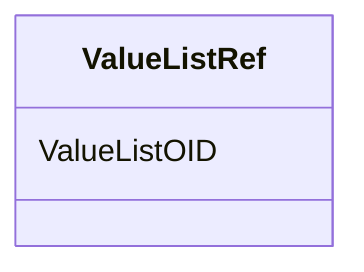

# Class: ValueListRef


URI: [odm:ValueListRef](http://www.cdisc.org/ns/odm/v2.0/ValueListRef)





<!-- no inheritance hierarchy -->


## Slots

| Name | Cardinality and Range | Description | Inheritance |
| ---  | --- | --- | --- |
| [ValueListOID](ValueListOID.md) | 1..1 <br/> [Oidref](Oidref.md) |  | direct |


## Usages

| used by | used in | type | used |
| ---  | --- | --- | --- |
| [ItemDef](ItemDef.md) | [ValueListRefRef](ValueListRefRef.md) | range | [ValueListRef](ValueListRef.md) |


## Identifier and Mapping Information


### Schema Source


* from schema: http://www.cdisc.org/ns/odm/v2.0


## Mappings

| Mapping Type | Mapped Value |
| ---  | ---  |
| self | odm:ValueListRef |
| native | odm:ValueListRef |


## LinkML Source

<!-- TODO: investigate https://stackoverflow.com/questions/37606292/how-to-create-tabbed-code-blocks-in-mkdocs-or-sphinx -->

### Direct

<details>
```yaml
name: ValueListRef
from_schema: http://www.cdisc.org/ns/odm/v2.0
slots:
- ValueListOID
slot_usage:
  ValueListOID:
    name: ValueListOID
    domain_of:
    - ValueListRef
    range: oidref
    required: true
class_uri: odm:ValueListRef

```
</details>

### Induced

<details>
```yaml
name: ValueListRef
from_schema: http://www.cdisc.org/ns/odm/v2.0
slot_usage:
  ValueListOID:
    name: ValueListOID
    domain_of:
    - ValueListRef
    range: oidref
    required: true
attributes:
  ValueListOID:
    name: ValueListOID
    from_schema: http://www.cdisc.org/ns/odm/v2.0
    rank: 1000
    alias: ValueListOID
    owner: ValueListRef
    domain_of:
    - ValueListRef
    range: oidref
    required: true
class_uri: odm:ValueListRef

```
</details>