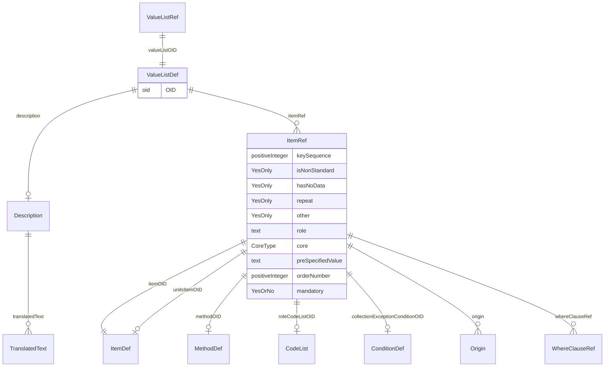

# Class: ValueListRef

_The ValueListRef element is the OID of the ValueListDef that contains the valuelist definition associated with the variable. If value-level metadata is required for a variable, a ValueListRef element should be provided as a child element on the ItemDef for the variable definition._


URI: [odm:ValueListRef](http://www.cdisc.org/ns/odm/v2.0/ValueListRef)





<!-- no inheritance hierarchy -->


## Slots

| Name | Cardinality* and Range | Description | Inheritance |
| ---  | --- | --- | --- |
| [valueListOID](valueListOID.md) | 1..1 <br/> [ValueListDef](ValueListDef.md) | Reference to the unique ID of a ValueListDef element that provides value-leve... | direct |

_* See [LinkML documentation](https://linkml.io/linkml/schemas/slots.html#slot-cardinality) for cardinality definitions._


## Usages

| used by | used in | type | used |
| ---  | --- | --- | --- |
| [ItemDef](ItemDef.md) | [valueListRef](valueListRef.md) | range | [ValueListRef](ValueListRef.md) |


## See Also

* [https://wiki.cdisc.org/display/PUB/ValueListRef](https://wiki.cdisc.org/display/PUB/ValueListRef)

## Identifier and Mapping Information


### Schema Source


* from schema: http://www.cdisc.org/ns/odm/v2.0


## Mappings

| Mapping Type | Mapped Value |
| ---  | ---  |
| self | odm:ValueListRef |
| native | odm:ValueListRef |


## LinkML Source

<!-- TODO: investigate https://stackoverflow.com/questions/37606292/how-to-create-tabbed-code-blocks-in-mkdocs-or-sphinx -->

### Direct

<details>
```yaml
name: ValueListRef
description: The ValueListRef element is the OID of the ValueListDef that contains
  the valuelist definition associated with the variable. If value-level metadata is
  required for a variable, a ValueListRef element should be provided as a child element
  on the ItemDef for the variable definition.
from_schema: http://www.cdisc.org/ns/odm/v2.0
see_also:
- https://wiki.cdisc.org/display/PUB/ValueListRef
rank: 1000
slots:
- valueListOID
slot_usage:
  valueListOID:
    name: valueListOID
    description: Reference to the unique ID of a ValueListDef element that provides
      value-level metadata.
    comments:
    - 'Required

      range: oidref

      Must match the OID of a ValueListDef in the same MetaDataVersion.'
    domain_of:
    - ValueListRef
    range: ValueListDef
    required: true
class_uri: odm:ValueListRef

```
</details>

### Induced

<details>
```yaml
name: ValueListRef
description: The ValueListRef element is the OID of the ValueListDef that contains
  the valuelist definition associated with the variable. If value-level metadata is
  required for a variable, a ValueListRef element should be provided as a child element
  on the ItemDef for the variable definition.
from_schema: http://www.cdisc.org/ns/odm/v2.0
see_also:
- https://wiki.cdisc.org/display/PUB/ValueListRef
rank: 1000
slot_usage:
  valueListOID:
    name: valueListOID
    description: Reference to the unique ID of a ValueListDef element that provides
      value-level metadata.
    comments:
    - 'Required

      range: oidref

      Must match the OID of a ValueListDef in the same MetaDataVersion.'
    domain_of:
    - ValueListRef
    range: ValueListDef
    required: true
attributes:
  valueListOID:
    name: valueListOID
    description: Reference to the unique ID of a ValueListDef element that provides
      value-level metadata.
    comments:
    - 'Required

      range: oidref

      Must match the OID of a ValueListDef in the same MetaDataVersion.'
    from_schema: http://www.cdisc.org/ns/odm/v2.0
    rank: 1000
    alias: valueListOID
    owner: ValueListRef
    domain_of:
    - ValueListRef
    range: ValueListDef
    required: true
class_uri: odm:ValueListRef

```
</details>