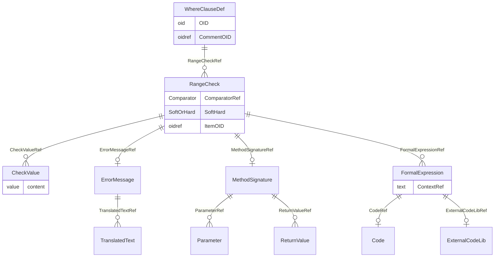

# Class: WhereClauseDef

_The WhereClauseDef element specifies a condition._


URI: [odm:WhereClauseDef](http://www.cdisc.org/ns/odm/v2.0/WhereClauseDef)





<!-- no inheritance hierarchy -->


## Slots

| Name | Cardinality* and Range | Description | Inheritance |
| ---  | --- | --- | --- |
| [OID](OID.md) | 1..1 <br/> [oid](oid.md) | Unique ID for the WhereClauseDef. See Section 2.13, Element Identifiers and R... | direct |
| [CommentOID](CommentOID.md) | 0..1 <br/> [oidref](oidref.md) | Reference to the unique ID of a CommentDef that describes how to join the dat... | direct |
| [RangeCheckRef](RangeCheckRef.md) | 0..* <br/> [RangeCheck](RangeCheck.md) | A WhereClause element defines a condition by using one or more RangeCheck ele... | direct |

_* See [LinkML documentation](https://linkml.io/linkml/schemas/slots.html#slot-cardinality) for cardinality definitions._


## Usages

| used by | used in | type | used |
| ---  | --- | --- | --- |
| [MetaDataVersion](MetaDataVersion.md) | [WhereClauseDefRef](WhereClauseDefRef.md) | range | [WhereClauseDef](WhereClauseDef.md) |


## See Also

* [https://wiki.cdisc.org/display/PUB/WhereClauseDef](https://wiki.cdisc.org/display/PUB/WhereClauseDef)

## Identifier and Mapping Information


### Schema Source


* from schema: http://www.cdisc.org/ns/odm/v2.0


## Mappings

| Mapping Type | Mapped Value |
| ---  | ---  |
| self | odm:WhereClauseDef |
| native | odm:WhereClauseDef |


## LinkML Source

<!-- TODO: investigate https://stackoverflow.com/questions/37606292/how-to-create-tabbed-code-blocks-in-mkdocs-or-sphinx -->

### Direct

<details>
```yaml
name: WhereClauseDef
description: The WhereClauseDef element specifies a condition.
from_schema: http://www.cdisc.org/ns/odm/v2.0
see_also:
- https://wiki.cdisc.org/display/PUB/WhereClauseDef
rank: 1000
slots:
- OID
- CommentOID
- RangeCheckRef
slot_usage:
  OID:
    name: OID
    description: Unique ID for the WhereClauseDef. See Section 2.13, Element Identifiers
      and References , for OID considerations.
    comments:
    - 'Required

      range: oid'
    domain_of:
    - Study
    - MetaDataVersion
    - Standard
    - ValueListDef
    - WhereClauseDef
    - StudyEventGroupDef
    - StudyEventDef
    - ItemGroupDef
    - ItemDef
    - CodeList
    - MethodDef
    - ConditionDef
    - CommentDef
    - StudyIndication
    - StudyIntervention
    - StudyObjective
    - StudyEndPoint
    - StudyTargetPopulation
    - StudyEstimand
    - Arm
    - Epoch
    - StudyParameter
    - StudyTiming
    - TransitionTimingConstraint
    - AbsoluteTimingConstraint
    - RelativeTimingConstraint
    - DurationTimingConstraint
    - WorkflowDef
    - Transition
    - Branching
    - Criterion
    - User
    - Organization
    - Location
    - SignatureDef
    - Query
    range: oid
    required: true
  CommentOID:
    name: CommentOID
    description: Reference to the unique ID of a CommentDef that describes how to
      join the datasets when the WhereClause includes references to variables in different
      datasets.
    comments:
    - 'Conditional

      range: oidref

      Required when RangeCheck includes ItemOID values that belong to different ItemGroupDef
      elements'
    domain_of:
    - MetaDataVersion
    - Standard
    - WhereClauseDef
    - StudyEventGroupDef
    - StudyEventDef
    - ItemGroupDef
    - ItemDef
    - CodeList
    - CodeListItem
    - MethodDef
    - ConditionDef
    - Coding
    range: oidref
  RangeCheckRef:
    name: RangeCheckRef
    description: A WhereClause element defines a condition by using one or more RangeCheck
      elements.
    multivalued: true
    domain_of:
    - WhereClauseDef
    - ItemDef
    range: RangeCheck
    inlined: true
    inlined_as_list: true
class_uri: odm:WhereClauseDef

```
</details>

### Induced

<details>
```yaml
name: WhereClauseDef
description: The WhereClauseDef element specifies a condition.
from_schema: http://www.cdisc.org/ns/odm/v2.0
see_also:
- https://wiki.cdisc.org/display/PUB/WhereClauseDef
rank: 1000
slot_usage:
  OID:
    name: OID
    description: Unique ID for the WhereClauseDef. See Section 2.13, Element Identifiers
      and References , for OID considerations.
    comments:
    - 'Required

      range: oid'
    domain_of:
    - Study
    - MetaDataVersion
    - Standard
    - ValueListDef
    - WhereClauseDef
    - StudyEventGroupDef
    - StudyEventDef
    - ItemGroupDef
    - ItemDef
    - CodeList
    - MethodDef
    - ConditionDef
    - CommentDef
    - StudyIndication
    - StudyIntervention
    - StudyObjective
    - StudyEndPoint
    - StudyTargetPopulation
    - StudyEstimand
    - Arm
    - Epoch
    - StudyParameter
    - StudyTiming
    - TransitionTimingConstraint
    - AbsoluteTimingConstraint
    - RelativeTimingConstraint
    - DurationTimingConstraint
    - WorkflowDef
    - Transition
    - Branching
    - Criterion
    - User
    - Organization
    - Location
    - SignatureDef
    - Query
    range: oid
    required: true
  CommentOID:
    name: CommentOID
    description: Reference to the unique ID of a CommentDef that describes how to
      join the datasets when the WhereClause includes references to variables in different
      datasets.
    comments:
    - 'Conditional

      range: oidref

      Required when RangeCheck includes ItemOID values that belong to different ItemGroupDef
      elements'
    domain_of:
    - MetaDataVersion
    - Standard
    - WhereClauseDef
    - StudyEventGroupDef
    - StudyEventDef
    - ItemGroupDef
    - ItemDef
    - CodeList
    - CodeListItem
    - MethodDef
    - ConditionDef
    - Coding
    range: oidref
  RangeCheckRef:
    name: RangeCheckRef
    description: A WhereClause element defines a condition by using one or more RangeCheck
      elements.
    multivalued: true
    domain_of:
    - WhereClauseDef
    - ItemDef
    range: RangeCheck
    inlined: true
    inlined_as_list: true
attributes:
  OID:
    name: OID
    description: Unique ID for the WhereClauseDef. See Section 2.13, Element Identifiers
      and References , for OID considerations.
    comments:
    - 'Required

      range: oid'
    from_schema: http://www.cdisc.org/ns/odm/v2.0
    rank: 1000
    identifier: true
    alias: OID
    owner: WhereClauseDef
    domain_of:
    - Study
    - MetaDataVersion
    - Standard
    - ValueListDef
    - WhereClauseDef
    - StudyEventGroupDef
    - StudyEventDef
    - ItemGroupDef
    - ItemDef
    - CodeList
    - MethodDef
    - ConditionDef
    - CommentDef
    - StudyIndication
    - StudyIntervention
    - StudyObjective
    - StudyEndPoint
    - StudyTargetPopulation
    - StudyEstimand
    - Arm
    - Epoch
    - StudyParameter
    - StudyTiming
    - TransitionTimingConstraint
    - AbsoluteTimingConstraint
    - RelativeTimingConstraint
    - DurationTimingConstraint
    - WorkflowDef
    - Transition
    - Branching
    - Criterion
    - User
    - Organization
    - Location
    - SignatureDef
    - Query
    range: oid
    required: true
  CommentOID:
    name: CommentOID
    description: Reference to the unique ID of a CommentDef that describes how to
      join the datasets when the WhereClause includes references to variables in different
      datasets.
    comments:
    - 'Conditional

      range: oidref

      Required when RangeCheck includes ItemOID values that belong to different ItemGroupDef
      elements'
    from_schema: http://www.cdisc.org/ns/odm/v2.0
    rank: 1000
    alias: CommentOID
    owner: WhereClauseDef
    domain_of:
    - MetaDataVersion
    - Standard
    - WhereClauseDef
    - StudyEventGroupDef
    - StudyEventDef
    - ItemGroupDef
    - ItemDef
    - CodeList
    - CodeListItem
    - MethodDef
    - ConditionDef
    - Coding
    range: oidref
  RangeCheckRef:
    name: RangeCheckRef
    description: A WhereClause element defines a condition by using one or more RangeCheck
      elements.
    from_schema: http://www.cdisc.org/ns/odm/v2.0
    rank: 1000
    multivalued: true
    identifier: false
    alias: RangeCheckRef
    owner: WhereClauseDef
    domain_of:
    - WhereClauseDef
    - ItemDef
    range: RangeCheck
    inlined: true
    inlined_as_list: true
class_uri: odm:WhereClauseDef

```
</details>