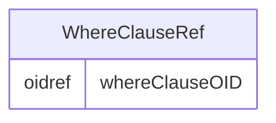

# Class: WhereClauseRef

_The WhereClauseRef references the WhereClauseDef element that describes the conditions under which the variable values are defined by the referenced ItemDef._


URI: [odm:WhereClauseRef](http://www.cdisc.org/ns/odm/v2.0/WhereClauseRef)





<!-- no inheritance hierarchy -->


## Slots

| Name | Cardinality* and Range | Description | Inheritance |
| ---  | --- | --- | --- |
| [whereClauseOID](whereClauseOID.md) | 1..1 <br/> [oidref](oidref.md) | Reference to the unique ID of a WhereClauseDef element | direct |

_* See [LinkML documentation](https://linkml.io/linkml/schemas/slots.html#slot-cardinality) for cardinality definitions._


## Usages

| used by | used in | type | used |
| ---  | --- | --- | --- |
| [ItemRef](ItemRef.md) | [whereClauseRef](whereClauseRef.md) | range | [WhereClauseRef](WhereClauseRef.md) |


## See Also

* [https://wiki.cdisc.org/display/PUB/WhereClauseRef](https://wiki.cdisc.org/display/PUB/WhereClauseRef)

## Identifier and Mapping Information


### Schema Source


* from schema: http://www.cdisc.org/ns/odm/v2.0


## Mappings

| Mapping Type | Mapped Value |
| ---  | ---  |
| self | odm:WhereClauseRef |
| native | odm:WhereClauseRef |


## LinkML Source

<!-- TODO: investigate https://stackoverflow.com/questions/37606292/how-to-create-tabbed-code-blocks-in-mkdocs-or-sphinx -->

### Direct

<details>
```yaml
name: WhereClauseRef
description: The WhereClauseRef references the WhereClauseDef element that describes
  the conditions under which the variable values are defined by the referenced ItemDef.
from_schema: http://www.cdisc.org/ns/odm/v2.0
see_also:
- https://wiki.cdisc.org/display/PUB/WhereClauseRef
rank: 1000
slots:
- whereClauseOID
slot_usage:
  whereClauseOID:
    name: whereClauseOID
    description: Reference to the unique ID of a WhereClauseDef element
    comments:
    - 'Required

      range: oidref'
    domain_of:
    - WhereClauseRef
    range: oidref
    required: true
class_uri: odm:WhereClauseRef

```
</details>

### Induced

<details>
```yaml
name: WhereClauseRef
description: The WhereClauseRef references the WhereClauseDef element that describes
  the conditions under which the variable values are defined by the referenced ItemDef.
from_schema: http://www.cdisc.org/ns/odm/v2.0
see_also:
- https://wiki.cdisc.org/display/PUB/WhereClauseRef
rank: 1000
slot_usage:
  whereClauseOID:
    name: whereClauseOID
    description: Reference to the unique ID of a WhereClauseDef element
    comments:
    - 'Required

      range: oidref'
    domain_of:
    - WhereClauseRef
    range: oidref
    required: true
attributes:
  whereClauseOID:
    name: whereClauseOID
    description: Reference to the unique ID of a WhereClauseDef element
    comments:
    - 'Required

      range: oidref'
    from_schema: http://www.cdisc.org/ns/odm/v2.0
    rank: 1000
    alias: whereClauseOID
    owner: WhereClauseRef
    domain_of:
    - WhereClauseRef
    range: oidref
    required: true
class_uri: odm:WhereClauseRef

```
</details>