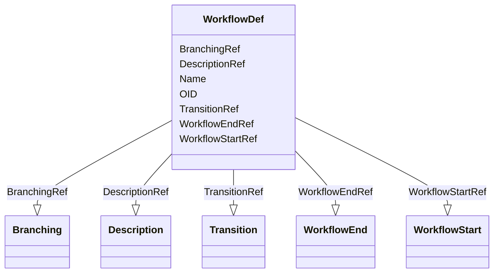

# Class: WorkflowDef


_A WorkflowDef defines an automated workflow for a study._


URI: [odm:WorkflowDef](http://www.cdisc.org/ns/odm/v2.0/WorkflowDef)





<!-- no inheritance hierarchy -->


## Slots

| Name | Cardinality and Range | Description | Inheritance |
| ---  | --- | --- | --- |
| [OID](OID.md) | 1..1 <br/> [oid](oid.md) | Unique identifier for the workflow. | direct |
| [Name](Name.md) | 1..1 <br/> [name](name.md) | Human readable label for the workflow. | direct |
| [DescriptionRef](DescriptionRef.md) | 0..1 <br/> [Description](Description.md) | Description reference: A free-text description of the containing metadata com... | direct |
| [WorkflowStartRef](WorkflowStartRef.md) | 0..1 <br/> [WorkflowStart](WorkflowStart.md) | WorkflowStart reference: WorkflowStart references a structural element that b... | direct |
| [WorkflowEndRef](WorkflowEndRef.md) | 0..* <br/> [WorkflowEnd](WorkflowEnd.md) | WorkflowEnd reference: A WorkflowEnd references a structural element with whi... | direct |
| [TransitionRef](TransitionRef.md) | 0..* <br/> [Transition](Transition.md) | Transition reference: A Transition defines a link between 2 structural elemen... | direct |
| [BranchingRef](BranchingRef.md) | 0..* <br/> [Branching](Branching.md) | Branching reference: This element describes the branching in a workflow from ... | direct |


## Usages

| used by | used in | type | used |
| ---  | --- | --- | --- |
| [MetaDataVersion](MetaDataVersion.md) | [WorkflowDefRef](WorkflowDefRef.md) | range | [WorkflowDef](WorkflowDef.md) |


## See Also

* [https://wiki.cdisc.org/display/ODM2/WorkflowDef](https://wiki.cdisc.org/display/ODM2/WorkflowDef)

## Identifier and Mapping Information


### Schema Source


* from schema: http://www.cdisc.org/ns/odm/v2.0


## Mappings

| Mapping Type | Mapped Value |
| ---  | ---  |
| self | odm:WorkflowDef |
| native | odm:WorkflowDef |


## LinkML Source

<!-- TODO: investigate https://stackoverflow.com/questions/37606292/how-to-create-tabbed-code-blocks-in-mkdocs-or-sphinx -->

### Direct

<details>
```yaml
name: WorkflowDef
description: A WorkflowDef defines an automated workflow for a study.
from_schema: http://www.cdisc.org/ns/odm/v2.0
see_also:
- https://wiki.cdisc.org/display/ODM2/WorkflowDef
slots:
- OID
- Name
- DescriptionRef
- WorkflowStartRef
- WorkflowEndRef
- TransitionRef
- BranchingRef
slot_usage:
  OID:
    name: OID
    description: Unique identifier for the workflow.
    comments:
    - 'Required

      range:oid

      The OID attribute value must be unique within the Study.'
    domain_of:
    - Study
    - MetaDataVersion
    - Standard
    - ValueListDef
    - WhereClauseDef
    - StudyEventGroupDef
    - StudyEventDef
    - ItemGroupDef
    - ItemDef
    - CodeList
    - MethodDef
    - ConditionDef
    - CommentDef
    - StudyIndication
    - StudyIntervention
    - StudyObjective
    - StudyEndPoint
    - StudyTargetPopulation
    - StudyEstimand
    - Arm
    - Epoch
    - StudyParameter
    - StudyTiming
    - TransitionTimingConstraint
    - AbsoluteTimingConstraint
    - RelativeTimingConstraint
    - DurationTimingConstraint
    - WorkflowDef
    - Transition
    - Branching
    - Criterion
    - ExceptionEvent
    - User
    - Organization
    - Location
    - SignatureDef
    - Query
    range: oid
    required: true
  Name:
    name: Name
    description: Human readable label for the workflow.
    comments:
    - 'Required

      range:name

      The Name attribute value must be unique within the Study.'
    domain_of:
    - Alias
    - MetaDataVersion
    - Standard
    - StudyEventGroupDef
    - StudyEventDef
    - ItemGroupDef
    - Class
    - SubClass
    - SourceItem
    - Resource
    - ItemDef
    - CodeList
    - MethodDef
    - Parameter
    - ReturnValue
    - ConditionDef
    - StudyObjective
    - StudyEndPoint
    - StudyTargetPopulation
    - StudyEstimand
    - Arm
    - Epoch
    - StudyTiming
    - TransitionTimingConstraint
    - AbsoluteTimingConstraint
    - RelativeTimingConstraint
    - DurationTimingConstraint
    - WorkflowDef
    - Transition
    - Branching
    - Criterion
    - ExceptionEvent
    - Organization
    - Location
    - Query
    range: name
    required: true
  DescriptionRef:
    name: DescriptionRef
    domain_of:
    - Study
    - MetaDataVersion
    - ValueListDef
    - StudyEventGroupRef
    - StudyEventGroupDef
    - StudyEventDef
    - ItemGroupDef
    - Origin
    - ItemDef
    - CodeList
    - CodeListItem
    - MethodDef
    - ConditionDef
    - CommentDef
    - Protocol
    - StudyStructure
    - TrialPhase
    - StudyIndication
    - StudyIntervention
    - StudyObjective
    - StudyEndPoint
    - StudyTargetPopulation
    - StudyEstimand
    - IntercurrentEvent
    - SummaryMeasure
    - Arm
    - Epoch
    - TransitionTimingConstraint
    - AbsoluteTimingConstraint
    - RelativeTimingConstraint
    - DurationTimingConstraint
    - WorkflowDef
    - Criterion
    - ExceptionEvent
    - Organization
    - Location
    - ODMFileMetadata
    range: Description
    maximum_cardinality: 1
  WorkflowStartRef:
    name: WorkflowStartRef
    domain_of:
    - WorkflowDef
    range: WorkflowStart
    maximum_cardinality: 1
  WorkflowEndRef:
    name: WorkflowEndRef
    multivalued: true
    domain_of:
    - WorkflowDef
    range: WorkflowEnd
    inlined: true
    inlined_as_list: true
  TransitionRef:
    name: TransitionRef
    multivalued: true
    domain_of:
    - WorkflowDef
    range: Transition
    inlined: true
    inlined_as_list: true
  BranchingRef:
    name: BranchingRef
    multivalued: true
    domain_of:
    - WorkflowDef
    range: Branching
    inlined: true
    inlined_as_list: true
class_uri: odm:WorkflowDef

```
</details>

### Induced

<details>
```yaml
name: WorkflowDef
description: A WorkflowDef defines an automated workflow for a study.
from_schema: http://www.cdisc.org/ns/odm/v2.0
see_also:
- https://wiki.cdisc.org/display/ODM2/WorkflowDef
slot_usage:
  OID:
    name: OID
    description: Unique identifier for the workflow.
    comments:
    - 'Required

      range:oid

      The OID attribute value must be unique within the Study.'
    domain_of:
    - Study
    - MetaDataVersion
    - Standard
    - ValueListDef
    - WhereClauseDef
    - StudyEventGroupDef
    - StudyEventDef
    - ItemGroupDef
    - ItemDef
    - CodeList
    - MethodDef
    - ConditionDef
    - CommentDef
    - StudyIndication
    - StudyIntervention
    - StudyObjective
    - StudyEndPoint
    - StudyTargetPopulation
    - StudyEstimand
    - Arm
    - Epoch
    - StudyParameter
    - StudyTiming
    - TransitionTimingConstraint
    - AbsoluteTimingConstraint
    - RelativeTimingConstraint
    - DurationTimingConstraint
    - WorkflowDef
    - Transition
    - Branching
    - Criterion
    - ExceptionEvent
    - User
    - Organization
    - Location
    - SignatureDef
    - Query
    range: oid
    required: true
  Name:
    name: Name
    description: Human readable label for the workflow.
    comments:
    - 'Required

      range:name

      The Name attribute value must be unique within the Study.'
    domain_of:
    - Alias
    - MetaDataVersion
    - Standard
    - StudyEventGroupDef
    - StudyEventDef
    - ItemGroupDef
    - Class
    - SubClass
    - SourceItem
    - Resource
    - ItemDef
    - CodeList
    - MethodDef
    - Parameter
    - ReturnValue
    - ConditionDef
    - StudyObjective
    - StudyEndPoint
    - StudyTargetPopulation
    - StudyEstimand
    - Arm
    - Epoch
    - StudyTiming
    - TransitionTimingConstraint
    - AbsoluteTimingConstraint
    - RelativeTimingConstraint
    - DurationTimingConstraint
    - WorkflowDef
    - Transition
    - Branching
    - Criterion
    - ExceptionEvent
    - Organization
    - Location
    - Query
    range: name
    required: true
  DescriptionRef:
    name: DescriptionRef
    domain_of:
    - Study
    - MetaDataVersion
    - ValueListDef
    - StudyEventGroupRef
    - StudyEventGroupDef
    - StudyEventDef
    - ItemGroupDef
    - Origin
    - ItemDef
    - CodeList
    - CodeListItem
    - MethodDef
    - ConditionDef
    - CommentDef
    - Protocol
    - StudyStructure
    - TrialPhase
    - StudyIndication
    - StudyIntervention
    - StudyObjective
    - StudyEndPoint
    - StudyTargetPopulation
    - StudyEstimand
    - IntercurrentEvent
    - SummaryMeasure
    - Arm
    - Epoch
    - TransitionTimingConstraint
    - AbsoluteTimingConstraint
    - RelativeTimingConstraint
    - DurationTimingConstraint
    - WorkflowDef
    - Criterion
    - ExceptionEvent
    - Organization
    - Location
    - ODMFileMetadata
    range: Description
    maximum_cardinality: 1
  WorkflowStartRef:
    name: WorkflowStartRef
    domain_of:
    - WorkflowDef
    range: WorkflowStart
    maximum_cardinality: 1
  WorkflowEndRef:
    name: WorkflowEndRef
    multivalued: true
    domain_of:
    - WorkflowDef
    range: WorkflowEnd
    inlined: true
    inlined_as_list: true
  TransitionRef:
    name: TransitionRef
    multivalued: true
    domain_of:
    - WorkflowDef
    range: Transition
    inlined: true
    inlined_as_list: true
  BranchingRef:
    name: BranchingRef
    multivalued: true
    domain_of:
    - WorkflowDef
    range: Branching
    inlined: true
    inlined_as_list: true
attributes:
  OID:
    name: OID
    description: Unique identifier for the workflow.
    comments:
    - 'Required

      range:oid

      The OID attribute value must be unique within the Study.'
    from_schema: http://www.cdisc.org/ns/odm/v2.0
    rank: 1000
    identifier: true
    alias: OID
    owner: WorkflowDef
    domain_of:
    - Study
    - MetaDataVersion
    - Standard
    - ValueListDef
    - WhereClauseDef
    - StudyEventGroupDef
    - StudyEventDef
    - ItemGroupDef
    - ItemDef
    - CodeList
    - MethodDef
    - ConditionDef
    - CommentDef
    - StudyIndication
    - StudyIntervention
    - StudyObjective
    - StudyEndPoint
    - StudyTargetPopulation
    - StudyEstimand
    - Arm
    - Epoch
    - StudyParameter
    - StudyTiming
    - TransitionTimingConstraint
    - AbsoluteTimingConstraint
    - RelativeTimingConstraint
    - DurationTimingConstraint
    - WorkflowDef
    - Transition
    - Branching
    - Criterion
    - ExceptionEvent
    - User
    - Organization
    - Location
    - SignatureDef
    - Query
    range: oid
    required: true
  Name:
    name: Name
    description: Human readable label for the workflow.
    comments:
    - 'Required

      range:name

      The Name attribute value must be unique within the Study.'
    from_schema: http://www.cdisc.org/ns/odm/v2.0
    rank: 1000
    alias: Name
    owner: WorkflowDef
    domain_of:
    - Alias
    - MetaDataVersion
    - Standard
    - StudyEventGroupDef
    - StudyEventDef
    - ItemGroupDef
    - Class
    - SubClass
    - SourceItem
    - Resource
    - ItemDef
    - CodeList
    - MethodDef
    - Parameter
    - ReturnValue
    - ConditionDef
    - StudyObjective
    - StudyEndPoint
    - StudyTargetPopulation
    - StudyEstimand
    - Arm
    - Epoch
    - StudyTiming
    - TransitionTimingConstraint
    - AbsoluteTimingConstraint
    - RelativeTimingConstraint
    - DurationTimingConstraint
    - WorkflowDef
    - Transition
    - Branching
    - Criterion
    - ExceptionEvent
    - Organization
    - Location
    - Query
    range: name
    required: true
  DescriptionRef:
    name: DescriptionRef
    description: 'Description reference: A free-text description of the containing
      metadata component, unless restricted by Business Rules.'
    from_schema: http://www.cdisc.org/ns/odm/v2.0
    rank: 1000
    identifier: false
    alias: DescriptionRef
    owner: WorkflowDef
    domain_of:
    - Study
    - MetaDataVersion
    - ValueListDef
    - StudyEventGroupRef
    - StudyEventGroupDef
    - StudyEventDef
    - ItemGroupDef
    - Origin
    - ItemDef
    - CodeList
    - CodeListItem
    - MethodDef
    - ConditionDef
    - CommentDef
    - Protocol
    - StudyStructure
    - TrialPhase
    - StudyIndication
    - StudyIntervention
    - StudyObjective
    - StudyEndPoint
    - StudyTargetPopulation
    - StudyEstimand
    - IntercurrentEvent
    - SummaryMeasure
    - Arm
    - Epoch
    - TransitionTimingConstraint
    - AbsoluteTimingConstraint
    - RelativeTimingConstraint
    - DurationTimingConstraint
    - WorkflowDef
    - Criterion
    - ExceptionEvent
    - Organization
    - Location
    - ODMFileMetadata
    range: Description
    maximum_cardinality: 1
  WorkflowStartRef:
    name: WorkflowStartRef
    description: 'WorkflowStart reference: WorkflowStart references a structural element
      that begins the automated workflow.'
    from_schema: http://www.cdisc.org/ns/odm/v2.0
    rank: 1000
    identifier: false
    alias: WorkflowStartRef
    owner: WorkflowDef
    domain_of:
    - WorkflowDef
    range: WorkflowStart
    maximum_cardinality: 1
  WorkflowEndRef:
    name: WorkflowEndRef
    description: 'WorkflowEnd reference: A WorkflowEnd references a structural element
      with which the workflows ends.'
    from_schema: http://www.cdisc.org/ns/odm/v2.0
    rank: 1000
    multivalued: true
    identifier: false
    alias: WorkflowEndRef
    owner: WorkflowDef
    domain_of:
    - WorkflowDef
    range: WorkflowEnd
    inlined: true
    inlined_as_list: true
  TransitionRef:
    name: TransitionRef
    description: 'Transition reference: A Transition defines a link between 2 structural
      elements in a workflow. When the execution of the transition is dependent upon
      a timing constraint that is either directly defined or calculated, a TransitionTimingConstraint
      must be defined, referencing the current Transition.'
    from_schema: http://www.cdisc.org/ns/odm/v2.0
    rank: 1000
    multivalued: true
    identifier: false
    alias: TransitionRef
    owner: WorkflowDef
    domain_of:
    - WorkflowDef
    range: Transition
    inlined: true
    inlined_as_list: true
  BranchingRef:
    name: BranchingRef
    description: 'Branching reference: This element describes the branching in a workflow
      from a source (start) structural element to 2 or more target structural elements,
      over a Transition element.'
    from_schema: http://www.cdisc.org/ns/odm/v2.0
    rank: 1000
    multivalued: true
    identifier: false
    alias: BranchingRef
    owner: WorkflowDef
    domain_of:
    - WorkflowDef
    range: Branching
    inlined: true
    inlined_as_list: true
class_uri: odm:WorkflowDef

```
</details>