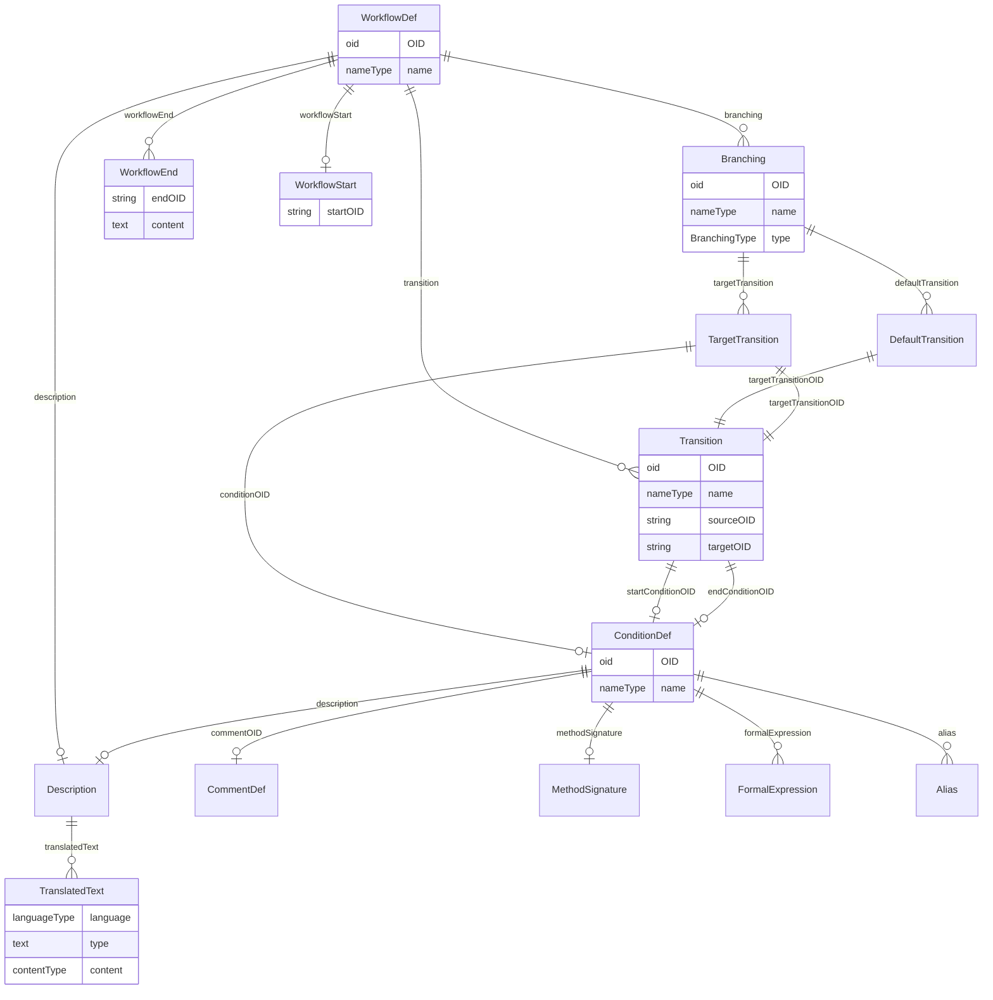

# Class: WorkflowDef

_A WorkflowDef defines an automated workflow for a study._


URI: [odm:WorkflowDef](http://www.cdisc.org/ns/odm/v2.0/WorkflowDef)





<!-- no inheritance hierarchy -->


## Slots

| Name | Cardinality* and Range | Description | Inheritance |
| ---  | --- | --- | --- |
| [OID](OID.md) | 1..1 <br/> [oid](oid.md) | Unique identifier for the workflow. | direct |
| [name](name.md) | 1..1 <br/> [nameType](nameType.md) | Human readable label for the workflow. | direct |
| [description](description.md) | 0..1 <br/> [Description](Description.md) | Description reference: A free-text description of the containing metadata com... | direct |
| [workflowStart](workflowStart.md) | 0..1 <br/> [WorkflowStart](WorkflowStart.md) | WorkflowStart reference: WorkflowStart references a structural element that b... | direct |
| [workflowEnd](workflowEnd.md) | 0..* <br/> [WorkflowEnd](WorkflowEnd.md) | WorkflowEnd reference: A WorkflowEnd references a structural element with whi... | direct |
| [transition](transition.md) | 0..* <br/> [Transition](Transition.md) | Transition reference: A Transition defines a link between 2 structural elemen... | direct |
| [branching](branching.md) | 0..* <br/> [Branching](Branching.md) | Branching reference: This element describes the branching in a workflow from ... | direct |

_* See [LinkML documentation](https://linkml.io/linkml/schemas/slots.html#slot-cardinality) for cardinality definitions._


## Usages

| used by | used in | type | used |
| ---  | --- | --- | --- |
| [MetaDataVersion](MetaDataVersion.md) | [workflowDef](workflowDef.md) | range | [WorkflowDef](WorkflowDef.md) |
| [WorkflowRef](WorkflowRef.md) | [workflowOID](workflowOID.md) | range | [WorkflowDef](WorkflowDef.md) |


## See Also

* [https://wiki.cdisc.org/display/PUB/WorkflowDef](https://wiki.cdisc.org/display/PUB/WorkflowDef)

## Identifier and Mapping Information


### Schema Source


* from schema: http://www.cdisc.org/ns/odm/v2.0


## Mappings

| Mapping Type | Mapped Value |
| ---  | ---  |
| self | odm:WorkflowDef |
| native | odm:WorkflowDef |


## LinkML Source

<!-- TODO: investigate https://stackoverflow.com/questions/37606292/how-to-create-tabbed-code-blocks-in-mkdocs-or-sphinx -->

### Direct

<details>
```yaml
name: WorkflowDef
description: A WorkflowDef defines an automated workflow for a study.
from_schema: http://www.cdisc.org/ns/odm/v2.0
see_also:
- https://wiki.cdisc.org/display/PUB/WorkflowDef
rank: 1000
slots:
- OID
- name
- description
- workflowStart
- workflowEnd
- transition
- branching
slot_usage:
  OID:
    name: OID
    description: Unique identifier for the workflow.
    comments:
    - 'Required

      range: oid

      The OID attribute value must be unique within the Study.'
    identifier: true
    domain_of:
    - Study
    - MetaDataVersion
    - Standard
    - ValueListDef
    - WhereClauseDef
    - StudyEventGroupDef
    - StudyEventDef
    - ItemGroupDef
    - ItemDef
    - CodeList
    - MethodDef
    - ConditionDef
    - CommentDef
    - StudyIndication
    - StudyIntervention
    - StudyObjective
    - StudyEndPoint
    - StudyTargetPopulation
    - StudyEstimand
    - Arm
    - Epoch
    - StudyParameter
    - StudyTiming
    - TransitionTimingConstraint
    - AbsoluteTimingConstraint
    - RelativeTimingConstraint
    - DurationTimingConstraint
    - WorkflowDef
    - Transition
    - Branching
    - Criterion
    - User
    - Organization
    - Location
    - SignatureDef
    - Query
    range: oid
    required: true
  name:
    name: name
    description: Human readable label for the workflow.
    comments:
    - 'Required

      range: name

      The Name attribute value must be unique within the Study.'
    domain_of:
    - Alias
    - MetaDataVersion
    - Standard
    - StudyEventGroupDef
    - StudyEventDef
    - ItemGroupDef
    - Class
    - SubClass
    - SourceItem
    - Resource
    - ItemDef
    - CodeList
    - MethodDef
    - Parameter
    - ReturnValue
    - ConditionDef
    - StudyObjective
    - StudyEndPoint
    - StudyTargetPopulation
    - StudyEstimand
    - Arm
    - Epoch
    - StudyTiming
    - TransitionTimingConstraint
    - AbsoluteTimingConstraint
    - RelativeTimingConstraint
    - DurationTimingConstraint
    - WorkflowDef
    - Transition
    - Branching
    - Criterion
    - Organization
    - Location
    - Query
    range: nameType
    required: true
  description:
    name: description
    domain_of:
    - Study
    - MetaDataVersion
    - ValueListDef
    - StudyEventGroupRef
    - StudyEventGroupDef
    - StudyEventDef
    - ItemGroupDef
    - Origin
    - ItemDef
    - CodeList
    - CodeListItem
    - MethodDef
    - ConditionDef
    - CommentDef
    - Protocol
    - StudyStructure
    - TrialPhase
    - StudyIndication
    - StudyIntervention
    - StudyObjective
    - StudyEndPoint
    - StudyTargetPopulation
    - StudyEstimand
    - IntercurrentEvent
    - SummaryMeasure
    - Arm
    - Epoch
    - TransitionTimingConstraint
    - AbsoluteTimingConstraint
    - RelativeTimingConstraint
    - DurationTimingConstraint
    - WorkflowDef
    - Criterion
    - Organization
    - Location
    - ODMFileMetadata
    range: Description
    maximum_cardinality: 1
  workflowStart:
    name: workflowStart
    domain_of:
    - WorkflowDef
    range: WorkflowStart
    maximum_cardinality: 1
  workflowEnd:
    name: workflowEnd
    multivalued: true
    domain_of:
    - WorkflowDef
    range: WorkflowEnd
    inlined: true
    inlined_as_list: true
  transition:
    name: transition
    multivalued: true
    domain_of:
    - WorkflowDef
    range: Transition
    inlined: true
    inlined_as_list: true
  branching:
    name: branching
    multivalued: true
    domain_of:
    - WorkflowDef
    range: Branching
    inlined: true
    inlined_as_list: true
class_uri: odm:WorkflowDef

```
</details>

### Induced

<details>
```yaml
name: WorkflowDef
description: A WorkflowDef defines an automated workflow for a study.
from_schema: http://www.cdisc.org/ns/odm/v2.0
see_also:
- https://wiki.cdisc.org/display/PUB/WorkflowDef
rank: 1000
slot_usage:
  OID:
    name: OID
    description: Unique identifier for the workflow.
    comments:
    - 'Required

      range: oid

      The OID attribute value must be unique within the Study.'
    identifier: true
    domain_of:
    - Study
    - MetaDataVersion
    - Standard
    - ValueListDef
    - WhereClauseDef
    - StudyEventGroupDef
    - StudyEventDef
    - ItemGroupDef
    - ItemDef
    - CodeList
    - MethodDef
    - ConditionDef
    - CommentDef
    - StudyIndication
    - StudyIntervention
    - StudyObjective
    - StudyEndPoint
    - StudyTargetPopulation
    - StudyEstimand
    - Arm
    - Epoch
    - StudyParameter
    - StudyTiming
    - TransitionTimingConstraint
    - AbsoluteTimingConstraint
    - RelativeTimingConstraint
    - DurationTimingConstraint
    - WorkflowDef
    - Transition
    - Branching
    - Criterion
    - User
    - Organization
    - Location
    - SignatureDef
    - Query
    range: oid
    required: true
  name:
    name: name
    description: Human readable label for the workflow.
    comments:
    - 'Required

      range: name

      The Name attribute value must be unique within the Study.'
    domain_of:
    - Alias
    - MetaDataVersion
    - Standard
    - StudyEventGroupDef
    - StudyEventDef
    - ItemGroupDef
    - Class
    - SubClass
    - SourceItem
    - Resource
    - ItemDef
    - CodeList
    - MethodDef
    - Parameter
    - ReturnValue
    - ConditionDef
    - StudyObjective
    - StudyEndPoint
    - StudyTargetPopulation
    - StudyEstimand
    - Arm
    - Epoch
    - StudyTiming
    - TransitionTimingConstraint
    - AbsoluteTimingConstraint
    - RelativeTimingConstraint
    - DurationTimingConstraint
    - WorkflowDef
    - Transition
    - Branching
    - Criterion
    - Organization
    - Location
    - Query
    range: nameType
    required: true
  description:
    name: description
    domain_of:
    - Study
    - MetaDataVersion
    - ValueListDef
    - StudyEventGroupRef
    - StudyEventGroupDef
    - StudyEventDef
    - ItemGroupDef
    - Origin
    - ItemDef
    - CodeList
    - CodeListItem
    - MethodDef
    - ConditionDef
    - CommentDef
    - Protocol
    - StudyStructure
    - TrialPhase
    - StudyIndication
    - StudyIntervention
    - StudyObjective
    - StudyEndPoint
    - StudyTargetPopulation
    - StudyEstimand
    - IntercurrentEvent
    - SummaryMeasure
    - Arm
    - Epoch
    - TransitionTimingConstraint
    - AbsoluteTimingConstraint
    - RelativeTimingConstraint
    - DurationTimingConstraint
    - WorkflowDef
    - Criterion
    - Organization
    - Location
    - ODMFileMetadata
    range: Description
    maximum_cardinality: 1
  workflowStart:
    name: workflowStart
    domain_of:
    - WorkflowDef
    range: WorkflowStart
    maximum_cardinality: 1
  workflowEnd:
    name: workflowEnd
    multivalued: true
    domain_of:
    - WorkflowDef
    range: WorkflowEnd
    inlined: true
    inlined_as_list: true
  transition:
    name: transition
    multivalued: true
    domain_of:
    - WorkflowDef
    range: Transition
    inlined: true
    inlined_as_list: true
  branching:
    name: branching
    multivalued: true
    domain_of:
    - WorkflowDef
    range: Branching
    inlined: true
    inlined_as_list: true
attributes:
  OID:
    name: OID
    description: Unique identifier for the workflow.
    comments:
    - 'Required

      range: oid

      The OID attribute value must be unique within the Study.'
    from_schema: http://www.cdisc.org/ns/odm/v2.0
    rank: 1000
    identifier: true
    alias: OID
    owner: WorkflowDef
    domain_of:
    - Study
    - MetaDataVersion
    - Standard
    - ValueListDef
    - WhereClauseDef
    - StudyEventGroupDef
    - StudyEventDef
    - ItemGroupDef
    - ItemDef
    - CodeList
    - MethodDef
    - ConditionDef
    - CommentDef
    - StudyIndication
    - StudyIntervention
    - StudyObjective
    - StudyEndPoint
    - StudyTargetPopulation
    - StudyEstimand
    - Arm
    - Epoch
    - StudyParameter
    - StudyTiming
    - TransitionTimingConstraint
    - AbsoluteTimingConstraint
    - RelativeTimingConstraint
    - DurationTimingConstraint
    - WorkflowDef
    - Transition
    - Branching
    - Criterion
    - User
    - Organization
    - Location
    - SignatureDef
    - Query
    range: oid
    required: true
  name:
    name: name
    description: Human readable label for the workflow.
    comments:
    - 'Required

      range: name

      The Name attribute value must be unique within the Study.'
    from_schema: http://www.cdisc.org/ns/odm/v2.0
    rank: 1000
    alias: name
    owner: WorkflowDef
    domain_of:
    - Alias
    - MetaDataVersion
    - Standard
    - StudyEventGroupDef
    - StudyEventDef
    - ItemGroupDef
    - Class
    - SubClass
    - SourceItem
    - Resource
    - ItemDef
    - CodeList
    - MethodDef
    - Parameter
    - ReturnValue
    - ConditionDef
    - StudyObjective
    - StudyEndPoint
    - StudyTargetPopulation
    - StudyEstimand
    - Arm
    - Epoch
    - StudyTiming
    - TransitionTimingConstraint
    - AbsoluteTimingConstraint
    - RelativeTimingConstraint
    - DurationTimingConstraint
    - WorkflowDef
    - Transition
    - Branching
    - Criterion
    - Organization
    - Location
    - Query
    range: nameType
    required: true
  description:
    name: description
    description: 'Description reference: A free-text description of the containing
      metadata component, unless restricted by Business Rules.'
    from_schema: http://www.cdisc.org/ns/odm/v2.0
    rank: 1000
    alias: description
    owner: WorkflowDef
    domain_of:
    - Study
    - MetaDataVersion
    - ValueListDef
    - StudyEventGroupRef
    - StudyEventGroupDef
    - StudyEventDef
    - ItemGroupDef
    - Origin
    - ItemDef
    - CodeList
    - CodeListItem
    - MethodDef
    - ConditionDef
    - CommentDef
    - Protocol
    - StudyStructure
    - TrialPhase
    - StudyIndication
    - StudyIntervention
    - StudyObjective
    - StudyEndPoint
    - StudyTargetPopulation
    - StudyEstimand
    - IntercurrentEvent
    - SummaryMeasure
    - Arm
    - Epoch
    - TransitionTimingConstraint
    - AbsoluteTimingConstraint
    - RelativeTimingConstraint
    - DurationTimingConstraint
    - WorkflowDef
    - Criterion
    - Organization
    - Location
    - ODMFileMetadata
    range: Description
    maximum_cardinality: 1
  workflowStart:
    name: workflowStart
    description: 'WorkflowStart reference: WorkflowStart references a structural element
      that begins the automated workflow.'
    from_schema: http://www.cdisc.org/ns/odm/v2.0
    rank: 1000
    alias: workflowStart
    owner: WorkflowDef
    domain_of:
    - WorkflowDef
    range: WorkflowStart
    maximum_cardinality: 1
  workflowEnd:
    name: workflowEnd
    description: 'WorkflowEnd reference: A WorkflowEnd references a structural element
      with which the workflows ends.'
    from_schema: http://www.cdisc.org/ns/odm/v2.0
    rank: 1000
    multivalued: true
    alias: workflowEnd
    owner: WorkflowDef
    domain_of:
    - WorkflowDef
    range: WorkflowEnd
    inlined: true
    inlined_as_list: true
  transition:
    name: transition
    description: 'Transition reference: A Transition defines a link between 2 structural
      elements in a workflow. When the execution of the transition is dependent upon
      a timing constraint that is either directly defined or calculated, a TransitionTimingConstraint
      must be defined, referencing the current Transition.'
    from_schema: http://www.cdisc.org/ns/odm/v2.0
    rank: 1000
    multivalued: true
    alias: transition
    owner: WorkflowDef
    domain_of:
    - WorkflowDef
    range: Transition
    inlined: true
    inlined_as_list: true
  branching:
    name: branching
    description: 'Branching reference: This element describes the branching in a workflow
      from a source (start) structural element to 2 or more target structural elements,
      over a Transition element.'
    from_schema: http://www.cdisc.org/ns/odm/v2.0
    rank: 1000
    multivalued: true
    alias: branching
    owner: WorkflowDef
    domain_of:
    - WorkflowDef
    range: Branching
    inlined: true
    inlined_as_list: true
class_uri: odm:WorkflowDef

```
</details>