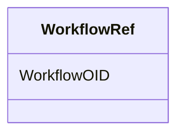

# Class: WorkflowRef


_The WorkflowRef references a workflow definition_


URI: [odm:WorkflowRef](http://www.cdisc.org/ns/odm/v2.0/WorkflowRef)





<!-- no inheritance hierarchy -->


## Slots

| Name | Cardinality and Range | Description | Inheritance |
| ---  | --- | --- | --- |
| [WorkflowOID](WorkflowOID.md) | 1..1 <br/> [oidref](oidref.md) | Reference to a WorfkflowDef | direct |


## Usages

| used by | used in | type | used |
| ---  | --- | --- | --- |
| [StudyEventGroupDef](StudyEventGroupDef.md) | [WorkflowRefRef](WorkflowRefRef.md) | range | [WorkflowRef](WorkflowRef.md) |
| [StudyEventDef](StudyEventDef.md) | [WorkflowRefRef](WorkflowRefRef.md) | range | [WorkflowRef](WorkflowRef.md) |
| [ItemGroupDef](ItemGroupDef.md) | [WorkflowRefRef](WorkflowRefRef.md) | range | [WorkflowRef](WorkflowRef.md) |
| [Protocol](Protocol.md) | [WorkflowRefRef](WorkflowRefRef.md) | range | [WorkflowRef](WorkflowRef.md) |
| [StudyStructure](StudyStructure.md) | [WorkflowRefRef](WorkflowRefRef.md) | range | [WorkflowRef](WorkflowRef.md) |
| [Arm](Arm.md) | [WorkflowRefRef](WorkflowRefRef.md) | range | [WorkflowRef](WorkflowRef.md) |


## See Also

* [https://wiki.cdisc.org/display/ODM2/WorkflowRef](https://wiki.cdisc.org/display/ODM2/WorkflowRef)

## Identifier and Mapping Information


### Schema Source


* from schema: http://www.cdisc.org/ns/odm/v2.0


## Mappings

| Mapping Type | Mapped Value |
| ---  | ---  |
| self | odm:WorkflowRef |
| native | odm:WorkflowRef |


## LinkML Source

<!-- TODO: investigate https://stackoverflow.com/questions/37606292/how-to-create-tabbed-code-blocks-in-mkdocs-or-sphinx -->

### Direct

<details>
```yaml
name: WorkflowRef
description: The WorkflowRef references a workflow definition
from_schema: http://www.cdisc.org/ns/odm/v2.0
see_also:
- https://wiki.cdisc.org/display/ODM2/WorkflowRef
slots:
- WorkflowOID
slot_usage:
  WorkflowOID:
    name: WorkflowOID
    description: Reference to a WorfkflowDef
    comments:
    - 'Required

      range: oidref

      Must match the OID of a WorkflowDef child element of this MetaDataVersion.'
    domain_of:
    - WorkflowRef
    range: oidref
    required: true
class_uri: odm:WorkflowRef

```
</details>

### Induced

<details>
```yaml
name: WorkflowRef
description: The WorkflowRef references a workflow definition
from_schema: http://www.cdisc.org/ns/odm/v2.0
see_also:
- https://wiki.cdisc.org/display/ODM2/WorkflowRef
slot_usage:
  WorkflowOID:
    name: WorkflowOID
    description: Reference to a WorfkflowDef
    comments:
    - 'Required

      range: oidref

      Must match the OID of a WorkflowDef child element of this MetaDataVersion.'
    domain_of:
    - WorkflowRef
    range: oidref
    required: true
attributes:
  WorkflowOID:
    name: WorkflowOID
    description: Reference to a WorfkflowDef
    comments:
    - 'Required

      range: oidref

      Must match the OID of a WorkflowDef child element of this MetaDataVersion.'
    from_schema: http://www.cdisc.org/ns/odm/v2.0
    rank: 1000
    alias: WorkflowOID
    owner: WorkflowRef
    domain_of:
    - WorkflowRef
    range: oidref
    required: true
class_uri: odm:WorkflowRef

```
</details>