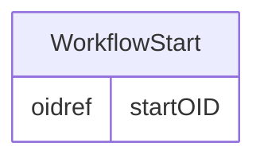

# Class: WorkflowStart

_WorkflowStart references a structural element that begins the automated workflow._


URI: [odm:WorkflowStart](http://www.cdisc.org/ns/odm/v2.0/WorkflowStart)





<!-- no inheritance hierarchy -->


## Slots

| Name | Cardinality* and Range | Description | Inheritance |
| ---  | --- | --- | --- |
| [startOID](startOID.md) | 1..1 <br/> [oidref](oidref.md) | Reference to the definition of the structural element that starts the workflo... | direct |

_* See [LinkML documentation](https://linkml.io/linkml/schemas/slots.html#slot-cardinality) for cardinality definitions._


## Usages

| used by | used in | type | used |
| ---  | --- | --- | --- |
| [WorkflowDef](WorkflowDef.md) | [workflowStart](workflowStart.md) | range | [WorkflowStart](WorkflowStart.md) |


## See Also

* [https://wiki.cdisc.org/display/PUB/WorkflowStart](https://wiki.cdisc.org/display/PUB/WorkflowStart)

## Identifier and Mapping Information


### Schema Source


* from schema: http://www.cdisc.org/ns/odm/v2.0


## Mappings

| Mapping Type | Mapped Value |
| ---  | ---  |
| self | odm:WorkflowStart |
| native | odm:WorkflowStart |


## LinkML Source

<!-- TODO: investigate https://stackoverflow.com/questions/37606292/how-to-create-tabbed-code-blocks-in-mkdocs-or-sphinx -->

### Direct

<details>
```yaml
name: WorkflowStart
description: WorkflowStart references a structural element that begins the automated
  workflow.
from_schema: http://www.cdisc.org/ns/odm/v2.0
see_also:
- https://wiki.cdisc.org/display/PUB/WorkflowStart
rank: 1000
slots:
- startOID
slot_usage:
  startOID:
    name: startOID
    description: Reference to the definition of the structural element that starts
      the workflow. It may be a StudyEventGroupDef, StudyEventDef, ItemGroupDef, or
      ItemDef element.
    comments:
    - 'Required

      range: oidref

      The StartOID must match the OID attribute of a StudyEventGroupDef, StudyEventDef,
      ItemGroupDef or ItemDef child element of the MetaDataVersion parent element
      of the WorkflowDef .'
    domain_of:
    - WorkflowStart
    range: oidref
    required: true
class_uri: odm:WorkflowStart

```
</details>

### Induced

<details>
```yaml
name: WorkflowStart
description: WorkflowStart references a structural element that begins the automated
  workflow.
from_schema: http://www.cdisc.org/ns/odm/v2.0
see_also:
- https://wiki.cdisc.org/display/PUB/WorkflowStart
rank: 1000
slot_usage:
  startOID:
    name: startOID
    description: Reference to the definition of the structural element that starts
      the workflow. It may be a StudyEventGroupDef, StudyEventDef, ItemGroupDef, or
      ItemDef element.
    comments:
    - 'Required

      range: oidref

      The StartOID must match the OID attribute of a StudyEventGroupDef, StudyEventDef,
      ItemGroupDef or ItemDef child element of the MetaDataVersion parent element
      of the WorkflowDef .'
    domain_of:
    - WorkflowStart
    range: oidref
    required: true
attributes:
  startOID:
    name: startOID
    description: Reference to the definition of the structural element that starts
      the workflow. It may be a StudyEventGroupDef, StudyEventDef, ItemGroupDef, or
      ItemDef element.
    comments:
    - 'Required

      range: oidref

      The StartOID must match the OID attribute of a StudyEventGroupDef, StudyEventDef,
      ItemGroupDef or ItemDef child element of the MetaDataVersion parent element
      of the WorkflowDef .'
    from_schema: http://www.cdisc.org/ns/odm/v2.0
    rank: 1000
    alias: startOID
    owner: WorkflowStart
    domain_of:
    - WorkflowStart
    range: oidref
    required: true
class_uri: odm:WorkflowStart

```
</details>