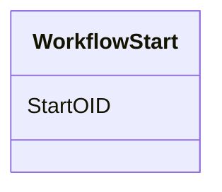

# Class: WorkflowStart


URI: [odm:WorkflowStart](http://www.cdisc.org/ns/odm/v2.0/WorkflowStart)





<!-- no inheritance hierarchy -->


## Slots

| Name | Cardinality and Range | Description | Inheritance |
| ---  | --- | --- | --- |
| [StartOID](StartOID.md) | 1..1 <br/> [Oidref](Oidref.md) |  | direct |


## Usages

| used by | used in | type | used |
| ---  | --- | --- | --- |
| [WorkflowDef](WorkflowDef.md) | [WorkflowStartRef](WorkflowStartRef.md) | range | [WorkflowStart](WorkflowStart.md) |


## See Also

* [https://wiki.cdisc.org/display/ODM2/WorkflowStart](https://wiki.cdisc.org/display/ODM2/WorkflowStart)

## Identifier and Mapping Information


### Schema Source


* from schema: http://www.cdisc.org/ns/odm/v2.0


## Mappings

| Mapping Type | Mapped Value |
| ---  | ---  |
| self | odm:WorkflowStart |
| native | odm:WorkflowStart |


## LinkML Source

<!-- TODO: investigate https://stackoverflow.com/questions/37606292/how-to-create-tabbed-code-blocks-in-mkdocs-or-sphinx -->

### Direct

<details>
```yaml
name: WorkflowStart
from_schema: http://www.cdisc.org/ns/odm/v2.0
see_also:
- https://wiki.cdisc.org/display/ODM2/WorkflowStart
slots:
- StartOID
slot_usage:
  StartOID:
    name: StartOID
    domain_of:
    - WorkflowStart
    range: oidref
    required: true
class_uri: odm:WorkflowStart

```
</details>

### Induced

<details>
```yaml
name: WorkflowStart
from_schema: http://www.cdisc.org/ns/odm/v2.0
see_also:
- https://wiki.cdisc.org/display/ODM2/WorkflowStart
slot_usage:
  StartOID:
    name: StartOID
    domain_of:
    - WorkflowStart
    range: oidref
    required: true
attributes:
  StartOID:
    name: StartOID
    from_schema: http://www.cdisc.org/ns/odm/v2.0
    rank: 1000
    alias: StartOID
    owner: WorkflowStart
    domain_of:
    - WorkflowStart
    range: oidref
    required: true
class_uri: odm:WorkflowStart

```
</details>