# CDISC Operational Data Model v2

ODM is a vendor-neutral, platform-independent format for exchanging and archiving clinical and translational research data, along with their associated metadata, administrative data, reference data, and audit information.

URI: http://www.cdisc.org/ns/odm/v2.0

Name: odm

## Schema Diagram

```mermaid 
erDiagram
ODMFileMetadata {
    FileType fileType  
    Granularity granularity  
    Context context  
    oid fileOID  
    datetime creationDateTime  
    oidref priorFileOID  
    datetime asOfDateTime  
    ODMVersion oDMVersion  
    text originator  
    text sourceSystem  
    text sourceSystemVersion  
}
Association {
    oidref studyOID  
    oidref metaDataVersionOID  
}
Annotation {
    positiveInteger seqNum  
    TransactionType transactionType  
    oid iD  
}
KeySet {
    oidref studyOID  
    subjectKeyType subjectKey  
    oidref metaDataVersionOID  
    oidref studyEventOID  
    repeatKey studyEventRepeatKey  
    oidref itemGroupOID  
    repeatKey itemGroupRepeatKey  
    oidref itemOID  
}
ClinicalData {
    oidref studyOID  
    oidref metaDataVersionOID  
}
Signature {
    oid iD  
}
AuditRecord {
    EditPointType editPoint  
    YesOrNo usedMethod  
}
Query {
    oid oID  
    QuerySourceType source  
    text target  
    QueryType type  
    QueryStateType state  
    datetime lastUpdateDatetime  
    nameType name  
}
ItemGroupData {
    oidref itemGroupOID  
    repeatKey itemGroupRepeatKey  
    TransactionType transactionType  
    positiveInteger itemGroupDataSeq  
}
SubjectData {
    subjectKeyType subjectKey  
    TransactionType transactionType  
}
ReferenceData {
    oidref studyOID  
    oidref metaDataVersionOID  
}
AdminData {
    oidref studyOID  
}
SignatureDef {
    oid oID  
    SignMethod methodology  
}
Location {
    oid oID  
    nameType name  
    text role  
    oidref organizationOID  
}
Organization {
    oid oID  
    nameType name  
    text role  
    OrganizationType type  
    oidref locationOID  
    oidref partOfOrganizationOID  
}
User {
    oid oID  
    UserType userType  
    oidref organizationOID  
    oidref locationOID  
}
Study {
    oid oID  
    nameType studyName  
    nameType protocolName  
    nameType versionID  
    nameType versionName  
    nameType status  
}
MetaDataVersion {
    oid oID  
    nameType name  
    oidref commentOID  
}
Description {

}

ODMFileMetadata ||--|o Description : "description"
ODMFileMetadata ||--}o Study : "study"
ODMFileMetadata ||--}o AdminData : "adminData"
ODMFileMetadata ||--}o ReferenceData : "referenceData"
ODMFileMetadata ||--}o ClinicalData : "clinicalData"
ODMFileMetadata ||--}o Association : "association"
Association ||--|o KeySet : "keySet"
Association ||--|o Annotation : "annotation"
Annotation ||--|o Comment : "comment"
Annotation ||--}o Coding : "coding"
Annotation ||--}o Flag : "flag"
ClinicalData ||--}o SubjectData : "subjectData"
ClinicalData ||--}o ItemGroupData : "itemGroupData"
ClinicalData ||--}o Query : "query"
ClinicalData ||--|o AuditRecord : "auditRecord"
ClinicalData ||--|o Signature : "signature"
ClinicalData ||--|o Annotation : "annotation"
Signature ||--|o UserRef : "userRef"
Signature ||--|o LocationRef : "locationRef"
Signature ||--|o SignatureRef : "signatureRef"
Signature ||--|o DateTimeStamp : "dateTimeStamp"
AuditRecord ||--|o UserRef : "userRef"
AuditRecord ||--|o LocationRef : "locationRef"
AuditRecord ||--|o DateTimeStamp : "dateTimeStamp"
AuditRecord ||--|o ReasonForChange : "reasonForChange"
AuditRecord ||--|o SourceID : "sourceID"
Query ||--|o Value : "value"
Query ||--}o AuditRecord : "auditRecord"
ItemGroupData ||--}o Query : "query"
ItemGroupData ||--}o ItemGroupData : "itemGroupData"
ItemGroupData ||--}o ItemData : "itemData"
ItemGroupData ||--|o AuditRecord : "auditRecord"
ItemGroupData ||--|o Signature : "signature"
ItemGroupData ||--|o Annotation : "annotation"
SubjectData ||--|o InvestigatorRef : "investigatorRef"
SubjectData ||--|o SiteRef : "siteRef"
SubjectData ||--}o StudyEventData : "studyEventData"
SubjectData ||--}o Query : "query"
SubjectData ||--|o AuditRecord : "auditRecord"
SubjectData ||--|o Signature : "signature"
SubjectData ||--|o Annotation : "annotation"
ReferenceData ||--}o ItemGroupData : "itemGroupData"
ReferenceData ||--|o AuditRecord : "auditRecord"
ReferenceData ||--|o Signature : "signature"
ReferenceData ||--|o Annotation : "annotation"
AdminData ||--}o User : "user"
AdminData ||--}o Organization : "organization"
AdminData ||--}o Location : "location"
AdminData ||--}o SignatureDef : "signatureDef"
SignatureDef ||--|o Meaning : "meaning"
SignatureDef ||--|o LegalReason : "legalReason"
Location ||--|o Description : "description"
Location ||--}o MetaDataVersionRef : "metaDataVersionRef"
Location ||--}o Address : "address"
Location ||--}o Telecom : "telecom"
Location ||--}o Query : "query"
Organization ||--|o Description : "description"
Organization ||--}o Address : "address"
Organization ||--}o Telecom : "telecom"
User ||--|o UserName : "userName"
User ||--|o Prefix : "prefix"
User ||--|o Suffix : "suffix"
User ||--|o FullName : "fullName"
User ||--|o GivenName : "givenName"
User ||--|o FamilyName : "familyName"
User ||--|o Image : "image"
User ||--}o Address : "address"
User ||--}o Telecom : "telecom"
Study ||--|o Description : "description"
Study ||--}o MetaDataVersion : "metaDataVersion"
MetaDataVersion ||--|o Description : "description"
MetaDataVersion ||--|o Include : "include"
MetaDataVersion ||--|o Standards : "standards"
MetaDataVersion ||--|o AnnotatedCRF : "annotatedCRF"
MetaDataVersion ||--|o SupplementalDoc : "supplementalDoc"
MetaDataVersion ||--}o ValueListDef : "valueListDef"
MetaDataVersion ||--}o WhereClauseDef : "whereClauseDef"
MetaDataVersion ||--|o Protocol : "protocol"
MetaDataVersion ||--}o WorkflowDef : "workflowDef"
MetaDataVersion ||--}o StudyEventGroupDef : "studyEventGroupDef"
MetaDataVersion ||--}o StudyEventDef : "studyEventDef"
MetaDataVersion ||--}o ItemGroupDef : "itemGroupDef"
MetaDataVersion ||--}o ItemDef : "itemDef"
MetaDataVersion ||--}o CodeList : "codeList"
MetaDataVersion ||--}o ConditionDef : "conditionDef"
MetaDataVersion ||--}o MethodDef : "methodDef"
MetaDataVersion ||--}o CommentDef : "commentDef"
MetaDataVersion ||--}o Leaf : "leaf"
Description ||--}o TranslatedText : "translatedText"

```

## Classes
_Classes provide templates for organizing data. Data objects instantiate classes in the schema. Each class has a set of slots (aka fields, attributes) that are applicable to it. See [LinkML documentation](https://linkml.io/linkml/schemas/models.html#classes) for more information._

| Class | Description |
| --- | --- |
| [Alias](Alias.md) | An Alias provides an additional name for an element. The Context attribute sp... |
| [Description](Description.md) | A free-text description of the containing metadata component, unless restrict... |
| [TranslatedText](TranslatedText.md) | Human-readable text that is appropriate for a particular language. Translated... |
| [Study](Study.md) | This element collects static structural information about an individual study... |
| [MetaDataVersion](MetaDataVersion.md) | The metadata for a study is defined in a series of MetaDataVersion elements. ... |
| [DocumentRef](DocumentRef.md) | Links to a leaf element with the location of the document. |
| [PDFPageRef](PDFPageRef.md) | This element is the container for CRF page references. |
| [Leaf](Leaf.md) | Contains the XLink information referenced by DocumentRef or ArchiveLocationID |
| [Title](Title.md) | Text with the label for the document or dataset. |
| [Include](Include.md) | The Include metadata element allows a reference to a prior metadata version. |
| [Standards](Standards.md) | The Standards element provides a container for the list of Standard elements ... |
| [Standard](Standard.md) | The Standard element describes each standard used within the MetaDataVersion ... |
| [AnnotatedCRF](AnnotatedCRF.md) | An Annotated Case Report Form (CRF) is a Portable File Format (PDF) document ... |
| [SupplementalDoc](SupplementalDoc.md) | Supplemental data definitions |
| [ValueListDef](ValueListDef.md) | The following table specifies the XML structure for valuelist metadata. The V... |
| [WhereClauseRef](WhereClauseRef.md) | The WhereClauseRef references the WhereClauseDef element that describes the c... |
| [WhereClauseDef](WhereClauseDef.md) | The WhereClauseDef element specifies a condition. |
| [StudyEventGroupRef](StudyEventGroupRef.md) | This element references a StudyEventGroupDef as it occurs within a specific v... |
| [StudyEventGroupDef](StudyEventGroupDef.md) | StudyEventGroupDef is a study building block that groups a number of smaller ... |
| [StudyEventRef](StudyEventRef.md) | This element references a StudyEventDef as it occurs within a specific versio... |
| [StudyEventDef](StudyEventDef.md) | StudyEventDef represents the definition of an activity in a study where data ... |
| [ItemGroupRef](ItemGroupRef.md) | ItemGroupRef references an ItemGroupDef as it occurs within a specific StudyE... |
| [ItemGroupDef](ItemGroupDef.md) | An ItemGroupDef describes a type of variable or field grouping that can occur... |
| [Class](Class.md) | The Class element identifies which predefined Class within the model applies ... |
| [SubClass](SubClass.md) | This element contains SubClass definitions. |
| [ItemRef](ItemRef.md) | A reference to an ItemDef as it occurs within a specific ItemGroupDef. The li... |
| [Origin](Origin.md) | Origin defines the source metadata, where applicable, for ODM ItemRefs or Ite... |
| [SourceItems](SourceItems.md) | Identifies source items as needed to support automated data capture and end-t... |
| [SourceItem](SourceItem.md) | Provides the information needed to identify the source metadata. |
| [Resource](Resource.md) | Describes an external resource used as the source for the parent ItemGroup or... |
| [Selection](Selection.md) | Template for machine-readable/executable expression for retrieving the data o... |
| [ItemDef](ItemDef.md) | An ItemDef describes a type of item that can occur within a study. Item prope... |
| [Question](Question.md) | A label shown to a human user when prompted to provide data for an item on pa... |
| [Definition](Definition.md) | Definition of the item. |
| [Prompt](Prompt.md) | A prompt text shown to a human user when prompted to provide data for an item... |
| [CRFCompletionInstructions](CRFCompletionInstructions.md) | Instructions for the clinical site on how to enter collected information on t... |
| [ImplementationNotes](ImplementationNotes.md) | Further information, such as rationale and implementation instructions, on ho... |
| [CDISCNotes](CDISCNotes.md) | Explanatory text for the variable. |
| [RangeCheck](RangeCheck.md) | A RangeCheck defines a constraint on the value of the enclosing item. It repr... |
| [CheckValue](CheckValue.md) | A comparison value used in a range check. |
| [ErrorMessage](ErrorMessage.md) | Error message provided to user when the range check fails. |
| [CodeListRef](CodeListRef.md) | A reference to a CodeList definition. |
| [ValueListRef](ValueListRef.md) | The ValueListRef element is the OID of the ValueListDef that contains the val... |
| [CodeList](CodeList.md) | Defines a discrete set of permitted values for an item, or provides a referen... |
| [CodeListItem](CodeListItem.md) | Defines an individual member value of a codelist. It may include a display va... |
| [Decode](Decode.md) | The displayed value relating to the CodeListItem/@CodedValue. This is often a... |
| [MethodDef](MethodDef.md) | A MethodDef defines how a data value can be obtained from a collection of oth... |
| [MethodSignature](MethodSignature.md) | A MethodSignature defines the parameters and return values for a method. The ... |
| [Parameter](Parameter.md) | The Parameter element represents a method parameter used as part of a MethodS... |
| [ReturnValue](ReturnValue.md) | The ReturnValue element represents a return value used as part of a MethodSig... |
| [ConditionDef](ConditionDef.md) | A ConditionDef defines a boolean condition. |
| [FormalExpression](FormalExpression.md) | A FormalExpression used within a ConditionDef or a RangeCheck must evaluate t... |
| [Code](Code.md) | Contains the source code that represents a FormalExpression in a given Contex... |
| [ExternalCodeLib](ExternalCodeLib.md) | The ExternalCodeLib element references a FormalExpression in an external code... |
| [CommentDef](CommentDef.md) | The Comment element allows referencing short comments self-contained in the X... |
| [Protocol](Protocol.md) | The Protocol element lists the kinds of study events that can occur within a ... |
| [StudyStructure](StudyStructure.md) | The StudyStructure element describes the general structure of a clinical stud... |
| [TrialPhase](TrialPhase.md) | The TrialPhase element designates the phase of the study in the clinical tria... |
| [StudyIndications](StudyIndications.md) | StudyIndications is a container element for individual StudyIndication elemen... |
| [StudyIndication](StudyIndication.md) | This element describes a study indication (e.g., condition, disease) for the ... |
| [StudyInterventions](StudyInterventions.md) | The StudyInterventions element is a container element for individual StudyInt... |
| [StudyIntervention](StudyIntervention.md) | This element describes a study intervention (e.g., medication, treatment, the... |
| [StudyObjectives](StudyObjectives.md) | The StudyObjectives is a container element for individual StudyObjective elem... |
| [StudyObjective](StudyObjective.md) | The reason for performing a study in terms of the scientific questions to be ... |
| [StudyEndPointRef](StudyEndPointRef.md) | A reference to a StudyEndPoint as it occurs within a specific StudyObjective. |
| [StudyEndPoints](StudyEndPoints.md) | The StudyEndPoints element is a container element for individual StudyEndPoin... |
| [StudyEndPoint](StudyEndPoint.md) | A study end point reflects an outcome measure of interest that is statistical... |
| [StudyTargetPopulation](StudyTargetPopulation.md) | The StudyTargetPopulation describes the population targeted for the clinical ... |
| [StudyEstimands](StudyEstimands.md) | StudyEstimands is a container element for individual StudyEstimand elements. |
| [StudyEstimand](StudyEstimand.md) | A precise description of the treatment effect reflecting the clinical questio... |
| [InclusionExclusionCriteria](InclusionExclusionCriteria.md) | The InclusionExclusionCriteria element can contain 2 lists of Criterion eleme... |
| [InclusionCriteria](InclusionCriteria.md) | The InclusionCriteria is a container element for Criterion elements describin... |
| [ExclusionCriteria](ExclusionCriteria.md) | The ExclusionCriteria is a container element for Criterion elements describin... |
| [StudyTargetPopulationRef](StudyTargetPopulationRef.md) | The StudyTargetPopulationRef references a StudyTargetPopulation to which the ... |
| [StudyInterventionRef](StudyInterventionRef.md) | The StudyInterventionRef references an intervention that is taken as the trea... |
| [IntercurrentEvent](IntercurrentEvent.md) | The IntercurrentEvent element describes an intercurrent event for an estimand... |
| [SummaryMeasure](SummaryMeasure.md) | The SummaryMeasure element describes a summary measure for an estimand (e.g.,... |
| [Arm](Arm.md) | An Arm element provides the declaration of a study arm. Arms do not have any ... |
| [Epoch](Epoch.md) | The planned period of subjects' participation in the trial is divided into se... |
| [WorkflowRef](WorkflowRef.md) | The WorkflowRef references a workflow definition |
| [StudySummary](StudySummary.md) | The StudyParameter element allows to provide a set of study design parameters... |
| [StudyParameter](StudyParameter.md) | A StudyParameter defines a study design parameter for which the value or valu... |
| [ParameterValue](ParameterValue.md) | This element contains the value of the study parameter as text content. |
| [StudyTimings](StudyTimings.md) | The StudyTimings element is a container element for individual StudyTiming el... |
| [StudyTiming](StudyTiming.md) | The StudyTiming element defines a timing constraint within the study, which c... |
| [TransitionTimingConstraint](TransitionTimingConstraint.md) | The TransitionTimingConstraint element defines a timing constraint on a trans... |
| [AbsoluteTimingConstraint](AbsoluteTimingConstraint.md) | The element AbsoluteTimingConstraint is used to specify when an activity, rep... |
| [RelativeTimingConstraint](RelativeTimingConstraint.md) | The RelativeTimingConstraint element describes a relative timing constraint b... |
| [DurationTimingConstraint](DurationTimingConstraint.md) | The DurationTimingConstraint constrains the duration of an activity represent... |
| [WorkflowDef](WorkflowDef.md) | A WorkflowDef defines an automated workflow for a study. |
| [WorkflowStart](WorkflowStart.md) | WorkflowStart references a structural element that begins the automated workf... |
| [Transition](Transition.md) | A Transition defines a link between 2 structural elements in a workflow. When... |
| [Branching](Branching.md) | This element describes the branching in a workflow from a source (start) stru... |
| [TargetTransition](TargetTransition.md) | TargetTransition provides a reference to a Transition element that is the tar... |
| [DefaultTransition](DefaultTransition.md) | The DefaultTransition references the Transition that needs to be executed whe... |
| [WorkflowEnd](WorkflowEnd.md) | A WorkflowEnd references a structural element with which the workflows ends. |
| [Criterion](Criterion.md) | The Criterion represents either an inclusion or an exclusion criterion, depen... |
| [AdminData](AdminData.md) | Administrative information about users, locations, organizations, and electro... |
| [User](User.md) | Information about a specific user of a clinical data collection or data manag... |
| [UserName](UserName.md) | The user's login identification in the sender's system. |
| [Prefix](Prefix.md) | Title or other prefix. Maps to FHIR HumanName.prefix (https://www.hl7.org/fhi... |
| [Suffix](Suffix.md) | This element may include credentials, or suffixes (e.g., Jr., III). |
| [FullName](FullName.md) | The user's full formal name. May be a combination of Prefix, GivenName, Famil... |
| [GivenName](GivenName.md) | The user's initial given name or all given names. |
| [FamilyName](FamilyName.md) | The user's surname (family name). |
| [Image](Image.md) | A visual depiction of the user. |
| [Organization](Organization.md) | An organization can reference a parent organization. Users may be associated ... |
| [Location](Location.md) | A physical location associated with data collection and/or treatment of subje... |
| [Address](Address.md) | The postal address for a user, location, or organization. |
| [Telecom](Telecom.md) | The telecommunication contacts points of a user, a location, or an organizati... |
| [StreetName](StreetName.md) | The street name part of a user's postal address. |
| [HouseNumber](HouseNumber.md) | The house number part of a user's postal address. |
| [City](City.md) | The city name part of a user's postal address. |
| [StateProv](StateProv.md) | The state or province name part of a user's postal address. |
| [Country](Country.md) | The country name part of a user's postal address. For CDISC SDTM or trial reg... |
| [PostalCode](PostalCode.md) | The postal code part of a user's postal address. |
| [GeoPosition](GeoPosition.md) | The geographical position using the World Geodetic System WGS84. |
| [OtherText](OtherText.md) | Any other text needed as part of a user's postal address. |
| [MetaDataVersionRef](MetaDataVersionRef.md) | A reference to a MetaDataVersion used at the containing Location. The Effecti... |
| [SignatureDef](SignatureDef.md) | Provides Metadata for signatures included in the /ODM/ClinicalData. |
| [Meaning](Meaning.md) | A short name or description for this signature. It should reflect the context... |
| [LegalReason](LegalReason.md) | The responsibility statement associated with a signature (e.g., "The signer a... |
| [ReferenceData](ReferenceData.md) | Reference data provides information on how to interpret clinical data. For ex... |
| [ClinicalData](ClinicalData.md) | Clinical data for 1 or more subjects. |
| [SubjectData](SubjectData.md) | Clinical data for a single subject. |
| [SiteRef](SiteRef.md) | Provides a reference to the site that the SubjectData record is associated wi... |
| [InvestigatorRef](InvestigatorRef.md) | Provides a reference to the user who created the SubjectData record in the so... |
| [StudyEventData](StudyEventData.md) | Clinical data for a study event (visit). The model supports repeating study e... |
| [ItemGroupData](ItemGroupData.md) | Clinical data corresponding to an ItemGroupRef defined in the active MetaData... |
| [ItemData](ItemData.md) | The ItemData element is used for transmission of the clinical data for an ite... |
| [AuditRecord](AuditRecord.md) | An AuditRecord carries information pertaining to the creation, deletion, or m... |
| [UserRef](UserRef.md) | A reference to information about a specific user of a clinical data collectio... |
| [LocationRef](LocationRef.md) | A reference to the user's physical location. |
| [DateTimeStamp](DateTimeStamp.md) | Date and time when an action was performed. |
| [ReasonForChange](ReasonForChange.md) | A user-supplied reason for a data change. |
| [SourceID](SourceID.md) | Information that identifies the source of the data within an originating syst... |
| [Signature](Signature.md) | An electronic signature applies to a collection of clinical data. This indica... |
| [SignatureRef](SignatureRef.md) | A reference to the signature meaning. |
| [Association](Association.md) | An association permits an annotation to be placed on an ordered pair of entit... |
| [KeySet](KeySet.md) | A KeySet references a single entity (e.g., a study, a subject, a study event)... |
| [Annotation](Annotation.md) | A general note about clinical data. If an annotation has both a comment and f... |
| [Comment](Comment.md) | A free-text (uninterpreted) comment about clinical data. The comment may have... |
| [Flag](Flag.md) | A machine-processable annotation. |
| [FlagValue](FlagValue.md) | The value of the flag. The meaning of this value is typically dependent on th... |
| [FlagType](FlagType.md) | The type of flag. This determines the purpose and semantics of the flag. |
| [Coding](Coding.md) | Coding references a symbol from a defined code system. It uses a code defined... |
| [Query](Query.md) | The Query element represents a request for clarification on a data item colle... |
| [Value](Value.md) | The data collected for an item. This data is represented according to DataTyp... |
| [ODMFileMetadata](ODMFileMetadata.md) | Root element for ODM Documents. The ODM element is the top-level (root) eleme... |

## Slots
_Slots (aka attributes, fields, columns, properties) can be associated with classes to specify what fields instances of that class can have. Slots operate the same way as “fields” in traditional object languages and the same ways as “columns” in spreadsheets and relational databases. See LinkML documentation [here](https://linkml.io/linkml/schemas/models.html#slots) and [here](https://linkml.io/linkml/schemas/slots.html) for more information._
 
| Slot | Description |
| --- | --- |
| [epochOID](epochOID.md) | Reference to an Epoch element defined in the study. |
| [asOfDateTime](asOfDateTime.md) | The date/time at which the source database was queried in order to create thi... |
| [studyInterventionOID](studyInterventionOID.md) | Reference to a StudyIntervention |
| [userOID](userOID.md) | Reference to a User definition. |
| [metaDataVersionOID](metaDataVersionOID.md) | References a prior MetaDataVersion within the Study referenced by the StudyOI... |
| [name](name.md) | General observation Sub Class. |
| [systemName](systemName.md) | Human readable name for the code system. |
| [imageFileName](imageFileName.md) | The file name of or file path to the picture |
| [granularity](granularity.md) | Granularity is intended to give the sender a shorthand way to Describes the s... |
| [studyName](studyName.md) | Sponsoring organization's internal name for the study. If no internal name is... |
| [system](system.md) | Identifies the code system that defines the code. If the code is taken from a... |
| [target](target.md) | Element upon which the Query is raised. The parent element is the Target when... |
| [path](path.md) | Provides the machine-executable instruction or template for it to obtain the ... |
| [mimeType](mimeType.md) | Media type of the image |
| [targetTransitionOID](targetTransitionOID.md) | Reference to the Transition that is one of the targets of the branching. |
| [leafID](leafID.md) | Unique identifier for the Leaf element with the document location. |
| [archiveLocationID](archiveLocationID.md) | Reference to the unique ID of a leaf element that provides the actual locatio... |
| [methodology](methodology.md) | Defines the type of electronic signature, including the meaning as required b... |
| [variableSet](variableSet.md) | ADaM variable set, e.g. Dose, Analysis Parameter, Treatment Timing. |
| [creationDateTime](creationDateTime.md) | Time of creation of the file containing the document. |
| [datasetName](datasetName.md) | Name of a file containing the ItemGroupData for this ItemGroupDef. The name a... |
| [domain](domain.md) | Identifies the scope or CDISC SDTMIG/SENDIG Domain of the ItemGroup data. The... |
| [workflowOID](workflowOID.md) | Reference to a WorkflowDef |
| [editPoint](editPoint.md) | Identifies the phase of data processing in which update action occurred. |
| [lastUpdateDatetime](lastUpdateDatetime.md) | When was this Query updated? Will correspond to the creation date or the last... |
| [softHard](softHard.md) | Type of range check. Soft indicates that a warning occurs when the RangeCheck... |
| [itemOID](itemOID.md) | Reference to the ItemDef . |
| [ref](ref.md) | Reference to a local instance (e.g. file) of the external library containing ... |
| [isNull](isNull.md) | Flag specifying that an item's value is to be set to null. In the interest of... |
| [language](language.md) | language context for internationalisation and localisation |
| [timepointPostWindow](timepointPostWindow.md) | Specifies the amount of time after the TimepointTarget, the time between the ... |
| [codeListOID](codeListOID.md) | Reference to the CodeList definition that provides the allowable values for I... |
| [level](level.md) | Defined level for the Study Objective |
| [hasNoData](hasNoData.md) | Used to indicate that an ItemGroupDef has no data. May be used at sponsor's d... |
| [valueListOID](valueListOID.md) | Reference to the unique ID of a ValueListDef element that provides value-leve... |
| [comparator](comparator.md) | Comparison operator used to compare the item and value(s). |
| [type](type.md) | Type of page for page references indicated in the PageRefs attribute. |
| [conditionOID](conditionOID.md) | Reference to a ConditionDef defining the condition under which the transition... |
| [timepointTarget](timepointTarget.md) | The planned time between the 2 activities defined by the transition in the wo... |
| [altitude](altitude.md) | Height above sea level in meters. |
| [userType](userType.md) | User's role in the study. |
| [fileOID](fileOID.md) | A unique identifier for this file. |
| [transitionOID](transitionOID.md) | References the workflow Transition on which the timing constraint must be exe... |
| [studyEventRepeatKey](studyEventRepeatKey.md) | A key used to distinguish between repeats of the same type of study event for... |
| [definition](definition.md) | A free-text definition of the parameter |
| [subjectKey](subjectKey.md) | Unique identifier for the Subject. |
| [dictionary](dictionary.md) |  |
| [isReferenceData](isReferenceData.md) | Specifies whether this ItemGroupDef is used for non-subject data. |
| [other](other.md) | Flag to indicate that the Item represents "other" content added to an ItemGro... |
| [preSpecifiedValue](preSpecifiedValue.md) | Prefill value or a default value for a field that is automatically populated. |
| [studyOID](studyOID.md) | References the Study that provides a prior metadata version. This attribute a... |
| [fileType](fileType.md) | Snapshot means that the document contains only the current state of the data ... |
| [publishingSet](publishingSet.md) | Set of published files of Standard when Type="CT" (e.g. SDTM, ADaM, SEND, CDA... |
| [value](value.md) | Human-readable designation of the trial phase. |
| [source](source.md) | Indicates the party responsible for the data's origin type. |
| [iD](iD.md) | Unique identifier for the leaf that is referenced. |
| [state](state.md) | Status of the Query |
| [versionID](versionID.md) | Identifier for the specific version of the study in the source system that th... |
| [collectionExceptionConditionOID](collectionExceptionConditionOID.md) | Reference to a ConditionDef |
| [title](title.md) | Text with the label for the document or dataset. |
| [methodOID](methodOID.md) | Reference to a MethodDef that will provide one or more data rows as output. T... |
| [core](core.md) | CDASH, ADaM, SDTM, and SEND Core designations. |
| [longitude](longitude.md) | Longitude component of geoposition coordinates in decimal degrees. May requir... |
| [itemGroupDataSeq](itemGroupDataSeq.md) | Unique sequence # for each ItemGroupData child element (record) in the contai... |
| [itemGroupRepeatKey](itemGroupRepeatKey.md) | A key used to distinguish between repeats of the same type of item group. |
| [structure](structure.md) | Description of the level of detail represented by individual records in the I... |
| [label](label.md) | Used to link the value to a named MethodDef parameter. |
| [pageRefs](pageRefs.md) | List of PDF pages separated by a space. |
| [attribute](attribute.md) | Field provided by the Name attribute where the data or information can be obt... |
| [structuralElementOID](structuralElementOID.md) | OID of a structural element such as a Study, Epoch, StudyEventGroup, StudyEve... |
| [roleCodeListOID](roleCodeListOID.md) | Reference to a CodeList that defines the allowable values of Role for the Stu... |
| [mandatory](mandatory.md) | Indicator of whether this StudyEventGroup must appear in the study clinical d... |
| [codedValue](codedValue.md) | Value of the codelist item (as it would occur in clinical data). |
| [studyEventOID](studyEventOID.md) | Reference to the StudyEventDef . |
| [displayFormat](displayFormat.md) | Display format supports data visualization of numeric float and date values. |
| [repeatingLimit](repeatingLimit.md) | Maximum number of repeats. |
| [context](context.md) | Identifies applicable domain or scope of the mapping. |
| [versionName](versionName.md) | Short descriptive label for the version of the study, e.g. "Initial go live" ... |
| [successorOID](successorOID.md) | Identifies a StudyEventGroup, StudyEvent, ItemGroup or Item tha occurs immedi... |
| [code](code.md) | A string pattern that identifies a concept as defined by the code system. |
| [itemGroupOID](itemGroupOID.md) | Reference to the ItemGroupDef . |
| [priorFileOID](priorFileOID.md) | Reference to the previous file (if any) in a series. |
| [startOID](startOID.md) | Reference to the definition of the structural element that starts the workflo... |
| [studyEventGroupOID](studyEventGroupOID.md) | Reference to the StudyEventGroupDef . |
| [length](length.md) | The Length attribute is optional when DataType is text, string, |
| [sourceSystemVersion](sourceSystemVersion.md) | The version of the "SourceSystem" above. |
| [unitsItemOID](unitsItemOID.md) | Reference to a sibling ItemRef element that represents the unit specification... |
| [partOfOrganizationOID](partOfOrganizationOID.md) | Reference to a parent organization. |
| [endConditionOID](endConditionOID.md) | The EndConditionOID references a ConditionDef defining the condition under wh... |
| [orderNumber](orderNumber.md) | Indicates the order in which this StudyEventGroup appears in Metadata display... |
| [durationTarget](durationTarget.md) | Constrains the duration of an activity represented by a Study, Epoch, StudyEv... |
| [status](status.md) | Status of Standard. |
| [extendedValue](extendedValue.md) |  |
| [predecessorOID](predecessorOID.md) | Identifies a StudyEventGroup, StudyEvent, ItemGroup or Item that occurs immed... |
| [firstPage](firstPage.md) | First page in a range of pages. |
| [seqNum](seqNum.md) | When more than 1 Value element exists this attribute uniquely identifies each... |
| [locationOID](locationOID.md) | Reference to a Location element. |
| [sourceSystem](sourceSystem.md) | The computer system or database management system that is the source of the i... |
| [sponsorOrSite](sponsorOrSite.md) | Source of the comment. |
| [category](category.md) | The Category attribute is typically used to indicate the study phase appropri... |
| [repeat](repeat.md) | Indicates that the item serves as the item over which repeats are to be perfo... |
| [studyEndPointOID](studyEndPointOID.md) | Reference to the StudyEndPoint . |
| [repeating](repeating.md) | The Repeating flag indicates when this type of study event can occur repeated... |
| [originator](originator.md) | The organization that generated the ODM file. |
| [shortName](shortName.md) | Short name or code for the parameter. |
| [armOID](armOID.md) | Reference to an Arm element defined in the study. |
| [standardOID](standardOID.md) | Reference to a Standard element. |
| [role](role.md) | The Role for the referenced ItemDef. The Role attribute provides a single rol... |
| [version](version.md) | Version of Standard. |
| [latitude](latitude.md) | Latitude component of geoposition coordinate in decimal degrees degrees. May ... |
| [whereClauseOID](whereClauseOID.md) | Reference to the unique ID of a WhereClauseDef element |
| [durationPostWindow](durationPostWindow.md) | Defines the amount of time by which the targetted duration may be increased. |
| [organizationOID](organizationOID.md) | Reference to an Organization elment. |
| [sourceOID](sourceOID.md) | References the definition of the source structural element for the transition... |
| [protocolName](protocolName.md) | Protocol identifier or protocol number assigned to the study. It is used by t... |
| [systemVersion](systemVersion.md) | Identifies the version of the code system |
| [parentClass](parentClass.md) | Parent class of the Sub Class |
| [commentOID](commentOID.md) | The Comment identifier that this value refers to. Needed when the WhereClause... |
| [term](term.md) | Longer name. Provides the full name of the parameter. |
| [endOID](endOID.md) | Reference to the definition of the structural element that ends the workflow.... |
| [oID](oID.md) | Unique identifier of the version within the XML document. |
| [isNonStandard](isNonStandard.md) | Required for ADaM, SDTM, or SEND if StandardOID is not provided. |
| [lastPage](lastPage.md) | Last page in a range of pages. |
| [effectiveDate](effectiveDate.md) | Datetime stamp when this MetaDataVersion was published at this location. |
| [rank](rank.md) | Numeric significance of the CodeListItem relative to others in the CodeList. ... |
| [sequenceNumber](sequenceNumber.md) | Order of the Epoch |
| [studyTargetPopulationOID](studyTargetPopulationOID.md) |  |
| [startConditionOID](startConditionOID.md) | The StartConditionOID references a ConditionDef specifying a condition that m... |
| [href](href.md) | URL that can be used to identify the location of a document or dataset file r... |
| [oDMVersion](oDMVersion.md) | The version of the ODM standard used. |
| [timepointPreWindow](timepointPreWindow.md) | Specifies the amount of time prior to the TimepointTarget, the time between t... |
| [usedMethod](usedMethod.md) | Indicates that the action was made by the system rather than a data entry for... |
| [library](library.md) | The name of the external library containing the FormalExpression. |
| [timepointRelativeTarget](timepointRelativeTarget.md) | The relative timing between two activities or groups of activities. |
| [keySequence](keySequence.md) | Indicates that this item is a key for the enclosing element. It also provides... |
| [method](method.md) | The name of the method or function that contains the FormalExpression code. |
| [transactionType](transactionType.md) | Identifies the transaction type when /ODM/@FileType is Transactional and ther... |
| [dataType](dataType.md) | The DataType attribute specifies how the corresponding value |
| [targetOID](targetOID.md) | References the definition of the target structural element for the transition... |
| [telecomType](telecomType.md) |  |
| [durationPreWindow](durationPreWindow.md) | Defines the amount of time by which the targetted duration may be reduced. |
| [signatureOID](signatureOID.md) | Reference to the SignatureDef . |
| [purpose](purpose.md) | Purpose of the ItemGroup. |
| [translatedText](translatedText.md) | TranslatedText reference: Human-readable text that is appropriate for a parti... |
| [content](content.md) | multi-line text content from between XML tags |
| [description](description.md) | Description reference: A free-text description of the containing metadata com... |
| [metaDataVersion](metaDataVersion.md) | MetaDataVersion reference: The metadata for a study is defined in a series of... |
| [include](include.md) | Include reference: The Include metadata element allows a reference to a prior... |
| [standards](standards.md) | Standards reference: The Standards element provides a container for the list ... |
| [annotatedCRF](annotatedCRF.md) | AnnotatedCRF reference: An Annotated Case Report Form (CRF) is a Portable Fil... |
| [supplementalDoc](supplementalDoc.md) | SupplementalDoc reference: Supplemental data definitions |
| [valueListDef](valueListDef.md) | ValueListDef reference: The following table specifies the XML structure for v... |
| [whereClauseDef](whereClauseDef.md) | WhereClauseDef reference: The WhereClauseDef element specifies a condition. |
| [protocol](protocol.md) | Protocol reference: The Protocol element lists the kinds of study events that... |
| [workflowDef](workflowDef.md) | WorkflowDef reference: A WorkflowDef defines an automated workflow for a stud... |
| [studyEventGroupDef](studyEventGroupDef.md) | StudyEventGroupDef reference: StudyEventGroupDef is a study building block th... |
| [studyEventDef](studyEventDef.md) | StudyEventDef reference: StudyEventDef represents the definition of an activi... |
| [itemGroupDef](itemGroupDef.md) | ItemGroupDef reference: An ItemGroupDef describes a type of variable or field... |
| [itemDef](itemDef.md) | ItemDef reference: An ItemDef describes a type of item that can occur within ... |
| [codeList](codeList.md) | CodeList reference: Defines a discrete set of permitted values for an item, o... |
| [conditionDef](conditionDef.md) | ConditionDef reference: A ConditionDef defines a boolean condition. |
| [methodDef](methodDef.md) | MethodDef reference: A MethodDef defines how a data value can be obtained fro... |
| [commentDef](commentDef.md) | CommentDef reference: The Comment element allows referencing short comments s... |
| [leaf](leaf.md) | Leaf reference: Contains the XLink information referenced by DocumentRef or A... |
| [pDFPageRef](pDFPageRef.md) | The PDFPageRef element is a container for page references in a PDF file. |
| [standard](standard.md) | Definition of a standard referenced in the Define-XML document. |
| [documentRef](documentRef.md) | The DocumentRef element is a container for page references in a PDF file. |
| [itemRef](itemRef.md) | ItemRef reference: A reference to an ItemDef as it occurs within a specific I... |
| [rangeCheck](rangeCheck.md) | RangeCheck reference: A RangeCheck defines a constraint on the value of the e... |
| [workflowRef](workflowRef.md) | WorkflowRef reference: The WorkflowRef references a workflow definition |
| [coding](coding.md) | Coding reference: Coding references a symbol from a defined code system. It u... |
| [studyEventGroupRef](studyEventGroupRef.md) | StudyEventGroupRef reference: This element references a StudyEventGroupDef as... |
| [studyEventRef](studyEventRef.md) | StudyEventRef reference: This element references a StudyEventDef as it occurs... |
| [itemGroupRef](itemGroupRef.md) | ItemGroupRef reference: ItemGroupRef references an ItemGroupDef as it occurs ... |
| [alias](alias.md) | Alias reference: An Alias provides an additional name for an element. The Con... |
| [classRef](classRef.md) | Class reference: The Class element identifies which predefined Class within t... |
| [origin](origin.md) | Origin reference: Origin defines the source metadata, where applicable, for O... |
| [subClass](subClass.md) | SubClass reference: This element contains SubClass definitions. |
| [whereClauseRef](whereClauseRef.md) | WhereClauseRef reference: The WhereClauseRef references the WhereClauseDef el... |
| [sourceItems](sourceItems.md) | SourceItems reference: Identifies source items as needed to support automated... |
| [sourceItem](sourceItem.md) | SourceItem reference: Provides the information needed to identify the source ... |
| [resource](resource.md) | Resource reference: Describes an external resource used as the source for the... |
| [selection](selection.md) | Selection reference: Template for machine-readable/executable expression for ... |
| [question](question.md) | Question reference: A label shown to a human user when prompted to provide da... |
| [prompt](prompt.md) | Prompt reference: A prompt text shown to a human user when prompted to provid... |
| [cRFCompletionInstructions](cRFCompletionInstructions.md) | CRFCompletionInstructions reference: Instructions for the clinical site on ho... |
| [implementationNotes](implementationNotes.md) | ImplementationNotes reference: Further information, such as rationale and imp... |
| [cDISCNotes](cDISCNotes.md) | CDISCNotes reference: Explanatory text for the variable. |
| [codeListRef](codeListRef.md) | CodeListRef reference: A reference to a CodeList definition. |
| [valueListRef](valueListRef.md) | ValueListRef reference: The ValueListRef element is the OID of the ValueListD... |
| [errorMessage](errorMessage.md) | ErrorMessage reference: Error message provided to user when the range check f... |
| [methodSignature](methodSignature.md) | MethodSignature reference: A MethodSignature defines the parameters and retur... |
| [formalExpression](formalExpression.md) | FormalExpression reference: A FormalExpression used within a ConditionDef or ... |
| [checkValue](checkValue.md) | CheckValue reference: A comparison value used in a range check. |
| [codeListItem](codeListItem.md) | CodeListItem reference: Defines an individual member value of a codelist. It ... |
| [decode](decode.md) | Decode reference: The displayed value relating to the CodeListItem/@CodedValu... |
| [parameter](parameter.md) | Parameter reference: The Parameter element represents a method parameter used... |
| [returnValue](returnValue.md) | ReturnValue reference: The ReturnValue element represents a return value used... |
| [externalCodeLib](externalCodeLib.md) | ExternalCodeLib reference: The ExternalCodeLib element references a FormalExp... |
| [studySummary](studySummary.md) | StudySummary reference: The StudyParameter element allows to provide a set of... |
| [studyStructure](studyStructure.md) | StudyStructure reference: The StudyStructure element describes the general st... |
| [trialPhase](trialPhase.md) | TrialPhase reference: The TrialPhase element designates the phase of the stud... |
| [studyTimings](studyTimings.md) | StudyTimings reference: The StudyTimings element is a container element for i... |
| [studyIndications](studyIndications.md) | StudyIndications reference: StudyIndications is a container element for indiv... |
| [studyInterventions](studyInterventions.md) | StudyInterventions reference: The StudyInterventions element is a container e... |
| [studyObjectives](studyObjectives.md) | StudyObjectives reference: The StudyObjectives is a container element for ind... |
| [studyEndPoints](studyEndPoints.md) | StudyEndPoints reference: The StudyEndPoints element is a container element f... |
| [studyTargetPopulation](studyTargetPopulation.md) | StudyTargetPopulation reference: The StudyTargetPopulation describes the popu... |
| [studyEstimands](studyEstimands.md) | StudyEstimands reference: StudyEstimands is a container element for individua... |
| [inclusionExclusionCriteria](inclusionExclusionCriteria.md) | InclusionExclusionCriteria reference: The InclusionExclusionCriteria element ... |
| [arm](arm.md) | Arm reference: An Arm element provides the declaration of a study arm. Arms d... |
| [epoch](epoch.md) | Epoch reference: The planned period of subjects' participation in the trial i... |
| [studyIndication](studyIndication.md) | StudyIndication reference: This element describes a study indication (e.g., c... |
| [studyIntervention](studyIntervention.md) | StudyIntervention reference: This element describes a study intervention (e.g... |
| [studyObjective](studyObjective.md) | StudyObjective reference: The reason for performing a study in terms of the s... |
| [studyEndPointRef](studyEndPointRef.md) | StudyEndPointRef reference: A reference to a StudyEndPoint as it occurs withi... |
| [studyEndPoint](studyEndPoint.md) | StudyEndPoint reference: A study end point reflects an outcome measure of int... |
| [studyEstimand](studyEstimand.md) | StudyEstimand reference: A precise description of the treatment effect reflec... |
| [studyTargetPopulationRef](studyTargetPopulationRef.md) | StudyTargetPopulationRef reference: The StudyTargetPopulationRef references a... |
| [studyInterventionRef](studyInterventionRef.md) | StudyInterventionRef reference: The StudyInterventionRef references an interv... |
| [intercurrentEvent](intercurrentEvent.md) | IntercurrentEvent reference: The IntercurrentEvent element describes an inter... |
| [summaryMeasure](summaryMeasure.md) | SummaryMeasure reference: The SummaryMeasure element describes a summary meas... |
| [inclusionCriteria](inclusionCriteria.md) | InclusionCriteria reference: The InclusionCriteria is a container element for... |
| [exclusionCriteria](exclusionCriteria.md) | ExclusionCriteria reference: The ExclusionCriteria is a container element for... |
| [criterion](criterion.md) | Criterion reference: The Criterion represents either an inclusion or an exclu... |
| [studyParameter](studyParameter.md) | StudyParameter reference: A StudyParameter defines a study design parameter f... |
| [parameterValue](parameterValue.md) | ParameterValue reference: This element contains the value of the study parame... |
| [studyTiming](studyTiming.md) | StudyTiming reference: The StudyTiming element defines a timing constraint wi... |
| [absoluteTimingConstraint](absoluteTimingConstraint.md) | AbsoluteTimingConstraint reference: The element AbsoluteTimingConstraint is u... |
| [relativeTimingConstraint](relativeTimingConstraint.md) | RelativeTimingConstraint reference: The RelativeTimingConstraint element desc... |
| [transitionTimingConstraint](transitionTimingConstraint.md) | TransitionTimingConstraint reference: The TransitionTimingConstraint element ... |
| [durationTimingConstraint](durationTimingConstraint.md) | DurationTimingConstraint reference: The DurationTimingConstraint constrains t... |
| [workflowStart](workflowStart.md) | WorkflowStart reference: WorkflowStart references a structural element that b... |
| [workflowEnd](workflowEnd.md) | WorkflowEnd reference: A WorkflowEnd references a structural element with whi... |
| [transition](transition.md) | Transition reference: A Transition defines a link between 2 structural elemen... |
| [branching](branching.md) | Branching reference: This element describes the branching in a workflow from ... |
| [targetTransition](targetTransition.md) | TargetTransition reference: TargetTransition provides a reference to a Transi... |
| [defaultTransition](defaultTransition.md) | DefaultTransition reference: The DefaultTransition references the Transition ... |
| [user](user.md) | User reference: Information about a specific user of a clinical data collecti... |
| [organization](organization.md) | Organization reference: An organization can reference a parent organization. ... |
| [location](location.md) | Location reference: A physical location associated with data collection and/o... |
| [signatureDef](signatureDef.md) | SignatureDef reference: Provides Metadata for signatures included in the /ODM... |
| [userName](userName.md) | UserName reference: The user's login identification in the sender's system. |
| [prefix](prefix.md) | Prefix reference: Title or other prefix. Maps to FHIR HumanName.prefix (https... |
| [suffix](suffix.md) | Suffix reference: This element may include credentials, or suffixes (e.g., Jr... |
| [fullName](fullName.md) | FullName reference: The user's full formal name. May be a combination of Pref... |
| [givenName](givenName.md) | GivenName reference: The user's initial given name or all given names. |
| [familyName](familyName.md) | FamilyName reference: The user's surname (family name). |
| [image](image.md) | Image reference: A visual depiction of the user. |
| [address](address.md) | Address reference: The postal address for a user, location, or organization. |
| [telecom](telecom.md) | Telecom reference: The telecommunication contacts points of a user, a locatio... |
| [metaDataVersionRef](metaDataVersionRef.md) | MetaDataVersionRef reference: A reference to a MetaDataVersion used at the co... |
| [query](query.md) | Query reference: The Query element represents a request for clarification on ... |
| [streetName](streetName.md) | StreetName reference: The street name part of a user's postal address. |
| [houseNumber](houseNumber.md) | HouseNumber reference: The house number part of a user's postal address. |
| [city](city.md) | City reference: The city name part of a user's postal address. |
| [stateProv](stateProv.md) | StateProv reference: The state or province name part of a user's postal addre... |
| [country](country.md) | Country reference: The country name part of a user's postal address. For CDIS... |
| [postalCode](postalCode.md) | PostalCode reference: The postal code part of a user's postal address. |
| [geoPosition](geoPosition.md) | GeoPosition reference: The geographical position using the World Geodetic Sys... |
| [otherText](otherText.md) | OtherText reference: Any other text needed as part of a user's postal address... |
| [meaning](meaning.md) | Meaning reference: A short name or description for this signature. It should ... |
| [legalReason](legalReason.md) | LegalReason reference: The responsibility statement associated with a signatu... |
| [itemGroupData](itemGroupData.md) | ItemGroupData reference: Clinical data corresponding to an ItemGroupRef defin... |
| [auditRecord](auditRecord.md) | AuditRecord reference: An AuditRecord carries information pertaining to the c... |
| [signature](signature.md) | Signature reference: An electronic signature applies to a collection of clini... |
| [annotation](annotation.md) | Annotation reference: A general note about clinical data. If an annotation ha... |
| [subjectData](subjectData.md) | SubjectData reference: Clinical data for a single subject. |
| [investigatorRef](investigatorRef.md) | InvestigatorRef reference: Provides a reference to the user who created the S... |
| [siteRef](siteRef.md) | SiteRef reference: Provides a reference to the site that the SubjectData reco... |
| [studyEventData](studyEventData.md) | StudyEventData reference: Clinical data for a study event (visit). The model ... |
| [itemData](itemData.md) | ItemData reference: The ItemData element is used for transmission of the clin... |
| [userRef](userRef.md) | UserRef reference: A reference to information about a specific user of a clin... |
| [locationRef](locationRef.md) | LocationRef reference: A reference to the user's physical location. |
| [dateTimeStamp](dateTimeStamp.md) | DateTimeStamp reference: Date and time when an action was performed. |
| [reasonForChange](reasonForChange.md) | ReasonForChange reference: A user-supplied reason for a data change. |
| [sourceID](sourceID.md) | SourceID reference: Information that identifies the source of the data within... |
| [signatureRef](signatureRef.md) | SignatureRef reference: A reference to the signature meaning. |
| [study](study.md) | Study reference: This element collects static structural information about an... |
| [adminData](adminData.md) | AdminData reference: Administrative information about users, locations, organ... |
| [referenceData](referenceData.md) | ReferenceData reference: Reference data provides information on how to interp... |
| [clinicalData](clinicalData.md) | ClinicalData reference: Clinical data for 1 or more subjects. |
| [association](association.md) | Association reference: An association permits an annotation to be placed on a... |
| [keySet](keySet.md) | KeySet reference: A KeySet references a single entity (e.g., a study, a subje... |
| [comment](comment.md) | Comment reference: A free-text (uninterpreted) comment about clinical data. T... |
| [flag](flag.md) | Flag reference: A machine-processable annotation. |
| [flagValue](flagValue.md) | FlagValue reference: The value of the flag. The meaning of this value is typi... |
| [flagType](flagType.md) | FlagType reference: The type of flag. This determines the purpose and semanti... |

## Enumerations
_Enumerations are common features in modeling frameworks. These can be thought of as a “drop-down” of permissible values for a field/slot. See [LinkML documentation](https://linkml.io/linkml/schemas/enums.html) for more information._

| Enumeration | Description |
| --- | --- |
| [DataType](DataType.md) | Enumeration used in dataType |
| [CLDataType](CLDataType.md) | Enumeration used in dataType |
| [FileType](FileType.md) | Enumeration used in fileType |
| [Granularity](Granularity.md) | Enumeration used in granularity |
| [Context](Context.md) | Enumeration used in context |
| [EventType](EventType.md) | Enumeration used in type |
| [BranchingType](BranchingType.md) | Enumeration used in type |
| [StudyObjectiveLevel](StudyObjectiveLevel.md) | Enumeration used in level |
| [TrialPhaseTypeEnum](TrialPhaseTypeEnum.md) |  |
| [StudyEndPointType](StudyEndPointType.md) | Enumeration used in type |
| [StudyEstimandLevel](StudyEstimandLevel.md) | Enumeration used in level |
| [RelativeTimingConstraintType](RelativeTimingConstraintType.md) | Enumeration used in type |
| [Comparator](Comparator.md) | Enumeration used in comparator |
| [SoftOrHard](SoftOrHard.md) | Enumeration used in softHard |
| [TransactionType](TransactionType.md) | Enumeration used in transactionType |
| [UserType](UserType.md) | Enumeration used in userType |
| [OrganizationType](OrganizationType.md) | Enumeration used in type |
| [TelecomTypeType](TelecomTypeType.md) | Enumeration used in telecomType |
| [CommentType](CommentType.md) | Enumeration used in sponsorOrSite |
| [SignMethod](SignMethod.md) | Enumeration used in methodology |
| [EditPointType](EditPointType.md) | Enumeration used in editPoint |
| [YesOrNo](YesOrNo.md) | Enumeration used in mandatory, repeating, isReferenceData, usedMethod |
| [YesOnly](YesOnly.md) | Enumeration used in extendedValue, hasNoData, repeat, other, isNull, isNonSta... |
| [MethodType](MethodType.md) | Enumeration used in type |
| [ItemGroupRepeatingType](ItemGroupRepeatingType.md) | Enumeration used in repeating |
| [ItemGroupTypeTypeEnum](ItemGroupTypeTypeEnum.md) |  |
| [QuerySourceType](QuerySourceType.md) | Enumeration used in source |
| [QueryType](QueryType.md) | Enumeration used in type |
| [QueryStateType](QueryStateType.md) | Enumeration used in state |
| [DefCoreType](DefCoreType.md) |  |
| [ODMCoreType](ODMCoreType.md) |  |
| [OriginSource](OriginSource.md) | Enumeration used in source |
| [OriginType](OriginType.md) | Enumeration used in type |
| [PDFPageType](PDFPageType.md) | Enumeration used in type |
| [StandardName](StandardName.md) | Enumeration used in name |
| [StandardPublishingSet](StandardPublishingSet.md) | Enumeration used in publishingSet |
| [StandardStatusEnum](StandardStatusEnum.md) |  |
| [StandardType](StandardType.md) | Enumeration used in type |
| [DictionaryNameTypeEnum](DictionaryNameTypeEnum.md) |  |
| [ItemGroupClass](ItemGroupClass.md) | Enumeration used in name |
| [ItemGroupSubClass](ItemGroupSubClass.md) | Enumeration used in name |

## Types
_Types in LinkML are scalar data values such as strings, integers, floats, and so on. See [LinkML documentation](https://linkml.io/linkml/schemas/models.html#types) for more information._

| Type | Description |
| --- | --- |
| [text](text.md) | https://wiki.cdisc.org/display/PUB/Data+Formats |
| [positiveInteger](positiveInteger.md) | https://wiki.cdisc.org/display/PUB/Data+Formats |
| [hexBinary](hexBinary.md) | https://wiki.cdisc.org/display/PUB/Data+Formats |
| [base64Binary](base64Binary.md) | https://wiki.cdisc.org/display/PUB/Data+Formats |
| [hexFloat](hexFloat.md) | https://wiki.cdisc.org/display/PUB/Data+Formats |
| [base64Float](base64Float.md) | https://wiki.cdisc.org/display/PUB/Data+Formats |
| [emptyTag](emptyTag.md) | https://wiki.cdisc.org/display/PUB/Data+Formats |
| [partialDate](partialDate.md) | https://wiki.cdisc.org/display/PUB/Data+Formats |
| [tHour](tHour.md) | https://wiki.cdisc.org/display/PUB/Data+Formats |
| [partialTime](partialTime.md) | https://wiki.cdisc.org/display/PUB/Data+Formats |
| [tDatetime](tDatetime.md) | https://wiki.cdisc.org/display/PUB/Data+Formats |
| [partialDatetime](partialDatetime.md) | https://wiki.cdisc.org/display/PUB/Data+Formats |
| [tDuration](tDuration.md) | https://wiki.cdisc.org/display/PUB/Data+Formats |
| [durationDatetime](durationDatetime.md) | https://wiki.cdisc.org/display/PUB/Data+Formats |
| [tInterval](tInterval.md) | https://wiki.cdisc.org/display/PUB/Data+Formats |
| [intervalDatetime](intervalDatetime.md) | https://wiki.cdisc.org/display/PUB/Data+Formats |
| [tIncomplete](tIncomplete.md) | https://wiki.cdisc.org/display/PUB/Data+Formats |
| [incompleteDatetime](incompleteDatetime.md) | https://wiki.cdisc.org/display/PUB/Data+Formats |
| [tIncompleteDate](tIncompleteDate.md) | https://wiki.cdisc.org/display/PUB/Data+Formats |
| [tIncompleteTime](tIncompleteTime.md) | https://wiki.cdisc.org/display/PUB/Data+Formats |
| [incompleteTime](incompleteTime.md) | https://wiki.cdisc.org/display/PUB/Data+Formats |
| [incompleteDate](incompleteDate.md) | https://wiki.cdisc.org/display/PUB/Data+Formats |
| [oid](oid.md) | https://wiki.cdisc.org/display/PUB/Data+Formats |
| [oidref](oidref.md) | https://wiki.cdisc.org/display/PUB/Data+Formats |
| [valueType](valueType.md) | https://wiki.cdisc.org/display/PUB/Data+Formats |
| [subjectKeyType](subjectKeyType.md) | https://wiki.cdisc.org/display/PUB/Data+Formats |
| [repeatKey](repeatKey.md) | https://wiki.cdisc.org/display/PUB/Data+Formats |
| [nameType](nameType.md) | https://wiki.cdisc.org/display/PUB/Data+Formats |
| [fileName](fileName.md) | https://wiki.cdisc.org/display/PUB/Data+Formats |
| [ODMVersion](ODMVersion.md) | Version of ODM that the file conforms to. |
| [TrialPhaseType](TrialPhaseType.md) | A terminology codelist relevant to the phase, or stage, of the |
| [ItemGroupTypeType](ItemGroupTypeType.md) | https://wiki.cdisc.org/display/PUB/Data+Formats |
| [CoreType](CoreType.md) | Core. |
| [StandardStatus](StandardStatus.md) | Terminology relevant to the development or publication status of the |
| [DictionaryNameType](DictionaryNameType.md) | A name given to a reference source that lists words and gives their |
| [ItemGroupClassSubClass](ItemGroupClassSubClass.md) | Sub class of a general observation class. Union of ItemGroupClass and |
| [languageType](languageType.md) | language context for internationalisation and localisation |
| [contentType](contentType.md) | multi-line text content from between XML tags |
| [string](string.md) | A character string |
| [integer](integer.md) | An integer |
| [boolean](boolean.md) | A binary (true or false) value |
| [float](float.md) | A real number that conforms to the xsd:float specification |
| [double](double.md) | A real number that conforms to the xsd:double specification |
| [decimal](decimal.md) | A real number with arbitrary precision that conforms to the xsd:decimal speci... |
| [time](time.md) | A time object represents a (local) time of day, independent of any particular... |
| [date](date.md) | a date (year, month and day) in an idealized calendar |
| [datetime](datetime.md) | The combination of a date and time |
| [date_or_datetime](date_or_datetime.md) | Either a date or a datetime |
| [uriorcurie](uriorcurie.md) | a URI or a CURIE |
| [curie](curie.md) | a compact URI |
| [uri](uri.md) | a complete URI |
| [ncname](ncname.md) | Prefix part of CURIE |
| [objectidentifier](objectidentifier.md) | A URI or CURIE that represents an object in the model. |
| [nodeidentifier](nodeidentifier.md) | A URI, CURIE or BNODE that represents a node in a model. |

## Subsets
_Elements of a schema can be partitioned into named subsets. These have no semantic meaning, but they can be useful for tagging parts of a schema for different purposes. See [LinkML documentation](https://linkml.io/linkml/schemas/models.html#subsets) for more information._

| Subset | Description |
| --- | --- |
| [AbsoluteTimingConstraintElementExtension](AbsoluteTimingConstraintElementExtension.md) |  |
| [AddressElementExtension](AddressElementExtension.md) |  |
| [AdminDataElementExtension](AdminDataElementExtension.md) |  |
| [AliasElementExtension](AliasElementExtension.md) |  |
| [AnnotatedCRFElementExtension](AnnotatedCRFElementExtension.md) |  |
| [AnnotationElementExtension](AnnotationElementExtension.md) |  |
| [ArmElementExtension](ArmElementExtension.md) |  |
| [AssociationElementExtension](AssociationElementExtension.md) |  |
| [AuditRecordElementExtension](AuditRecordElementExtension.md) |  |
| [AuditRecordSignatureNotationGroup](AuditRecordSignatureNotationGroup.md) |  |
| [BranchingElementExtension](BranchingElementExtension.md) |  |
| [CDISCNotesElementExtension](CDISCNotesElementExtension.md) |  |
| [ClassElementExtension](ClassElementExtension.md) |  |
| [ClinicalDataElementExtension](ClinicalDataElementExtension.md) |  |
| [CodeListElementExtension](CodeListElementExtension.md) |  |
| [CodeListItemElementExtension](CodeListItemElementExtension.md) |  |
| [CodeListRefElementExtension](CodeListRefElementExtension.md) |  |
| [CodingElementExtension](CodingElementExtension.md) |  |
| [CommentDefElementExtension](CommentDefElementExtension.md) |  |
| [CommentElementExtension](CommentElementExtension.md) |  |
| [ConditionDefElementExtension](ConditionDefElementExtension.md) |  |
| [CRFCompletionInstructionsElementExtension](CRFCompletionInstructionsElementExtension.md) |  |
| [CriterionElementExtension](CriterionElementExtension.md) |  |
| [DecodeElementExtension](DecodeElementExtension.md) |  |
| [DefaultTransitionElementExtension](DefaultTransitionElementExtension.md) |  |
| [DefinitionElementExtension](DefinitionElementExtension.md) |  |
| [DescriptionElementExtension](DescriptionElementExtension.md) |  |
| [DocumentRefElementExtension](DocumentRefElementExtension.md) |  |
| [DurationTimingConstraintElementExtension](DurationTimingConstraintElementExtension.md) |  |
| [EpochElementExtension](EpochElementExtension.md) |  |
| [ErrorMessageElementExtension](ErrorMessageElementExtension.md) |  |
| [ExceptionEventGroupDefinition](ExceptionEventGroupDefinition.md) |  |
| [ExclusionCriteriaElementExtension](ExclusionCriteriaElementExtension.md) |  |
| [FlagElementExtension](FlagElementExtension.md) |  |
| [FormalExpressionElementExtension](FormalExpressionElementExtension.md) |  |
| [GeoPositionElementExtension](GeoPositionElementExtension.md) |  |
| [ImageElementExtension](ImageElementExtension.md) |  |
| [ImplementationNotesElementExtension](ImplementationNotesElementExtension.md) |  |
| [IncludeElementExtension](IncludeElementExtension.md) |  |
| [InclusionCriteriaElementExtension](InclusionCriteriaElementExtension.md) |  |
| [InclusionExclusionCriteriaElementExtension](InclusionExclusionCriteriaElementExtension.md) |  |
| [IntercurrentEventElementExtension](IntercurrentEventElementExtension.md) |  |
| [InvestigatorRefElementExtension](InvestigatorRefElementExtension.md) |  |
| [ItemDataElementExtension](ItemDataElementExtension.md) |  |
| [ItemDefElementExtension](ItemDefElementExtension.md) |  |
| [ItemGroupDataElementExtension](ItemGroupDataElementExtension.md) |  |
| [ItemGroupDataGroup](ItemGroupDataGroup.md) |  |
| [ItemGroupDefElementExtension](ItemGroupDefElementExtension.md) |  |
| [ItemGroupDefGroup](ItemGroupDefGroup.md) |  |
| [ItemGroupRefElementExtension](ItemGroupRefElementExtension.md) |  |
| [ItemRefElementExtension](ItemRefElementExtension.md) |  |
| [KeySetElementExtension](KeySetElementExtension.md) |  |
| [LeafElementExtension](LeafElementExtension.md) |  |
| [LocationElementExtension](LocationElementExtension.md) |  |
| [LocationRefElementExtension](LocationRefElementExtension.md) |  |
| [MetaDataVersionElementExtension](MetaDataVersionElementExtension.md) |  |
| [MetaDataVersionPreIncludeElementExtension](MetaDataVersionPreIncludeElementExtension.md) |  |
| [MetaDataVersionRefElementExtension](MetaDataVersionRefElementExtension.md) |  |
| [MethodDefElementExtension](MethodDefElementExtension.md) |  |
| [MethodSignatureElementExtension](MethodSignatureElementExtension.md) |  |
| [ODMElementExtension](ODMElementExtension.md) |  |
| [OrganizationElementExtension](OrganizationElementExtension.md) |  |
| [OriginElementExtension](OriginElementExtension.md) |  |
| [ParameterElementExtension](ParameterElementExtension.md) |  |
| [ParameterValueElementExtension](ParameterValueElementExtension.md) |  |
| [PromptElementExtension](PromptElementExtension.md) |  |
| [ProtocolElementExtension](ProtocolElementExtension.md) |  |
| [QueryElementExtension](QueryElementExtension.md) |  |
| [QuestionElementExtension](QuestionElementExtension.md) |  |
| [RangeCheckElementExtension](RangeCheckElementExtension.md) |  |
| [ReferenceDataElementExtension](ReferenceDataElementExtension.md) |  |
| [RelativeTimingConstraintElementExtension](RelativeTimingConstraintElementExtension.md) |  |
| [ResourceElementExtension](ResourceElementExtension.md) |  |
| [ReturnValueElementExtension](ReturnValueElementExtension.md) |  |
| [SelectionElementExtension](SelectionElementExtension.md) |  |
| [SignatureDefElementExtension](SignatureDefElementExtension.md) |  |
| [SignatureElementExtension](SignatureElementExtension.md) |  |
| [SignatureRefElementExtension](SignatureRefElementExtension.md) |  |
| [SiteRefElementExtension](SiteRefElementExtension.md) |  |
| [SourceItemElementExtension](SourceItemElementExtension.md) |  |
| [StandardElementExtension](StandardElementExtension.md) |  |
| [StudyElementExtension](StudyElementExtension.md) |  |
| [StudyEndPointElementExtension](StudyEndPointElementExtension.md) |  |
| [StudyEndPointRefElementExtension](StudyEndPointRefElementExtension.md) |  |
| [StudyEstimandElementExtension](StudyEstimandElementExtension.md) |  |
| [StudyEventDataElementExtension](StudyEventDataElementExtension.md) |  |
| [StudyEventDefElementExtension](StudyEventDefElementExtension.md) |  |
| [StudyEventDefGroup](StudyEventDefGroup.md) |  |
| [StudyEventGroupDefElementExtension](StudyEventGroupDefElementExtension.md) |  |
| [StudyEventGroupRefElementExtension](StudyEventGroupRefElementExtension.md) |  |
| [StudyEventRefElementExtension](StudyEventRefElementExtension.md) |  |
| [StudyIndicationElementExtension](StudyIndicationElementExtension.md) |  |
| [StudyInterventionElementExtension](StudyInterventionElementExtension.md) |  |
| [StudyObjectiveElementExtension](StudyObjectiveElementExtension.md) |  |
| [StudyParameterElementExtension](StudyParameterElementExtension.md) |  |
| [StudyStructureElementExtension](StudyStructureElementExtension.md) |  |
| [StudySummaryElementExtension](StudySummaryElementExtension.md) |  |
| [StudyTargetPopulationElementExtension](StudyTargetPopulationElementExtension.md) |  |
| [StudyTimingElementExtension](StudyTimingElementExtension.md) |  |
| [SubjectDataElementExtension](SubjectDataElementExtension.md) |  |
| [SummaryMeasureElementExtension](SummaryMeasureElementExtension.md) |  |
| [SupplementalDocElementExtension](SupplementalDocElementExtension.md) |  |
| [TargetTransitionElementExtension](TargetTransitionElementExtension.md) |  |
| [TelecomElementExtension](TelecomElementExtension.md) |  |
| [TransitionElementExtension](TransitionElementExtension.md) |  |
| [TransitionTimingConstraintElementExtension](TransitionTimingConstraintElementExtension.md) |  |
| [TrialPhaseElementExtension](TrialPhaseElementExtension.md) |  |
| [UserElementExtension](UserElementExtension.md) |  |
| [UserRefElementExtension](UserRefElementExtension.md) |  |
| [ValueListDefElementExtension](ValueListDefElementExtension.md) |  |
| [ValueListRefElementExtension](ValueListRefElementExtension.md) |  |
| [WhereClauseDefElementExtension](WhereClauseDefElementExtension.md) |  |
| [WhereClauseRefElementExtension](WhereClauseRefElementExtension.md) |  |
| [WorkflowDefElementExtension](WorkflowDefElementExtension.md) |  |
| [WorkflowRefElementExtension](WorkflowRefElementExtension.md) |  |
| [WorkflowStartElementExtension](WorkflowStartElementExtension.md) |  |
| [WorkflowTransitionGroupDefinition](WorkflowTransitionGroupDefinition.md) |  |
